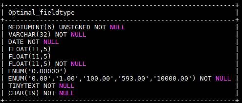

```yaml lw-blog-meta
title: Mysql的20条优化建议
date: "2019-07-08"
brev: 看到这篇文章，觉得讲得不错，作者是php工程师，从Web应用的角度来考虑问题；我从中学到很多东西，所以转载过来，翻译并加上一些自己的心得，与大家分享。
tags: ["中间件"]
```


原文地址：[Top 20+ MySQL Best Practices](https://code.tutsplus.com/tutorials/top-20-mysql-best-practices--net-7855)

## 前言

> Database operations often tend to be the main bottleneck for most web applications today. 
> It's not only the DBA's (database administrators) that have to worry about these performance 
> issues. We as programmers need to do our part by structuring tables properly, writing optimized 
> queries and better code. In this article, I'll list some MySQL optimization techniques for programmers.

数据库操作往往是Web应用的性能瓶颈。不能仅由DBA来考虑性能问题，我们一般的开发者也要在自己的范围内，恰当地建表、优化查询。

> 下面的代码都是php写的，但是都很好理解吧。我没学过php，但是看起来有点像bash或者js的风格，还是可以理解的。

### 1.充分利用缓存

`MySQL`服务器一般都开启了查询缓存(`query caching`)。
缓存是改善性能的最有效手段之一，而且完全是由数据库引擎`database engine`所控制的。
同一条查询语句`query`多次执行时，（后面的）结果会从缓存中提取。

> 数据库进程一般会自己维护缓存，你只管用（或者设置）就行了，不用担心实现细节。

但是其中有一些问题容易被忽视，比如在下面的情况中就无法使用查询缓存：

```php
// 缓存无效
$r = mysql_query("SELECT username FROM user WHERE signup_date >= CURDATE()");
 
// 应该这样写
$today = date("Y-m-d");
$r = mysql_query("SELECT username FROM user WHERE signup_date >= '$today'");
```

前面缓存无效，是因为`CURDATE()`没有确定的值，要由`Mysql`自己来执行，所以保存的查询记录是无效的；
而后面先把条件存为变量，这样的话提交给`Mysql`的查询语句就是一个确定的值，这样就可以进行缓存了。

### 2.使用`EXPLAIN`来分析你的查询语句

在你平常使用的查询语句**前面**加上`EXPLAIN`关键字，这样`MySQL`就会在返回的结果中告诉你，
这个查询`Query`用了哪个索引`Index`，如何对表进行扫描和排序的……之类的信息。

译者平时在公司用到的查询语句作为例子：

```mysql
SELECT * FROM apmosdb.Trade where ap_code =  "省略" order by trade_datetime desc limit 100 ;
```


从上面的执行结果可以发现，如果我们在主键`Primary Key`上进行查询，只需要扫描1行，直接命中；
而如果在非索引的其他字段上查询，就要经历全表扫描。
虽然对于我们公司70万行的数据量来说，性能差别不大；但是可以想象，对于互联网公司动辄千万上亿的数据量来说，这样的操作实在是太蠢了。

### 3.确定只有一行时，请用`Limit 1`

有时你想要读取一行，有时你只是想确认这行是否存在；
如果你确定只有一行（或者固定的几行），请用`Limit`关键字。这样，当数据库检索到1行之后，就会停止检索了。

```php
// do I have any users from Alabama?
 
// 别这样做
$r = mysql_query("SELECT * FROM user WHERE state = 'Alabama'");
if (mysql_num_rows($r) > 0) {
    // ...
} 
 
// 这样就好多了
$r = mysql_query("SELECT 1 FROM user WHERE state = 'Alabama' LIMIT 1");
if (mysql_num_rows($r) > 0) {
    // ...
}
```

### 4.在搜索字段上建立索引

就像前面说的，多建立一些索引吧，而不仅仅是在主键和唯一键`Unique Key`上才有索引。
如果你会经常在这个字段上搜索，那么大多数情况下你都应该给他建立索引。
（当然，也别太随便就建立索引，因为它也是要占用空间和性能的。）


从上面原作者提供的截图我们可以看到，对于一个`Like 'a%'`搜索语句，建立索引后性能从(0.25 sec)上升到(0.06 sec)，提升明显。

但是要注意，有些情况下你不会从普通的索引`a normal Index`上获益（例如前后匹配搜索一个单词`WHERE someCol LIKE '%apple%'`）。
你可以参考官方的[mysql fulltext search](https://dev.mysql.com/doc/refman/8.0/en/fulltext-search.html)，
或者构建你自己的索引解决方案。

### 5.使用`Join`的时候

如果应用程序`application`中含有大量的`Join`查询，你要注意

1. `Join`的列都建立了索引（因为这会影响`MySQL`内部的优化）；
2. `Join`的列最好是相同的相同的字段类型`Type`。

### 6.不要使用 `ORDER BY RAND()`

这种写法看起来很酷，很多新手会这样写。也许你只是想打乱序列`random rows`，但是在这种情况下`MySQL`不得不为每一行单独执行`RAND()`，
这是非常耗费CPU的；这导致了长时间的表锁，会导致更加严重的后果。

请用下面的写法：

```php
// 请不要这样写:
$r = mysql_query("SELECT username FROM user ORDER BY RAND() LIMIT 1");
  
// 这样会好很多: 
$r = mysql_query("SELECT count(*) FROM user");
$d = mysql_fetch_row($r);
$rand = mt_rand(0,$d[0] - 1); 
$r = mysql_query("SELECT username FROM user LIMIT $rand, 1");
```

### 7.避免`SELECT *`

读取越多的数据，查询效率也就越慢（废话），它会增加磁盘操作时间（或是占用更大的缓存）。
而且如果Web服务器与数据库服务器位于不同的物理机上，你将不得不面对更长的网络通信延迟（或是占用更大的网络带宽）。

坚持**仅仅读取你需要的数据**是一个非常好的习惯。

```php
// 不要这样写
$r = mysql_query("SELECT * FROM user WHERE user_id = 1");
 
// 这样是好习惯
$r = mysql_query("SELECT username FROM user WHERE user_id = 1");
```

### 8.一定要有ID列

在每个表中都设置一个ID列（特征`PRIMARY KEY`,`AUTO_INCREMENT`,`INT / UNSIGNED INT`）。

即使你有一个`User`表中包含唯一键`username`，你也不要把它设置为主键。
因为`VARCHAR`字段作为主键会降低性能。而且，在代码中通过id来访问用户资料会是一种更好的代码结构。

还有一个更重要的原因：`MySQL`引擎内部有一些操作会使用主键，
在这些情况下，主键的性能和设置变得非常重要，比如集群`clusters`、分区`partitioning`等，特别是数据库的设置很复杂的情况下尤为重要。

不过有一个特例，我没有完全理解，怕翻译不好附上原文：

> One possible exception to the rule are the "association tables", used for the many-to-many type 
> of associations between 2 tables. For example a "posts_tags" table that contains 2 columns: 
> post_id, tag_id, that is used for the relations between two tables named "post" and "tags". 
> These tables can have a PRIMARY key that contains both id fields.

### 9.使用`ENUM`代替`VARCHAR`

> 先解释一下`ENUM`：是一个字符串对象，它的取值范围是在创建表时指定的列表。
> 可以把它理解为`Key-Value`映射，因为数据库中实际储存的是另一种值（数字类型），但是显示的是字符串。  
> 比如对于“性别”字段，我们可以将其定义为`ENUM('男','女')`（说无性别的走开，我们这里只讨论技术）；
> 其在数据库中可能映射为`{0:"",1:"男",2:"女"}`，实际储存的值是`[1,1,1,2,1,2...]`.

`ENUM`类型又快又小，在内部它被储存为`TinyInt`，但是对外显示为字符串，这使得它成为在有限值数量的字段上的最佳选择。

### 10.从`PROCEDURE ANALYSE()`获取优化建议

这个语句会让`MySQL`自己分析字段结构与你实际储存的值之间是否合适。所以只有当你的表里有数据的时候才有意义。
看一个例子：

```sql
select * from yourDatabase.yourTable PROCEDURE ANALYSE();
```

在返回的结果中，`MySQL`会给出字段优化建议：



### 11.不要使用`Null`

我们很容易会认为，`Null`值会节省很多空间。但是事实上并不是这样的。

首先，问问你自己，把一个字段储存为空值（例如`""`）与储存为`Null`是否对你的业务逻辑有区别？
如果没有区别，那么就不要使用`Null`。（你知道`Oracle`把`Null`值视为字符串`"empty"`吗？）

`Null`字段需要额外的储存空间，并且会增加你的查询语句的复杂度。所以一定要尽可能地避免它。
当然，在某些情况下你可能真的确实需要`Null`，那你也尽管放心用吧。

> "NULL columns require additional space in the row to record whether their values are NULL. 
> For MyISAM tables, each NULL column takes one bit extra, rounded up to the nearest byte."  
> Null需要额外的空间来证明它自己是Null。比如MyISAM引擎的表，每个Null字段需要额外1bit空间，并向上取整到最近的byte。

### 12.Prepared Statements

没有看懂，引用[别人](https://coolshell.cn/articles/1846.html)的翻译:

Prepared Statements很像存储过程，是一种运行在后台的SQL语句集合，
我们可以从使用 prepared statements 获得很多好处，无论是性能问题还是安全问题。

Prepared Statements 可以检查一些你绑定好的变量，这样可以保护你的程序不会受到“SQL注入式”攻击。
当然，你也可以手动地检查你的这些变量，然而，手动的检查容易出问题，而且很经常会被程序员忘了。
当我们使用一些framework或是ORM的时候，这样的问题会好一些。

在性能方面，当一个相同的查询被使用多次的时候，这会为你带来可观的性能优势。
你可以给这些Prepared Statements定义一些参数，而MySQL只会解析一次。

虽然最新版本的MySQL在传输Prepared Statements是使用二进制形势，所以这会使得网络传输非常有效率。

当然，也有一些情况下，我们需要避免使用Prepared Statements，因为其不支持查询缓存。但据说版本5.1后支持了。

在PHP中要使用prepared statements，你可以查看其使用手册：mysqli 扩展 或是使用数据库抽象层，如： PDO.

```php
// create a prepared statement
if ($stmt = $mysqli->prepare("SELECT username FROM user WHERE state=?")) {
 
    // bind parameters
    $stmt->bind_param("s", $state);
 
    // execute
    $stmt->execute();
 
    // bind result variables
    $stmt->bind_result($username);
 
    // fetch value
    $stmt->fetch();
 
    printf("%s is from %s\n", $username, $state);
 
    $stmt->close();
}
```

### 13.无缓冲查询

一般来说，你在代码中调用查询语句，程序会阻塞直到查询结果返回。你可以使用无缓冲查询`Unbuffered Queries`来改变这一行为。

### 14.将IP储存为`UNSIGNED INT`

我们知道IP地址的范围是四段0-255，刚好是4*8bit二进制，也就是32bit。
所以一个同样是32位的`UNSIGNED INT`就可以把这个IP地址储存下来，而不需要`VARCHAR(15)`。

有些程序中自带这种转换的函数（例如`php`的`INET_ATON()`），你可以充分利用它们：

```php
$r = "UPDATE users SET ip = INET_ATON('{$_SERVER['REMOTE_ADDR']}') WHERE user_id = $user_id";
```

同理，可以发挥你的想象力，思考一下其他的数据是否也可以用类试的方法进行“压缩”，这可以对你的数据库性能有明显的提升。
但是要注意压缩和解压缩过程中的性能损耗。

### 15.固定长度表是更快的

如果一个表中的每个字段都是固定长度的，那么这个表就是固定长度的`Fixed-length Tables`(或者叫`Static Tables`)。
比如`VARCHAR`,`TEXT`,`BLOB`就是非固定长度的，只要你包含了1个非固定长度的字段，整个表就是非固定长度表了。

固定长度表速度更快，因为`MySQL`可以更快的查询数据`records`。
如果它需要特定行的数据，它可以很快的**计算**出该行所在的位置，只需要一次乘法；
而如果是非固定长度的，那每次都要根据主键去找。

固定长度表同样更容易缓存、也更容易重建`reconstruct`。

唯一的缺点就是可能占用更多的空间。例如`CHAR(20)`一定会占用整整20个字符的空间，而`VARCHAR(20)`可以根据情况占用0-20字符空间。

如果一定想用非固定长度的字段怎么办？
用垂直分区`Vertical Partitioning`技术，把一张表分为一张固定长度表+一张非固定长度表（见下面分析）。

### 16.垂直分区

举例1：  
你可能有一个`Users`表，保存了`电话`这种常用固定长度数据，和`住址`这种不常用的非固定长度数据。
你可以把后者分离出去，使用外键去关联两张表。

但你要注意你不能经常`Join`操作，否则就得不偿失了。

### 17.分割大型操作

如果你要在生产环境中执行一个大型的`DELETE`或者`INSERT`操作（比如插入十万行），要小心这可能会带来网络阻塞。
因为在执行过程中，表是锁定的；在锁定的期间里，堆积的用户请求可能会让你的服务器炸掉。

所以如果你一定要操作这么多的数据的话，请把它分割开，让其他的请求也有机会执行：

```php
while (1) {
    mysql_query("DELETE FROM logs WHERE log_date <= '2009-10-01' LIMIT 10000");
    if (mysql_affected_rows() == 0) {
        // done deleting
        break;
    }
    // you can even pause a bit
    usleep(50000);
}
```

### 18.越小的字段越快

对于大多数引擎来说，硬盘性能会是最重要的瓶颈。
所以尽可能压缩你的数据吧！

参看 MySQL 的文档 [Storage Requirements](http://dev.mysql.com/doc/refman/5.0/en/storage-requirements.html) 
查看所有的数据类型。

比如，如果表的行数很少，那么ID字段用`TINYINT`就可以了；比如不需要具体时间的话，使用`DATE`就比`DATETIME`好。

当然，你也要适当的为以后的拓展考虑一下。否则对于一个大表来说，`ALTER`可能会非常非常非常耗时。

### 19.选择合适的引擎

`MySQL`主要的引擎是`MyISAM`和`InnoDB`这两个。它们各有利弊。

`MyISAM`适合查询为主(`read-heavy`)的应用。当你`update`一行的时候，整个表都会锁起来，其他请求就阻塞了。
但它对于`SELECT COUNT(*)`非常快。

`InnoDB`更适合于那些复杂的应用。对于小型简单的应用可能会比`MyISAM`更慢。
但它支持行级锁`row-based locking`，所以在巨大规模的时候优势明显。
它还支持更高级的特性，比如事务`transactions`。

### 20.使用对象关系映射器ORM

ORM（`Object Relational Mapper`）可以获得一定的性能提升。虽然ORM可以做的，你自己敲代码也可以实现，不过这需要一个高级DBA的大量心血。

ORM最好的地方是“懒惰查询”`Lazy Loading`，意思是只在需要值的时候才去`fetch`。不过这可能会产生一些细分的查询，从而导致性能下降。

> 其实很多地方都见过ORM。比如`Django`的模型系统，其实就是实现了ORM的中间件；
再比如`pymongo`那种完全面向对象的写法，我觉得也是某种意义上的ORM；还有`sqlalchemy`库也是。

### 21.小心永久连接

永久连接`Persistent Connections`好处是连接复用，即后面的查询可以复用前面保持的连接，减少网络开销。

但是这会导致资源占用，所以在使用的时候要仔细考虑一下。
