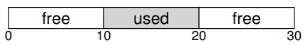
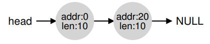
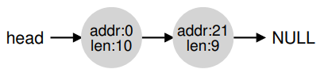
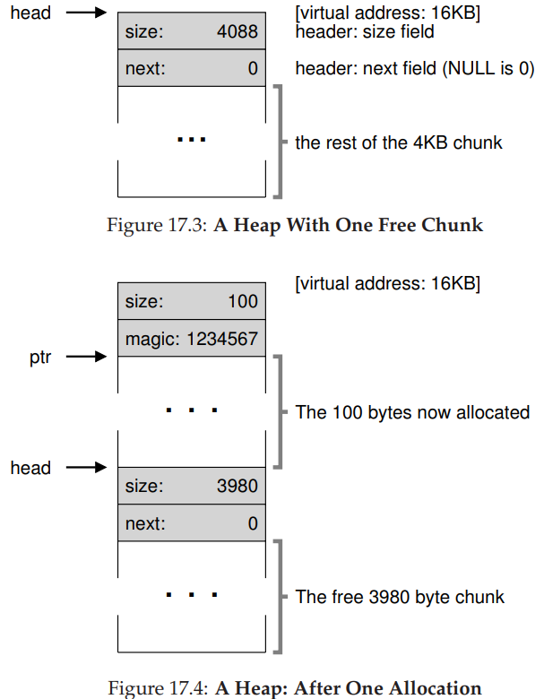
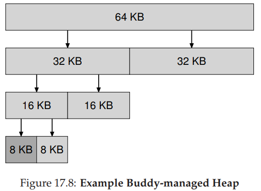

```yaml lw-blog-meta
title: OS学习笔记17：内存虚拟化-政策-空闲内存管理
date: "2019-08-14"
brev: 绕个路，不讲内存虚拟化了，讲一下内存管理。
tags: [OS]
```


# 第十七章 <空闲内存管理>

[PDF链接](http://pages.cs.wisc.edu/~remzi/OSTEP/vm-freespace.pdf)

不管是库函数也好，还是OS本身提供的也好，我们讨论一下内存管理方面的基础内容，即`空闲内存管理Free-Space Management`。

我们后面会说`分页paging`。如果内存都划分为了一些固定大小的单位，那就很容易管理了，把每一页的入口存为一个列表就好了。

只有当你管理的空间中包含一些可变大小的单元时，管理才变得困难，即所谓的边界摩擦问题。

**关键问题：如何在满足空间可变的情况下管理内存？用什么策略减少摩擦、这些策略需要多少时空损耗？**

## 17.1 假设

假设之前的`malloc()`和`free()`，只接收一个参数就可以了。在进程内部，库函数会有一个类似的`free-list`来管理可用的堆内存，不一定是数组，可以是任意的数据结构。

假设我们目前只关心边界摩擦问题。其实内部也有摩擦，我们暂时不考虑。

假设分配出去的内存，不能重新分配，只能被free。因此不考虑压缩问题。

假设分配器管理的内存都是连续的。假设碎片区域不会改变大小。

## 17.2 底层机制

### 分裂与聚合 Splitting and Coalescing



那么在free-list中，应该有两个元素：



在这种情况下，任何超过10字节的内存请求都会被拒绝；等于10字节的会被满足；那么低于10字节的请求呢？

假设我们只需要一个字节。此时，分配器会执行`分裂splitting`，然后malloc会返回一个地址是20，剩余的部分依然存在于free-list中：



如果程序free了已经使用的10个字节，那么分配器可以把他们聚合起来，类似上面的分裂过程。

### 追踪已分配区域的大小

在每个已分配的内存块前面，加一个头，保存了这块区域的尺寸以及一些魔法，比如这样的一个数据结构作为头部：

```c
typedef struct {
int size;
int magic;
} header_t;
```

### 实现一个freelist

我们用一个链表来做，节点是这样：

```c
typedef struct __node_t {
int size;
struct __node_t *next;
} node_t;
```

假如有一块4096字节的空间可用，那么我们初始化这个free-list：

```c
// mmap() returns a pointer to a chunk of free space
node_t *head = mmap(NULL, 4096, PROT_READ|PROT_WRITE,MAP_ANON|MAP_PRIVATE, -1, 0);
head->size = 4096 - sizeof(node_t);
head->next = NULL;
```



### 堆的增长

传统的内存分配器，一开始只会申请一个相对小的堆，用完了之后systemcall来获得更大的堆。

## 17.3 基本策略 Basic Strategies

有了底层机制（OS层面和库函数层面）的支持，我们看一下有哪些常见的算法：

### Best Fit

搜索整个freelist，找到一个大于等于的空闲内存块（最接近的大小）。这种算法有利于减少浪费，但是遍历一次freelist单价很高。

### Worst Fit

找到最大的那一块来分割。同样也需要搜索整个链表，所以很傻。

### First Fit

找到第一个大于等于的块。搜索很快，但是在free的时候要给链表排序，才能做好聚合。

### Next Fit

同理，找到第二个大于等于的。

## 17.4 其他方法

还有一些别的方法来提升内存分配的效率。

### 隔离列表 Segregated Lists

对于一些常用的内存块尺寸，分别使用独立的列表来管理。（比如4字节一类，8字节一类，等等；译者注：Go语言就是这样的策略）好处很明显，首先减少了摩擦，另外分配和回收都很方便。

那么，需要为这种`内存池pool of memory`申请多大的内存？

`厚片分配器slab allocator`实现地很合理。当系统开机时，为一些经常用到的内核对象分配一些`对象缓存object caches`（比如锁，文件索引节点等）；当某种对象的池不够了，就从通用内存中申请；多余了，就释放。

这种机制同时还支持`预初始化pre-initialized`，因为大型数据结构的创建销毁是很累的；因此在这种对象池中保持一种预初始化的状态有利于大大减少这种开支。

### 兄弟分配 Buddy Allocation

有一些方法让`聚合coalescing`变得简单，有种叫做`二进制兄弟分配binary buddy allocator`。

在这种系统中，空闲内存被看作是一大块`2^N`大小的块。当申请内存时，在空闲内存中递归地除以2来获得一块大于等于申请尺寸的块。下面图片是申请7KB内存的情况：



这个系统在申请时会受制于内部摩擦，但是好处是，在释放时特别快。

### 其他方法

上面提到的方法有一个主要的问题，就是`缺乏扩展lack of scaling`。特别是，在链表中搜索会很慢。因此有一些分配器算法会构建更复杂的数据结构来优化性能，但是单价就是简洁性，比如`二叉树binary tree`，`伸展树splay tree`，`部分排序树partially-ordered tree`。

此外，现代系统经常要多进程多线程运行，所以还有很多分配器致力于优化多核系统中的性能。

还有很多很多种思路，如果感兴趣的话自己去查找资料；或者，至少看一看`glibc`中的思路吧！

## 17.5 小结

这一章讲了一些原始的内存分配器模型，但是它们随处可见，在库函数中、在OS中。

随着学习的深入，你会发现操作系统中总是有着大量的`折衷方案trade-off`；你越学习并了解分配器的原理，你就越容易根据其特性来优化你的代码。

写出一个快速、节约空间并且易于扩展规模的分配器，依然是OS领域中的重要挑战。
