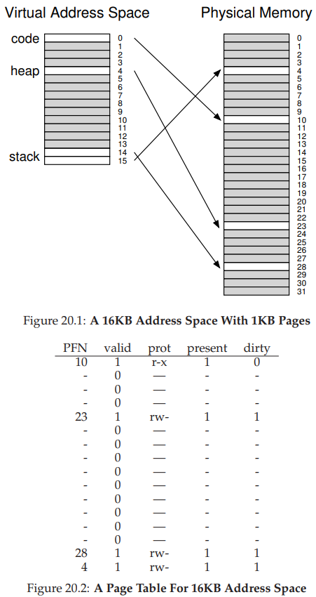
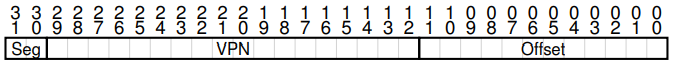
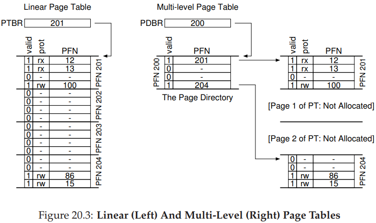
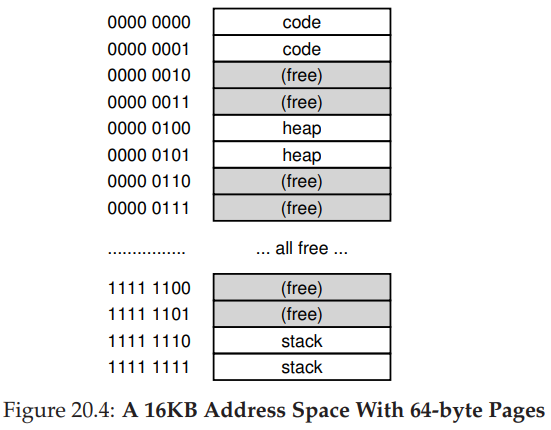
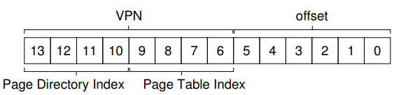
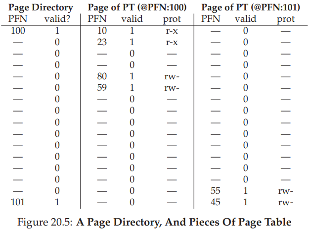
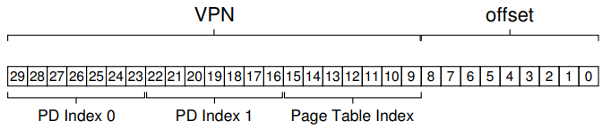

```yaml lw-blog-meta
title: OS学习笔记20：内存虚拟化-更小的页码表
date: "2019-08-18"
brev: 按照之前的页码表实现，为每个进程都维护一个数兆的页码表，太浪费内存了。所以考虑一下如何缩小页码表。
tags: [OS]
```


# 第二十章 <分页：更小的页码表 Smaller Tables>

[PDF链接](http://pages.cs.wisc.edu/~remzi/OSTEP/vm-smalltables.pdf)

假如对于32位的设备来说，每页4KB，则前20bits用于页码，一共有1M个页；假设是线性数组页码表，每页需要4bytes保存`入口page-table entry(PTE)`信息，则这个页码表大小为4MB。注意，我们要为每个进程维护单独的页码表！

**关键问题：线性数组页码表太大了。如何减小页码表的大小？关键点是什么、会对性能有何影响？**

## 20.1 简单解法：更大的页

比如从4KB增大到16KB，那么页码表就只有1MB大小了。

带来的问题就是加剧了每页内部的浪费（即内部摩擦问题），所以一般的系统都是用4KB或者8KB。

> 现在很多架构都支持放大页面尺寸。比如应用程序可以直接申请一个4MB的页，以节约TLB，典型例子就是数据库。这让OS更加复杂，但是应用程序只需要简单地调用接口就好了。

## 20.2 混合：分页与碎片 Paging and Segments

举个例子，我们有16KB的地址空间，每页1KB，我们只用了其中4页：



有大量的页码表的空间被浪费了。

于是我们考虑引入碎片：页码表不需映射整个地址空间，而是将地址空间分为多个`逻辑碎片logical segment`，为每个逻辑碎片维护单独的页码表。比如我们按Code，heap，stack划分为三个碎片。

还记得在碎片政策中，我们讲过`base, bound, limit`三个寄存器？现在我们依然使用这三个，MMU为这三个碎片区分别持有这三个寄存器。



不过现在`base`保存的是页码表的物理地址，而`bound`保存着页码表的最大有效长度。比如如果Code碎片区使用了3页（0,1,2），那么bound就是3。

这样的话，堆/栈之间无效的页码翻译，就不需要储存了；而是用多少取多少。

## 20.3 多级页码表 Multi-level Page Tables

这是与混合碎片不同的方法。思想就是把页码表从数组转化为某种树。这时非常高效的办法，所以现代的操作系统用它。

首先，把页码表也划分为大小固定的单元；其次，如果整个单元中的页码翻译都是无效的，就不为这个单元分配空间。

使用一种新的数据结构，所谓的`页码字典page dicrectory`：



页码字典为**页码表的每一页**储存一个`入口信息page directory entries(PDE)`。PDE包含一位有效位，表明这一页中至少有一条翻译是有效的。

多级页码表有很多好处：首先，节省很多空间；第二，如果构建得好，页码表每个部分都可以整齐地放在一个页面中，可以与其他任意页面等同管理，非常有利于OS得管理。

但是也要注意其缺点：当TLBmiss了，我们就需要更多一次内存访问（总共3次）才可以得到物理地址了。同时，也会增加复杂度。

所以，这是一个典型的`时空妥协time-space trade-off`，即使用时间代价来换取空间。

### 一个更详细的例子

假设我们有16KB的地址空间，每页64bytes。那么我们需要14bits来表示地址（8位页码和6位偏移）。



`页码表`中总共有256条`入口信息PTE`，假设每个PTE依然是4bytes，那么页码表总大小是1KB，那么需要16页来储存一个完整的页码表。

那么`页码字典`就需要16条`入口信息PDE`（对应每个页码表的页）。所以8位的`页码VPN`中，前四位保存页码字典入口PDE，后四位表示页码字典偏移：





### 更多级别的页码字典

当单个页不足以存放页码字典的时候，就需要更多的级别了。

- 比如假设我们的虚拟地址空间有30位，每页512bytes即9位，页码有21位。
- 假设每条PTE还是4bytes，那么一页内存只能储存128条PTE（7位）；
- 那么页码字典就要有`2^14`条PDE（21-7=14位），每条PDE也是4bytes，也就是说，这个字典需要128页（7位）才能装下。

那我们就需要三级字典了：



> 译者注：所以，为什么我们的页面大小是4KB？因为一页可以储存10位的PTE，那么对于32位操作系统前20位是页码的话，刚好二级页码表就可以实现了。

### 翻译过程：记住TLB

不管多少级页码字典，只要TLB有缓存，就都能直接访问内存。

## 20.4 反转的页码表

还有一种更加极端的节约空间的方式：在整个系统中只维护一个页码表，映射到所有物理内存。那么每条PTE还要保存进程信息用以隔离。

但是每次检索代价很大。线性代价很大，用哈希表会好很多。

页码表只是一种数据结构，你甚至可以实现自己的。

## 20.5 把页码表交换到硬盘中 Swapping the Page Tables to Disk

我们释放掉最后一个假设（我们假设页码表只放在内核管理的物理内存中）。

因为在某些情况下，依然有可能使得页码表特别巨大，而不能一次性放入内存中。这种情况下，有些系统会把它放入`内核虚拟内存kernel virtual memory`中。我们以后讨论。

> 译者注：如此关键的数据，应当是第一优先级留在内存中；甚至我们开发了TLB缓存来提高效率。放入交换区还有什么意义？？

## 20.6 小结

我们了解了一些真实的页码表的实现。主要是数据结构的优化。这也是一个典型的时空妥协的列子，我们必须找到平衡点。

TLB的存在提升了相当的性能，达到了量变产生质变的程度。

思考一下，你还能想到什么样的数据结构用来储存页码表？能解决什么问题，有何优点和缺点？
