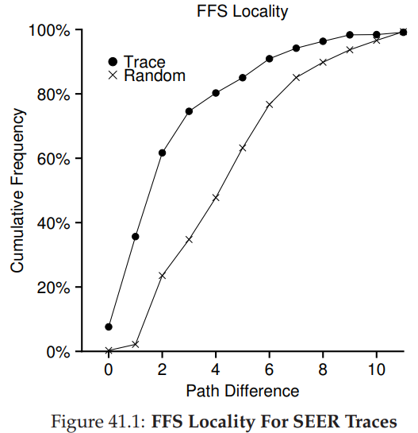
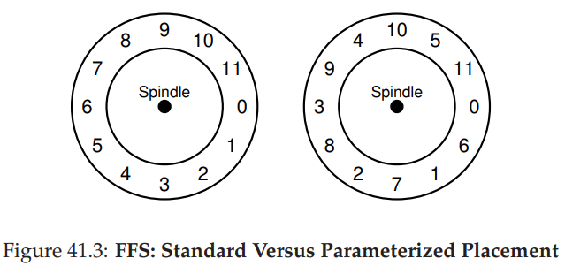

```yaml lw-blog-meta
title: OS学习笔记41：持久化：快速文件系统
date: "2019-09-03"
brev: FFS是文件系统发展历史中的分水岭，是现代文件系统的祖先。
tags: [OS]
```


# 第四一章 <本地化与快速文件系统 Locality and The Fast File System>

[PDF链接](http://pages.cs.wisc.edu/~remzi/OSTEP/file-ffs.pdf)

此前介绍的文件系统模型，让我们称为『旧的UNIX文件系统』，它的基本理念是：

```text
SuperBlock |  Inodes             |           Data                                        |
```

这种模型的好处是简单，并且满足了基本的需求（目录树），但是：

## 41.1 问题：低性能

有研究表明，这种文件系统大概只能发挥出2%的设备带宽！

主要的问题在于，它将硬盘中的区块视为完全随机的，因此在定位上损耗了太多性能。比如一个文件的数据块往往离节点块很远，因此要耗费很多时间用于硬盘寻道。

更糟糕的是，这样的文件系统会变得高度碎片化。想象一下一个连续的文件请求，却要前后前后地访问不同的区块，这性能不敢直视。

> 译者注：书中对这几章依然讲解的非常详细；但是我觉得，如果像我一样从第一章学过来，到现在应该学起来很轻松了，很多具体的例子根本不需要了，所以我就会省略这些例子。

还有一个问题，硬盘的原生分区很小（扇区大小一般512bytes），这有利于减少内部摩擦，但是增大了定位的损耗。

**关键问题：如何组织硬盘数据以提升性能？**

## 41.2 FFS

后来有了`快速文件系统FFS`，思路是在`硬盘感知disk aware`的情况下设计文件系统的数据结构与分配政策。这开启了文件系统研究的新时代。

## 41.3 组织结构：圆柱群

第一步是改变硬盘上的数据结构。把硬盘划分为很多`圆柱组cylinder group`，一个圆柱是在不同表面距离圆心相等磁道的集合，因其形状而得名。FFS将N个连续的圆柱分为一组，因此整个硬盘可以看作是一些圆柱组的集合。

下图展示了一个硬盘模型，它有六个表面，每个表面这里显示了最外的4圈；一个圆柱组在这里包含3个圆柱。


但是要注意，前面提到过硬盘驱动隐藏了具体的硬件细节，因此OS不知道硬盘的物理模型到底是怎样的。因此现代文件系统只能将硬盘划分为`区块组block group`，每个组只是一个连续的硬盘地址空间。


这就是FFS的核心模型。最关键的是，如果把两个文件放在同一个组里，FFS可以确认对它们的访问不会花费太多寻道时间。

然后，FFS在每个区块组中都按之前的模型进行划分，即SuperBlock/Bitmaps/Inodes/Data四部分，其中超级区块是一个副本。

## 41.4 政策：如何分配文件与目录

基本思路就是：把相关的文件放在一起。那么如何判断是否相关？

看如何放置目录。选出含有最少目录以及最多空闲节点的组，用来存放新的目录。以此保证组之间的平衡，以及尽可能让更多的文件能放在同一个组。

对于文件。首先在正常情况下，保证数据块与节点块放在同一组。第二，把所有的文件放在它们的目录所在的组中。

```text
文件夹/a, /b, 文件/a/c, /a/d, /b/f, /a/e
group   inodes      data
    0   /---------  /---------
    1   acde------  accddee---
    2   bf--------  bff-------
    3   ----------  ----------
    4   ----------  ----------
    5   ----------  ----------
    6   ----------  ----------
    7   ----------  ----------
```

但是这也会有一个问题，比如一个目录下的多个子目录会被分散开。FFS并不是基于严谨的研究统计，而是基于良好的常识，即一个目录下的文件往往会一起访问。

## 41.5 评价：文件本地性

我们统计一下两个文件之间的距离有多远。比如打开一个文件f，然后重新打开f，那么距离是0；打开一个文件g，然后打开同目录下的文件f，那么距离是1；即两个文件之间要经过多少父目录。



可以看到，在一个正常的工作负荷下，有将近40%的文件请求都是同一个文件或者同一个目录的文件，因此FFS的假设是有道理的。

另一个有趣的现象是有大约25%的请求是发生在2点距离上的，这种情况一般发生在代码工程目录下，用户以多级文件夹的形式来组织代码和数据文件，并在运行时频繁地在目录之间切换。FFS对这种场景表现不佳。

## 41.6 大文件的处理

FFS在储存大文件时要注意，如果没有特殊规则，那么这个大文件可能会将整个组的剩余空间用完，这就使得前面所说的优化目标无效了。

因此，对于大文件，FFS会将其拆分到不同的组里面。

```text
group inodes     data
    0 /a-------- /aaaaaaaaa aaaaaaaaaa aaaaaaaaaa a---------
    1 ---------- ---------- ---------- ---------- ----------
    2 ---------- ---------- ---------- ---------- ----------

// 拆分后：
group inodes     data
    0 /a-------- /aaaaa---- ---------- ---------- ----------
    1 ---------- aaaaa----- ---------- ---------- ----------
    2 ---------- aaaaa----- ---------- ---------- ----------
    3 ---------- aaaaa----- ---------- ---------- ----------
    4 ---------- aaaaa----- ---------- ---------- ----------
    5 ---------- aaaaa----- ---------- ---------- ----------
    6 ---------- ---------- ---------- ---------- ----------
```

将连续的文件分散在不同的区域，会降低性能。但是只要我们选择一个较大的分块尺寸，这种损耗就会相对较小。这种优化思路我们称为`摊销amortization`。

举个例子，假设硬盘的定位时间（寻道+旋转）总共10ms，理论传输速度40MB/s；而你希望分块之后性能能保持速度能有50%的水平，那么意味着每连续读取10ms后定位10ms，那么计算可得每个分区的大小应该是409.6KB，这个尺寸并不大。为了达到90%的性能水平，需要3.69MB的分块尺寸；为了达到99%的性能水平，需要40.6MB的分块尺寸。

请注意，磁盘驱动器的发展趋势是，传输速率提高得相当快，而定位时间提升的相对慢。因此随着时间的进步，你可能需要更大的分块尺寸来摊销定位损耗。

## 41.7 其他方面

在空间利用方面，最麻烦的是小文件。前面说了2KB的小文件是很多的，而我们的通用分页尺寸是4KB，这对于读写效率来说很棒，但是对于储存空间利用率来说非常不利。

因此引入了`次级区块sub-block`，每块的大小是512bytes，这才是硬盘上给文件分配的最小空间单位。假如有一个1KB的文件，那么一开始会放在两个次级区块中，如果文件增长到大于4KB了，文件系统会重新分配一个4KB的完整区块，然后把次级区块的数据复制过去并释放。

这会带来很多额外的复制操作，会明显影响性能。因此FFS在写入时设置了4KB缓冲，以此避免了大多数情况下的额外复制。

还有另外一个问题，在连续读取时，假设先读了区块-0，之后FFS立即又请求了区块-1，而这时已经太迟了因为磁盘已经转过去了。所以在硬盘上区块并不是物理连续的，中间会有间隔（如下图右边的），这样FFS就有充足的时间来应对下一个请求。



你可能会问，这样的话读取一圈的数据需要转两圈，性能只有一半啊！别担心，现代硬盘还有磁道缓存，只要转一圈，所有的数据都被写入缓存，然后从缓存中传输回去就可以了，性能没有打折。

FFS还是第一个支持长文件名（超过8字母）的文件系统，很好的支持了软连接。FFS还提供了原子性的rename()操作。

## 41.8 小结

FFS是文件系统发展历史中的分水岭，从它的基础上衍生出了数百种文件系统，包括如今的Linux-ext2和-ext3.

它的关键思想就是：将硬盘视为硬盘来对待。
