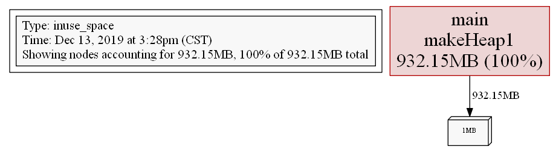

```yaml lw-blog-meta
title: 'Go性能分析工具: pprof'
date: "2019-12-13"
brev: 遇到Golang内存泄露的问题，以及衍伸出检测工具pprof的问题。内存泄露问题以后再说，先看看这个检测工具怎么用。
tags: [Golang]
```


## 1. 官方介绍

我们先看一下官方对于性能分析(Diagnostics)的整体介绍，
原文地址：[Diagnostics - The Go programming Language](https://golang.org/doc/diagnostics.html)。

### 1.1 简介

Go生态提供了一个庞大的套装，包含接口和工具，用于测试Go程序的性能问题。这些工具主要分为以下四类：

- `Profiling`：用于分析Go程序的复杂度和消耗。比如内存和调用等。
- `Tracing`：用于分析调用（或请求）的延迟。
- `Debugging`：用于暂停一个Go程序并检查它的执行环境。
- `Runtime statistics and events`：用于收集和分析运行时的状态和事件，提供一个宏观的健康分析。

### 1.2 Profiling

Go运行时能够提供可视化工具所需的数据。这些运行时数据，可以在`go test`测试期间收集，也可以通过`net/http/pprof`这个包。

预先定义的数据有：

- cpu
- heap
- threadcreate
- goruntine
- block
- mutex

#### 除了Go提供的工具，我还能用什么工具来分析？

在Linux上，可以用`perf tools`，它有助于分析内核性能瓶颈。在macOS上，可以用`Instruments`。

#### 可以在生产环境上做profile吗？

可以的，没有安全问题。但是这会带来巨大的性能负担，你可能会观察到性能下降一个数量级。最好充分评估性能负担之后再用在生产环境上。

一个典型的场景是集群部署。你可以在一个（或一部分）服务实例上做profile，这样就不会影响到整体的服务质量。

#### 可视化的最佳方法？

Go工具链提供 text, graph, callgrind 三种方式。具体使用方法请参考[另一篇官方博客](https://blog.golang.org/profiling-go-programs)

可以通过HTML来观察各个部分的性能损耗。也可以用[火焰图](http://www.brendangregg.com/flamegraphs.html)来看。

#### 我只能获取这些种类的profile数据吗？

不。除了Go运行时已经提供的，你还可以在`pprof.Profile`这个函数中定义自己的数据。

#### 我能改变服务端网址吗？

可以的。`net/http/pprof`包用的是默认的mux，你也可以自己定义它：

```go
import (
	"log"
	"net/http"
	"net/http/pprof"
)

func main() {
	mux := http.NewServeMux()
	mux.HandleFunc("/custom_debug_path/profile", pprof.Profile)
	log.Fatal(http.ListenAndServe(":7777", mux))
}
```

### 1.3 Tracing

用于追踪一次调用链（或请求）所经历的延迟。Go提供了`golang.org/x/net/trace`这个包。

通过Tracing，我们可以：

- 测量应用延迟。
- 测量调用链的消耗。
- 找出利用率和性能改进建议。没有Tracing就可能不太好找性能瓶颈。

在一个单一系统中做Tracing是相对容易的，但是当应用体积膨胀，做成了分布式系统，那就复杂了。不过别担心，我们也有针对分布式系统的Tracing，它可以：

- 测量大型系统的应用延迟。
- 追踪一个用户请求内的所有RPC。
- 找出性能瓶颈。

#### 能自动追踪吗？

不能。你要自己在代码中定义。

#### 我如何传递trace头部信息？

使用`context.Context`。

### 1.4 Debugging

用于寻找为什么程序不正常工作。常用的工具有：

- `Devle`：支持Go的运行时概念以及内建类型。它尝试成为一个可靠的全功能的debugger（调试器）。
- `GDB`：支持gccgo。但是可能不太好用。

#### 调试器好用吗？

GC编译器可能会做一些优化，比如内联函数和变量注册等方面。这些优化可能让调试变得困难。目前，我们建议你在调试阶段直接屏蔽掉优化：

```shell-session
$ go build -gcflags=all="-N -l"
```

从Go1.10开始，支持一个新的flag，允许调试器在优化过的二进制代码上工作：

```shell-session
$ go build -gcflags="-dwarflocationlists=true"
```

#### 调试器客户端用谁家的好？

虽然 delve 和 gdb 都提供客户端，但是一般情况下IDE都会提供用户操作接口，直接用就好了。

#### 可以“验尸”吗？

『core dump file』保存着一个运行中的进程的内存快照，分析这个文件就可以“验尸”了。

### 1.5 Runtime statistics and events

用户可以查看运行时内部的事件和状态，以此可以分析性能和利用率问题。一些常用的工具有：

- runtime.ReadMemStats
- debug.ReadGCStats
- debug.Stack
- debug.WriteHeapDump
- runtime.NumGoroutine

#### Execution tracer （运行跟踪器）

可以用来追踪很多运行时事件，比如调度、syscall、gc、堆等。使用`go tool trace`！

#### GODEBUG

只要设置这个环境变量，运行时就会抛出相关信息。

- `GODEBUG=gctrace=1`
- `GODEBUG=schedtrace=X`

还能用它来禁用一些特性：

- `GODEBUG=cpu.all=off`
- `GODEBUG=cpu.extension=off`

## 2. pprof 的基本运用

现在我们知道了，做性能分析大概分成四个维度，其中比较基础也比较常用的是`profile`。在Go的世界中，我们一般使用`net/http/pprof`这个包，通过浏览器来查看相关数据；也可以录制导出，用`go tool pprof`来查看；还有一些成熟的工具提供更加强大的可视化效果。

关于工具的具体使用，参考了几篇博客：

- [实战Go内存泄露 - 大彬](https://segmentfault.com/a/1190000019222661)
- [Profiling Go programs with pprof - Julia Evans](https://jvns.ca/blog/2017/09/24/profiling-go-with-pprof/)
- [使用 pprof 和火焰图调试 golang 应用 - Cizixs](https://cizixs.com/2017/09/11/profiling-golang-program/)

### 2.1 基本使用：线上服务

```go
package main

import (
    "net/http"
    _ "net/http/pprof"
    "os"
    "time"
)

var buf [][]byte

func main() {
    go makeHeap1()
    if err := http.ListenAndServe("0.0.0.0:6060", nil); err != nil {
        os.Exit(1)
    }
    println(len(buf))
}

// 每0.1秒分配1MB内存
func makeHeap1() {
    tick := time.Tick(time.Second / 10)
    for range tick {
        buf = append(buf, make([]byte, 1024*1024))
    }
}
```

上面这段代码只是单纯的无限分配内存。我们运行代码，然后从浏览器访问本地`localhost:6060/debug/pprof/`，可以看到一个简单的页面，显示着：

```text
Types of profiles available:
Count	Profile
1	allocs
0	block
0	cmdline
5	goroutine
1	heap
0	mutex
0	profile
12	threadcreate
0	trace
full goroutine stack dump
```

在网页上可能看不出什么东西，我们还是要在本地使用`go tool pprof`来查看。

举个例子，我们现在尝试获取一下Heap信息，我们运行`go tool pprof http://localhost:6060/debug/pprof/heap`，然后在交互界面下输入`top`命令，（或者合并为一条命令`go tool pprof -top http...`，）可得：

```shell-session
$ go tool pprof http://localhost:6060/debug/pprof/heap
Fetching profile over HTTP from http://localhost:6060/debug/pprof/heap
Saved profile in C:\Users\lewin\xxxxx.004.pb.gz
Type: inuse_space
Time: Dec 13, 2019 at 2:46pm (CST)
Entering interactive mode (type "help" for commands, "o" for options)
(pprof) top
Showing nodes accounting for 9.25MB, 100% of 9.25MB total
      flat  flat%   sum%        cum   cum%
    9.25MB   100%   100%     9.25MB   100%  main.makeHeap1

(pprof) web
Showing nodes accounting for 9.25MB, 100% of 9.25MB total
      flat  flat%   sum%        cum   cum%
    9.25MB   100%   100%     9.25MB   100%  main.makeHeap1
```

我们还可以将上述profile数据做可视化处理，我们在交互界面输入`svg`或者`png`命令，就会在当前目录下输出相应的图片资源。（注1，可视化的功能依赖[graphviz](https://graphviz.gitlab.io/download/)，要提前安装）（注2，这里有个小坑，windows不支持`go tool pprof -png http... >out.png`这样的命令，输出的文件无法打开；要交互界面下输出的文件才能打开。）



### 2.2 基本使用：线下应用

对于运行完成后马上退出的工具型应用，我们就要在代码中开启`pprof`，程序退出时将相关数据保存到文件中。

我们这次看看cpu的profile，写两个计算密集型函数，然后起两个Goruntine运行并且监测：

```go
func mainRun() {
    f, _ := os.Create("cpuprofile.out")
    defer f.Close()
    pprof.StartCPUProfile(f)
    defer pprof.StopCPUProfile()

    var wt = make(chan struct{})
    var x1, x2 float64
    go func() { x1 = runCpu1(wt) }()
    go func() { x2 = runCpu2(wt) }()
    <-wt
    <-wt
}
```

这样我们就在当前目录下得到了一个`cpuprofile.out`文件，我们用工具打开它：

```shell-session
$ go tool pprof ./cpuprofile.out
Type: cpu
Time: Dec 13, 2019 at 4:01pm (CST)
Duration: 201.09ms, Total samples = 40ms (19.89%)
Entering interactive mode (type "help" for commands, "o" for options)
(pprof) top
Showing nodes accounting for 40ms, 100% of 40ms total
      flat  flat%   sum%        cum   cum%
      20ms 50.00% 50.00%       20ms 50.00%  main.runCpu1
      20ms 50.00%   100%       20ms 50.00%  main.runCpu2
         0     0%   100%       20ms 50.00%  main.mainRun.func1
         0     0%   100%       20ms 50.00%  main.mainRun.func2
```

有些遗憾的是，由于cpu-pprof是基于抽样统计的，因此具体的运行时间不会特别精准，只能给出一个大致的参考。

### 2.3 基本使用：与测试工具集成

前面两种方法都需要在原来的代码逻辑中，将pprof硬编码进去。另一种思路就是只对测试程序做profile，这样可以不用修改任何代码。不过这样会有一些局限性，比如很难模拟实际生产中的场景。

```shell-session
$ go test -bench . -cpuprofile=cpu.prof
PASS
ok      _/C_/Users/lewin/github/Learning/Golang/a       0.842s
```

运行之后会在当前目录下生成两个文件：一个编译后的可执行文件，一个是profile结果文件（以你指定的文件名）。我们还是用工具来读取它：

```shell-session
$ go tool pprof .\cpu.prof
Type: cpu
Time: Dec 13, 2019 at 4:45pm (CST)
Duration: 201.13ms, Total samples = 100ms (49.72%)
Entering interactive mode (type "help" for commands, "o" for options)
(pprof) top
Showing nodes accounting for 100ms, 100% of 100ms total
      flat  flat%   sum%        cum   cum%
      50ms 50.00% 50.00%       50ms 50.00%  _/C_/Users/lewin/github/Learning/Golang/a.runCpu1
      50ms 50.00%   100%       50ms 50.00%  _/C_/Users/lewin/github/Learning/Golang/a.runCpu2
         0     0%   100%       50ms 50.00%  _/C_/Users/lewin/github/Learning/Golang/a.mainRun.func1
         0     0%   100%       50ms 50.00%  _/C_/Users/lewin/github/Learning/Golang/a.mainRun.func2
```

## 3. 小结

整个看下来，其实做profile的思路很清晰：在运行程序时同时运行`runtime/pprof`，录制数据后导出；然后用一些工具来解析这些数据或者做可视化。

目前已经能够想到，这个工具可以帮助解决内存泄露问题、帮助找出性能瓶颈等。不过目前也没有真实的生产环境来调试，我猜的话真实环境应该会比较复杂，可能要结合不同维度的数据才能得出正确结论。等以后有更进一步的使用经验再来分享吧。
