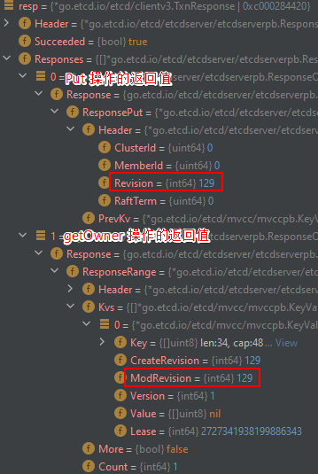

```yaml lw-blog-meta
title: "etcd入门教程 与 分布式理论"
date: "2021-01-16"
brev: "以分布式锁为例子，简单分析一下etcd的用法和原理。"
tags: ["中间件","技术分享会"]
```

## 前言

这个话题呢，起源于“分布式锁”的选择。我猜对大部分中小公司来说，用Redis来实现锁应该是最常见的选择了吧。

但是业界还有更专业的组件可以做，主流的选择有`Zookeeper`和`etcd`，还有个名字听起来就很奇怪的`consul` 。关于他们三者之间的比较，可以参考etcd官方文档中的[一篇文章](https://etcd.io/docs/v3.3.12/learning/why/) 。虽然可能带有主观色彩，但是简而言之就是——选`etcd`就对了。

`etcd`这个名字的来源，是`etc` + `d`，意思是「配置文件」+「分布式」。读音就按字母读“ETCD”就行，或者标准一点读“et-cee-dee”（“哎特CD”）。

欣赏一下 etcd 对自己的描述：

etcd is a strongly consistent, distributed key-value store that provides a reliable way to store data that needs to be accessed by a distributed system or cluster of machines.

翻译：etcd是一个强一致性的分布式KV储存服务，它提供了一种可靠的方式来储存那些需要被一个分布式系统或者机器集群所访问的数据。

要强调的是，etcd这类组件的用处并不局限于锁。它的本质是KV储存服务。

> 本文中用到的Demo代码可以在 [我的Github](https://github.com/Saodd/learn-etcd) 上找到。

## 性能

无论是用作锁还是其他的用途，我们最关心的，除了可靠性之外当然就是性能了。

关于可靠性，k8s用的就是etcd，所以它的可靠性不必多说了吧。（虽然也有过很多严重漏洞，但是通过那些issue和PR可以发现，都是很多一线大厂的专家在debug，所以我选择相信它的品质）

关于性能，我没有找到非常严谨的性能对比的文章，我自己也暂时没有精力去做，因此暂时罗列一些文章和结论在这里供大家参考：

- [震惊！路人甲表示etcd比redis差不了多少](https://stackoverflow.com/questions/63591806/performance-difference-in-redis-vs-etcdv3)
- [etcd/zookeeper/consul对比，etcd完胜](https://coreos.com/blog/performance-of-etcd.html) （注意coreos有利益相关）

我要专门说一下etcd官方提供的 [etcd v3 performance benchmarking](https://github.com/etcd-io/etcd/blob/master/Documentation/op-guide/performance.md#benchmarks) 。它在一个比较典型的硬件场景下（3台8c16g），跑出了最高50k的写入和185k的读取QPS 。这个成绩，对于绝大多数项目来说，哪怕就是当作缓存用也是足够的。

最后还有一点看起来无关紧要但其实对于技术选型来说还挺重要的一点：前途。

etcd是k8s的关键部件、是Go语言写的、是CNCF支持的成熟项目之一。就请问在这个领域还有比它更根正苗红的开源组件吗？

> 意外发现：在查阅`CoreOS`以及背后的`rkt`的相关资料时，居然牵扯出容器生态之间的恩怨情仇……

## CAP理论

到这里会很疑惑，为什么Redis性能可以这么高，为什么后起之秀etcd都比不上Redis的性能，它们之间的关键区别是什么？

以及，我们做分布式开发，经常提到什么可用性，一致性之类的词语，如果只是零散地去学习的话，总会有一种雾里看花的感觉。那么，有没有一个比较权威的一统理论，把这些概念串联起来？

它就是 CAP理论。即 Consistency 一致性， Availability 可用性， Partition Tolerance分区容错性。

参考阅读：

- 理论解读：[谈谈分布式系统的CAP理论 - 崔同学](https://zhuanlan.zhihu.com/p/33999708)
- 结合一致性协议的解读：[从CAP理论到分布式一致性协议 - 林林林](https://zhuanlan.zhihu.com/p/152105666)
- 结合分布式锁概念的解读：[分布式锁实现的最全要点 - 林林林](https://zhuanlan.zhihu.com/p/152240168)

简而言之：C、A、P在理论上是不能同时成立的；我们在实践中一般会保证`P`，然后在`A`和`C`之间选择一个，也就是`AP`和`CP`之间的选择。

举个例子。假如我们现在有3个机器 A、B、C 组成的一个分布式储存系统。某客户端向A写入一个值，此时：

- 如果 A 向 B、C 发送同步请求，并且得到确认，再通知客户端写入成功。此时保证了`（强）一致性C`，但是如果B、C宕机，A的写入就失败了，此时**没有**保证`可用性A`。
- 如果 A 不管 B、C，直接通知客户端写入成功，事后再异步地通知 B、C 进行同步。此时有`可用性A`但是失去了`一致性C`，因为B、C的数据可能会跟A不同。

显然，第二种方案`AP`的性能更高。而Redis的主从模式正是采用了AP模型。第一种方案`CP`更可靠，etcd正是采用了AC模型。所以，Redis 和 etcd 完全是两种不同的东西。

### RedLock

对了，如果你对后端分布式锁的机制不太熟悉的话，建议先看看Redis官方的这篇文章：[Distributed locks with Redis](https://redis.io/topics/distlock)

在Redis的文章中，提到了一个叫`RedLock`的概念。简而言之就是在**客户端**自己实现一致性的保障。具体做法其实就是在多个Redis实例上注册同一把锁。

这显然，非常 errprone 。而且，这把 C 捡起来，却又丢了 A ，有意义吗？

专业的事情就应该交给专业的组件去做。

> 你看，没学CAP理论之前我敢怒不敢言，现在有了理论武器，我可以把我的反(chao)对(feng)意见漂亮地表达出来了。我可真犇~

### 最终一致性

暂时性地失去C，在工程上有时也是可以容忍的，只要通过幂等操作来保证`最终一致性`就好，所以Redis锁在业务上也不是不可以用。这个不展开讨论。

## 基本运维 与 RAFT算法

### 第一个实例

[etcd官方仓库](https://github.com/etcd-io/etcd) 既包含了 etcd 本体，也包含了 go-sdk. 

```shell
docker pull gcr.io/etcd-development/etcd
```

下载速度很快。我大Go语言就是先进（

我们先简单地启动一个容器试一试。[官方教程](https://github.com/etcd-io/etcd/releases) 给出的参数很多，我稍微精简一下：

```shell
docker run --name etcd1 -p 12379:2379 -p 12380:2380 -v etcd1:/data \
    -dit gcr.io/etcd-development/etcd \
    /usr/local/bin/etcd \
    --name etcd1 \
    --data-dir /data \
    --listen-client-urls http://0.0.0.0:2379 \
    --advertise-client-urls http://10.0.6.239:12379 \
    --listen-peer-urls http://0.0.0.0:2380 \
    --initial-advertise-peer-urls http://10.0.6.239:12380 \
    --initial-cluster etcd1=http://10.0.6.239:12380,etcd2=http://10.0.6.239:22380,etcd3=http://10.0.6.239:32380 \
    --initial-cluster-token tkn
```

上述参数的意思在 [官方文档](https://etcd.io/docs/v3.4.0/op-guide/configuration/) 中都能找到，我简单解释一下：

- `name`：本实例的名字，很重要，在集群中通讯时要用到。
- `listen-client-urls`：本实例监听的API地址
- `advertise-client-urls`：告诉别人的、本实例API地址（`10.0.6.239`是我宿主机IP）
- `listen-peer-urls`：本实例监听的集群通讯地址
- `advertise-client-urls`：告诉别人的、本实例的集群通讯地址（`10.0.6.239`是我宿主机IP）
- `initial-cluster`：初始的集群列表，必须包含自己。这里把两个还未启动的实例先列举在这里了。
- 记得要挂载volume并且指定`data-dir`，因为一个member一旦注册到cluster中，就会有一个哈希值存放在`data-dir`里；下次重启的时候必须要使用上次相同的哈希值才能重新回到cluster中去。（否则你要手动把某个member从cluster中踢出去，才能让新的实例以这个member的身份加入cluster）

此时观察这个容器的日志，会发现它在不断地尝试联系 etcd2 和 etcd3 这两个实例。

### 三个实例组成集群

然后我们接下来启动第二个实例，注意启动参数需要一些调整。

```shell
docker run --name etcd2 -p 22379:2379 -p 22380:2380 -v etcd2:/data \
    -dit gcr.io/etcd-development/etcd \
    /usr/local/bin/etcd \
    --name etcd2 \
    --data-dir /data \
    --listen-client-urls http://0.0.0.0:2379 \
    --advertise-client-urls http://10.0.6.239:22379 \
    --listen-peer-urls http://0.0.0.0:2380 \
    --initial-advertise-peer-urls http://10.0.6.239:22380 \
    --initial-cluster etcd1=http://10.0.6.239:12380,etcd2=http://10.0.6.239:22380,etcd3=http://10.0.6.239:32380 \
    --initial-cluster-token tkn
```

此时我们可以在第2个实例的日志中看到成功与第1个实例建立了联系，并且它们经过投票，选择了 etcd1 作为 `leader`:

```shell
$ docker logs -f etcd1
......
2021-01-16 09:33:00.031255 I | rafthttp: peer bf8c80817fa0eff1 became active
2021-01-16 09:33:00.031305 I | rafthttp: established a TCP streaming connection with peer bf8c80817fa0eff1 (stream MsgApp v2 writer)
2021-01-16 09:33:00.031433 I | rafthttp: established a TCP streaming connection with peer bf8c80817fa0eff1 (stream Message writer)
2021-01-16 09:33:00.207902 I | rafthttp: established a TCP streaming connection with peer bf8c80817fa0eff1 (stream Message reader)
2021-01-16 09:33:00.208041 I | rafthttp: established a TCP streaming connection with peer bf8c80817fa0eff1 (stream MsgApp v2 reader)
2021-01-16 09:33:00.555040 I | raft: fa5e59193de34069 is starting a new election at term 62
2021-01-16 09:33:00.555133 I | raft: fa5e59193de34069 became candidate at term 63
2021-01-16 09:33:00.555181 I | raft: fa5e59193de34069 received MsgVoteResp from fa5e59193de34069 at term 63
2021-01-16 09:33:00.555231 I | raft: fa5e59193de34069 [logterm: 1, index: 3] sent MsgVote request to 76a83c0acb501c47 at term 63
2021-01-16 09:33:00.555275 I | raft: fa5e59193de34069 [logterm: 1, index: 3] sent MsgVote request to bf8c80817fa0eff1 at term 63
2021-01-16 09:33:00.565051 I | raft: fa5e59193de34069 received MsgVoteResp from bf8c80817fa0eff1 at term 63
2021-01-16 09:33:00.565114 I | raft: fa5e59193de34069 [quorum:2] has received 2 MsgVoteResp votes and 0 vote rejections
2021-01-16 09:33:00.565183 I | raft: fa5e59193de34069 became leader at term 63
2021-01-16 09:33:00.565213 I | raft: raft.node: fa5e59193de34069 elected leader fa5e59193de34069 at term 63
```

```shell
$ docker logs -f etcd2
......
2021-01-16 09:33:00.031794 I | rafthttp: peer fa5e59193de34069 became active
2021-01-16 09:33:00.031876 I | rafthttp: established a TCP streaming connection with peer fa5e59193de34069 (stream MsgApp v2 reader)
2021-01-16 09:33:00.035095 I | rafthttp: established a TCP streaming connection with peer fa5e59193de34069 (stream Message reader)
2021-01-16 09:33:00.207722 I | rafthttp: established a TCP streaming connection with peer fa5e59193de34069 (stream Message writer)
2021-01-16 09:33:00.208014 I | rafthttp: established a TCP streaming connection with peer fa5e59193de34069 (stream MsgApp v2 writer)
2021-01-16 09:33:00.561159 I | raft: bf8c80817fa0eff1 [term: 1] received a MsgVote message with higher term from fa5e59193de34069 [term: 63]
2021-01-16 09:33:00.561218 I | raft: bf8c80817fa0eff1 became follower at term 63
2021-01-16 09:33:00.561309 I | raft: bf8c80817fa0eff1 [logterm: 1, index: 3, vote: 0] cast MsgVote for fa5e59193de34069 [logterm: 1, index: 3] at term 63
2021-01-16 09:33:00.565883 I | raft: raft.node: bf8c80817fa0eff1 elected leader fa5e59193de34069 at term 63
```

在上述日志中，etcd1 的代号是 `fa5e59193de34069`, etcd2 的代号是 `bf8c80817fa0eff1`。

我们来尝试从日志中还原它们的选举经过：

- etcd1 先上线，此时cluster中群龙无首，于是它尝试举行选举。
- 但是没人给它投票，它只能不断地重复尝试。选举的过程会有一个计数器叫`term`不断递增。
- 在 etcd1 计数器达到`62`的时候，已经与 etcd2 建立了连接。此时它作为候选人，给集群中所有人包括自己发送竞选请求`MsgVote request`。
    - etcd1 收到了自己的竞选请求，同意自己，于是给候选人（也就是自己）发送一条竞选响应`MsgVoteResp`
    - etcd2 收到了关于 etc1 的竞选请求，发现他的term=63比自己的term=1更大，于是同意这个请求，于是给候选人（etcd1）发送一条竞选响应`MsgVoteResp`，并且把自己的选择广播出去。
    - etcd1 作为候选人，在“etcd1竞选”上收到2票同意票、0票反对票，因此 etcd1 当选成为`leader`。
    
好了，选举结束，但是此时名单中还有一个 etcd3 同学缺席呢。我们修改上面的启动参数，让 etcd3 上线：

```shell
docker run --name etcd3 -p 32379:2379 -p 32380:2380 -v etcd3:/data\
    -dit gcr.io/etcd-development/etcd \
    /usr/local/bin/etcd \
    --name etcd3 \
    --data-dir /data \
    --listen-client-urls http://0.0.0.0:2379 \
    --advertise-client-urls http://10.0.6.239:32379 \
    --listen-peer-urls http://0.0.0.0:2380 \
    --initial-advertise-peer-urls http://10.0.6.239:32380 \
    --initial-cluster etcd1=http://10.0.6.239:12380,etcd2=http://10.0.6.239:22380,etcd3=http://10.0.6.239:32380 \
    --initial-cluster-token tkn \
    --initial-cluster-state new
```

观察它的日志，etcd3 在收到来自 The·Leader - etcd1 的心跳之后，自觉地选择了服从，并且广播自己的选择以示尊敬（这措辞好像不对……

```shell
$ docker logs -f etcd2
......
2021-01-16 09:57:14.728653 I | raft: 76a83c0acb501c47 [term: 1] received a MsgHeartbeat message with higher term from fa5e59193de34069 [term: 63]
2021-01-16 09:57:14.728712 I | raft: 76a83c0acb501c47 became follower at term 63
2021-01-16 09:57:14.728764 I | raft: raft.node: 76a83c0acb501c47 elected leader fa5e59193de34069 at term 63
```

> 此时一个有趣的现象是当集群全部上线后会出现： etcdserver: updating the cluster version from 3.0 to 3.3

### 下线一个实例

既然说到选举，那就多观察一下吧。我们把现在的Leader: etcd1 干掉。然后会观察到 etcd2 主动成为候选人，然后发起投票，然后 etcd2 当选成为新的Leader：

```text
2021-01-16 10:01:55.705499 W | rafthttp: lost the TCP streaming connection with peer fa5e59193de34069 (stream Message reader)
2021-01-16 10:01:55.705586 E | rafthttp: failed to read fa5e59193de34069 on stream Message (unexpected EOF)
2021-01-16 10:01:55.705600 I | rafthttp: peer fa5e59193de34069 became inactive (message send to peer failed)
2021-01-16 10:01:55.705761 W | rafthttp: lost the TCP streaming connection with peer fa5e59193de34069 (stream MsgApp v2 reader)
2021-01-16 10:01:57.177841 I | raft: bf8c80817fa0eff1 is starting a new election at term 63
2021-01-16 10:01:57.177985 I | raft: bf8c80817fa0eff1 became candidate at term 64
2021-01-16 10:01:57.178072 I | raft: bf8c80817fa0eff1 received MsgVoteResp from bf8c80817fa0eff1 at term 64
2021-01-16 10:01:57.178130 I | raft: bf8c80817fa0eff1 [logterm: 63, index: 9] sent MsgVote request to fa5e59193de34069 at term 64
2021-01-16 10:01:57.178160 I | raft: bf8c80817fa0eff1 [logterm: 63, index: 9] sent MsgVote request to 76a83c0acb501c47 at term 64
2021-01-16 10:01:57.178208 I | raft: raft.node: bf8c80817fa0eff1 lost leader fa5e59193de34069 at term 64
2021-01-16 10:01:57.187735 I | raft: bf8c80817fa0eff1 received MsgVoteResp from 76a83c0acb501c47 at term 64
2021-01-16 10:01:57.187804 I | raft: bf8c80817fa0eff1 [quorum:2] has received 2 MsgVoteResp votes and 0 vote rejections
2021-01-16 10:01:57.187887 I | raft: bf8c80817fa0eff1 became leader at term 64
2021-01-16 10:01:57.187953 I | raft: raft.node: bf8c80817fa0eff1 elected leader bf8c80817fa0eff1 at term 64
```

### 更多RAFT

上述选举流程，只是我个人根据日志反推的。 更多关于 RAFT 的详细讲解，请参考：

- [RAFT官方页面](https://raft.github.io/)
- [wiki](https://en.wikipedia.org/wiki/Raft_(algorithm))
- [一文搞懂Raft算法 - xybaby](https://www.cnblogs.com/xybaby/p/10124083.html)

### 基本操作

此时我们进入任意一个容器，用`etcdctl`查看一下运行状况：

```shell
docker exec -it etcd1 etcdctl member list
5aaaa22bc3f9a5d9: name=etcd1 peerURLs=http://10.0.6.239:12380 clientURLs=http://10.0.6.239:12379 isLeader=true
76a83c0acb501c47: name=etcd3 peerURLs=http://10.0.6.239:32380 clientURLs=http://10.0.6.239:32379 isLeader=false
bf8c80817fa0eff1: name=etcd2 peerURLs=http://10.0.6.239:22380 clientURLs=http://10.0.6.239:22379 isLeader=false
```

试着从一个实例中设置一个值，然后从另一个实例中取出：

```shell
$ docker exec -it etcd3 etcdctl set some_key some_value
some_value
$ docker exec -it etcd1 etcdctl get some_key
some_value
$ docker exec -it etcd2 etcdctl rm some_key
PrevNode.Value: some_value
$ docker exec -it etcd1 etcdctl get some_key
Error:  100: Key not found (/some_key) [20]
```

注意这里有个巨坑，在官方的release下面的Demo中写的`put`是`v3`的API！！而`v2`的API是`set`！！

这官方镜像里的`etcdctl`居然默认用`v2`版本的API你敢信？？而且`v2`设置的key-value，跟`v3`是在不同的空间的，你敢信？？（虽然好像有道理，但是我感觉不能原谅:(

```shell
$ ETCDCTL_API=3 etcdctl get some_key
some_key
some_value2

$ etcdctl get some_key
aa
```

所以我们接下来要主动设定一个环境变量，或者在使用SDK时只用同一个版本的。

## Go SDK

```shell
go get go.etcd.io/etcd/clientv3@release-3.4
```

> 注意，在[Client官方文档](https://github.com/etcd-io/etcd/tree/master/client/v3) 中写的安装命令是错的，最后在[issue-12484](https://github.com/etcd-io/etcd/issues/12484#issuecomment-740192667) 中找到上述临时解决方案。

虽然它的文档做的实在是漏洞百出，但是基本的Demo还是有的，我们直接去release的源码里去找Demo，例如 [release-3.4/clientv3](https://github.com/etcd-io/etcd/tree/release-3.4/clientv3)

### Key-Value 用法示例

- [example_kv_test](https://github.com/etcd-io/etcd/blob/release-3.4/clientv3/example_kv_test.go)
  
抄一段最简单的例子吧：

```go
func main() {
    cli, err := clientv3.New(clientv3.Config{
        Endpoints:   []string{"10.0.6.239:12379", "10.0.6.239:22379", "10.0.6.239:32379"},
        DialTimeout: 2 * time.Second,
    })
    if err != nil {
        log.Fatal(err)
    }
    defer cli.Close()

    // 设一个值
    _, err = cli.Put(context.TODO(), "some_key", "some_value_20210116")
    if err != nil {
        log.Fatal(err)
    }

    // 取一个值
    resp, err := cli.Get(context.Background(), "some_key")
    if err != nil {
        log.Fatal(err)
    }
    for _, ev := range resp.Kvs {
        fmt.Printf("%s : %s\n", ev.Key, ev.Value)
    }
    // 输出: some_key : some_value_20210116
}
```

这里比较反直觉的是，Get 命令居然返回的是一个列表。原因是etcd并没有单独的Get接口，它只有一个叫`Range`的接口，因为可以提供很多选项并且进行前缀查询，所以才返回一个`repeated`类型。

### lease 用法示例

- [example_lease_test](https://github.com/etcd-io/etcd/blob/release-3.4/clientv3/example_lease_test.go)

### lock 用法示例

```go
func main() {
    // cli := ...

    session, _ := concurrency.NewSession(cli)
    defer session.Close()

    lk := concurrency.NewMutex(session, "/locked/resource/1")

    fmt.Println("排队取锁")
    ctx, _ := context.WithTimeout(context.Background(), 3*time.Second)
    if err := lk.Lock(ctx); err != nil {
        log.Fatal(err)
    }
    fmt.Println("带锁工作ing……")
    time.Sleep(10 * time.Second)
    if err := lk.Unlock(context.Background()); err != nil {
        log.Fatal(err)
    }
    fmt.Println("释放锁")
}
```

## Go SDK Lock源码剖析

### 准备：基本概念

鸣谢： [基于 etcd 实现分布式锁 - 徐亚松](https://segmentfault.com/a/1190000021603215)  。我在阅读`clientv3`源码时，一开始对很多概念不了解，导致源码也无法理解。在参考这篇文章后有了大体的思路，再结合源码去理解就很容易了。

所以先解释几个概念：

- `Lease 租约`：可以理解为是Redis中的带过期时间的键，或者理解为是一种 session 。在etcd中，可以给一个KV绑定一个Lease，当Lease到期时KV也被删除。Lease可以续期（KeepAlive）。
- `Revision 版本号`：重要！每个KV都有一个全局唯一的版本号！etcd的每次**事务**都会让版本号+1 。
- `Prefix 前缀`：可以把前缀当目录用。get一个前缀的时候，可以取出下面的所有子键。

我们用前面的 Golang代码 来获取、释放锁，然后用`etcdctl`观察一下对应的 KV 的情况：

```shell
# 1. 获取锁之前，revision==114，没有子键
$ etcdctl get /locks/resource/1 --prefix -w json
{"header":{"cluster_id":9946116703747541375,"member_id":6533212518309537241,"revision":114,"raft_term":278}}

# 2. 执行Golang代码，获取锁并占住，此时revision==115了，并且增加了一个新的key
$ etcdctl get /locks/resource/1 --prefix -w json
{
    "header":{"cluster_id":9946116703747541375,"member_id":6533212518309537241,"revision":115,"raft_term":278},
    "kvs":[{"key":"L2xvY2tzL3Jlc291cmNlLzEvMjVkOTc3MGFlZjZkZjlmMg==","create_revision":115,"mod_revision":115,"version":1,"lease":2727341938199886322}],
    "count":1
}
$ etcdctl get /locks/resource/1 --prefix
/locks/resource/1/25d9770aef6df9f2

# 3. 此时还可以观察到有一个lease被创建了，并且与上面那个KV中的lease对应
$ etcdctl lease list
found 1 leases
25d9770aef6df9f2

# 4. Golang代码把锁释放了，此时revision==116了，并且子键被删除
$ etcdctl get /locks/resource/1 --prefix -w json
{"header":{"cluster_id":9946116703747541375,"member_id":6533212518309537241,"revision":116,"raft_term":278}}
```

### 步骤一：创建租约

根据上面的介绍，Lease 是有过期时间的，并且是用来绑定在KV上的。那么在SDK中是如何实现的呢：

```go
func main() {
    // ...
    session, _ := concurrency.NewSession(cli)
    defer session.Close()
    // ...
}
```

就是上面这两行代码，在SDK中，把Lease转化为了session的概念，更接近传统数据库的术语，也许让人更好理解吧（并不）。

session的工作很简单，创建时获取一个租约并且维持，结束时释放租约。

```go
// 下面代码经过简化
func NewSession(client *v3.Client, opts ...SessionOption) (*Session, error) {
    // Grant 获取租约
    resp, _ := client.Grant(ops.ctx, int64(ops.ttl))
    id = resp.ID

    // 启动一个Go程不断地续约
    keepAlive, _ := client.KeepAlive(ctx, id)
    go func() {
        for range keepAlive {  // 它是一个 <-chan
        }
    }()

    return s, nil
}
```

### 步骤二：获取锁

这个锁呢，实质上是一个 `key="{prefix}{UUID}" value=""` 的一个键值对罢了，例如第一个客户端创建`/locks/resource/1/UUID1`，第二个客户端创建`/locks/resource/1/UUID2`。

我们依然用上面的Golang获取锁的代码来看一下，这次我们同时启动两个示例来抢这把锁：

```shell
# 此时一个进程获取到锁，另一个进程在等待
$ etcdctl get /locks/resource/1 --prefix -w json
{
    "header":{"cluster_id":9946116703747541375,"member_id":6533212518309537241,"revision":118,"raft_term":278},
    "kvs":[
        {"key":"L2xvY2tzL3Jlc291cmNlLzEvMjVkOTc3MGFlZjZkZjlmOA==","create_revision":118,"mod_revision":118,"version":1,"lease":2727341938199886328},
        {"key":"L2xvY2tzL3Jlc291cmNlLzEvNmZmMTc3MGFmMTA1ZDg1MQ==","create_revision":117,"mod_revision":117,"version":1,"lease":8066359296474339409}
    ],
    "count":2
}
```

在上面的状态下，`/locks/resource/1`这个前缀下面有两个子键，它们分别是两个Golang进程对应的“锁”（并且分别对应着不同的Lease）。

它们最关键的区别是`create_revision`不同。因此每次要获取锁的流程：

1. 申请Lease
2. 用Lease创建一个KV
3. 检查"我"创建的KV是否是**当前前缀下最小的revision**
4. 如果是，则说明"我"拿到了锁，可以执行被锁住的代码了；
5. 如果不是，则表明锁在"别人"那里，那就watch "前面一个人的"KV

提醒：在下面的代码中，`Op`代表一次"数据库操作"，`Txn`代表一个"事务"。一个`Txn`可以装进很多`Op`来形成原子性操作。（从下面代码也可以看出，etcd的事务具有足够的自定义能力和表达能力，而且与Redis+lua相比有更好的原生支持）

```go
// 下面代码经过简化
func (m *Mutex) Lock(ctx context.Context) error {
    // 1. 此时session已经申请了租约，用租约ID作为UUID拼接一个key
    m.myKey = fmt.Sprintf("%s%x", m.pfx, s.Lease())
    
    // 2. 制作一系列的Op作为事务提交
    // 2.1 检查自己的UUID之前有没有用过
    cmp := v3.Compare(v3.CreateRevision(m.myKey), "=", 0)
    // 2.2 正常情况是没有用过的，那就put创建这个KV
    put := v3.OpPut(m.myKey, "", v3.WithLease(s.Lease()))
    // 2.3 如果创建过，就取回来
    get := v3.OpGet(m.myKey)
    // 2.4 检查当前**前缀**下的revision最小的那个KV
    getOwner := v3.OpGet(m.pfx, v3.WithFirstCreate()...)
    // 2.5 组装事务并提交
    resp, _ := client.Txn(ctx).If(cmp).Then(put, getOwner).Else(get, getOwner).Commit()
    
    // 3. 检查revision
    // 3.1 如果我就是最小的，那说明我拿到了锁，返回
    ownerKey := resp.Responses[1].GetResponseRange().Kvs
    if len(ownerKey) == 0 || ownerKey[0].CreateRevision == resp.Header.Revision {
        return nil
    }
    // 3.2 如果我不是最小的，那就阻塞监听等待我上一个revision删除的事件（上一个删除了说明轮到我了）
    hdr, _ := waitDeletes(ctx, client, m.pfx, m.myRev-1)

    return werr
}
```



这样梳理之后，是不是很简单？

那么总结一下etcd的实现与Redis+lua的实现有什么异同点？

- 都用了一个UUID来证明是自己。
- 都用了一个带有过期时间的KV。
- etcd的事务，与Redis的lua脚本是相似的。
- etcd可以watch等待回调，并且无缝衔接；而不用像Redis一样傻傻地轮询。
- etcd中所有竞争者都注册了，也就是可以知道其他竞争者的情况；Redis不行。

所以，虽然为了一致性而牺牲了性能，但是显而易见etcd的功能比Redis强大太多。前者是一个吸取了众多经验教训的现代化服务治理组件，而后者是一个单纯的缓存组件。

### 步骤三：释放锁

```go
func (m *Mutex) Unlock(ctx context.Context) error {
    client := m.s.Client()
    if _, err := client.Delete(ctx, m.myKey); err != nil {
        return err
    }
    m.myKey = "\x00"
    m.myRev = -1
    return nil
}
```

太简单了，一个Delete命令删除自己的KV就可以了。

### 步骤四：释放租约

```go
// 下面代码经过简化
func (s *Session) Close() error {
    // Revoke 释放租约
    _, err := s.client.Revoke(ctx, s.id)
    return err
}
```

太简单了，一个Revoke命令就搞定了。

## Python SDK

项目地址 [kragniz/python-etcd3](https://github.com/kragniz/python-etcd3)

```python
import etcd3
import time

if __name__ == '__main__':
    client = etcd3.client(host="10.0.6.239", port=12379)
    v, _ = client.get("some_key")
    print(v)  # b'some_value_20210116'

    with client.lock("resource/1") as lock:
        print(lock.key)
        time.sleep(10)
```

这里面有坑：

- 只能指定一个server
- 会给key加一个前缀"/locks/"，不可修改。
- 不给key加UUID后缀，而是把UUID作为value存进去。
- KeepAlive 的逻辑我没看，但我估计够呛，恐怕实现不了。
- 没有静态类型，太难写了，难道要对着gRPC来撸吗？

简而言之：「大人，时代变了。」

## gRPC 直连

etcdv3 最为强大的另一个优势是，它通过 gRPC 来提供服务。这不仅仅提升了性能，同时也保证了跨语言的兼容性。

下面我来直接使用 gRPC 裸连 etcd cluster，做一个查询操作：

```go
package main

import (
    "context"
    pb "go.etcd.io/etcd/etcdserver/etcdserverpb"
    "google.golang.org/grpc"
    "log"
    "time"
)

func main() {
    conn, err := grpc.Dial("10.0.6.239:12379", grpc.WithInsecure())
    if err != nil {
        log.Fatal("连接失败: ", err)
    }
    defer conn.Close()

    client := pb.NewKVClient(conn)
    req := &pb.RangeRequest{
        Key: []byte("some_key"),
    }
    ctx, _ := context.WithTimeout(context.Background(), time.Second*2)
    resp, err := client.Range(ctx, req)
    if err != nil {
        log.Fatalln(err)
    }
    for _, kv := range resp.Kvs {
        log.Println(string(kv.Key), string(kv.Value))
    }
}

// 输出:
// 2021/01/17 19:07:16 some_key some_value_20210116
```

我写这段代码大概用了3分钟，并且一次性调通。静态语言的优势完全体现，对着proto文件、跟着IDE提示 瞎几把写，就能写出正确的代码，再也不用求爷爷(Google)告奶奶(Stackoverflow)了！

## 服务注册与发现

除了锁之外，当然也可以做这类事情。

我大概想象了一下，无非就是利用Lease机制，当一个服务上线时去拿一个Lease然后Put一个KV，然后一直KeepAlive呗。抛砖引玉，我想象中的机制应该是：

+ 服务上线时，把自己注册到某个KV服务中
  - 注册是有时效的，在etcd中可以通过Lease实现
  - 服务自己不断地KeepAlive
+ 客户端从KV服务中获取可用的服务端列表
  - 在etcd中可以通过前缀查询来实现
  - 客户端可以同时连接多个服务端，用RoundRobin等方式（负载均衡）提高可用性
+ 服务下线时，主动把自己在KV服务中的注册信息清除
  - 意外下线（宕机），注册信息可能还会残留一个Lease的时间，到期自动清除
  - 可以有专门的HealthCheck服务去缩短这个残留时间

去Google简单了解了一下，再想想，感觉好像也没有两句话那么简单。

今天写累了，下周再说吧（咕咕咕），散会。

## 附录：推荐阅读

- [在微服务架构中是否可用 redis 代替 etcd? - v2ex](https://www.v2ex.com/t/520367)
- [Etcd 最佳实（踩）践（坑） - pandaychen](https://pandaychen.github.io/2019/10/20/ETCD-BEST-PRACTISE/)
- [三年之久的 etcd3 数据不一致 bug 分析 - 王超凡](https://mp.weixin.qq.com/s/VJi1jzTK2G7bH1pi4ND7Yw)

## 总结

整整两天的学习成果就是这么一篇文章了。收获很大很大。

首先是 CAP理论，让我对分布式系统有了新的更清晰的认识。

然后对我触动最大的是上面参考文章的最后一篇，大佬们在对etcd进行debug的时候，动不动就改源码自己定制，这是该夸大佬们艺高人胆大呢，还是该夸Go语言大道至简好读好写呢？反正我试着在脑海里把etcd换成了Redis想象了一下……嗯，我还是写我的Go吧 :)

最后还是要吐槽一下。etcd的文档真的太不健全了，刚开始的时候连Demo都跑不起来，真的很令人暴躁。我就觉得吧，整个微服务体系，k8s, protobuf, grpc, etcd 它们的文档以及各种下载资源都有各种各样的问题，真的好难折腾。只能安慰自己，这已经是现在互联网领域最先进的技术了，在我接下来的学习过程中，缺少文档恐怕将会是常态。要冷静、冷静、冷静……
