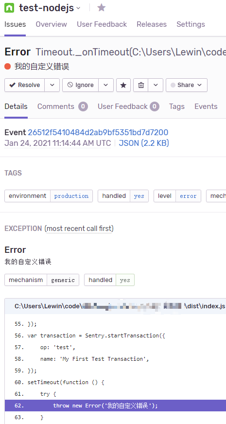

```yaml lw-blog-meta
title: "Sentry入门"
date: "2021-01-24"
brev: "老三样：基本运维、Go-SDK源码剖析、Node-SDK使用体验。"
tags: ["中间件"]
```

## 简介

[Sentry](https://sentry.io) 称自己为： Application Monitoring and Error Tracking Software, 即「应用监控和错误追踪软件」。

它的最常用用法，就是在我们的程序发生异常时，把日志和一些堆栈变量推送到它这个平台上去。然后，它收集了错误之后可以做很多事情，比如分类、搜索、标签、报警等等。

除了这种”高级版日志收集功能“之外，它似乎还支持一些其他辅助性的功能，比如用户反馈收集等（我记得有），这些不详细展开，今天只讲日志和堆栈收集。

至于技术，它采用的是Python的技术栈。（之前我们自建的Sentry被打爆过，队列消化非常缓慢）

不过它的Web界面真挺好看的，美工也好看，各种设计都很规范。就是用Python可惜了。

## Docker部署

在[Dockerhub - Sentry](https://hub.docker.com/_/sentry) 页面上，部署的步骤写得很详细，而且执行也比较顺利，照着来就好了，我这里姑且复述一遍：

先准备两个数据库依赖：

```shell
docker run -d --name sentry-redis redis
docker run -d --name sentry-postgres -e POSTGRES_PASSWORD=secret -e POSTGRES_USER=sentry postgres
```

然后按教程的建议，要通过它自带的密码生成工具来生成一串高强度密码来使用（不过我估计自己随便写也行）（小诀窍：为了省事，直接用文档上的`<secret-key>`字符串就可以）：

```shell
docker run --rm sentry config generate-secret-key
# 输出一串字符串
```

接着，在首次运行时，需要先初始化一下，也就是upgrade操作：

```shell
docker run -it --rm -e SENTRY_SECRET_KEY='你的密码' \
    --link sentry-postgres:postgres --link sentry-redis:redis \
    sentry upgrade
```

这个初始化需要至少好几分钟的时间，完成之后，会提示你是否需要现在建立用户？可以立即建立，不过要小心，这个命令行不支持退格等特殊输入，不小心打错了的话那就像我一样重新执行`createuser`命令吧。

（话说这里创建用户还报错了，然后整个流程重新来了一遍。我眼睁睁看着这Python只用1个cpu运行，实在是，用一个字形容：相当难受。）

然后启动Sentry本体服务，它的web端口是`9000`，找个你喜欢的端口映射一下就好（我这里用的39000）：

```shell
docker run --name my-sentry -e SENTRY_SECRET_KEY='你的密码' \
     --link sentry-redis:redis --link sentry-postgres:postgres \
     -p 39000:9000 -d sentry
```

接着通过浏览器访问，然后用刚才createuser创建的用户登录，完成！

哦不，好像还要启动celery来着，一个`beat`一个`worker`：

```shell
docker run -d --name sentry-cron -e SENTRY_SECRET_KEY='你的密码' \
    --link sentry-postgres:postgres --link sentry-redis:redis \
    sentry run cron
    
docker run -d --name sentry-worker-1 -e SENTRY_SECRET_KEY='你的密码' \
    --link sentry-postgres:postgres --link sentry-redis:redis \
    sentry run worker
```

稍等一会儿，再回到Web页面，最顶部那个提示你没有启动worker的信息条消失了，看起来一切顺利。

一套容器启动下来，总内存占用大概700MB 。

## Go SDK 源码简析 与 手动发送消息

我们简单看一下 Go SDK 的源码，它的仓库在：

```shell
$ go get github.com/getsentry/sentry-go
```

基本用法：

```go
func someFunction() {
    sentry.Init(sentry.ClientOptions{
		Dsn: "https://马赛克A@马赛克B.ingest.sentry.io/马赛克C",
	})
    sentry.CaptureException(errors.New("某个错误"))
}
```

只要简简单单的一条`CaptureException`
，就能把一份11.3KB大小的错误追踪信息发到Sentry上去，不得不说，这真是挺方便的。但是对我来说好像太重了一点，简单地看了一下，有很多信息都是无用的，因此我决定研究一下它的消息格式。

我们这里只看消息是如何发送的，而暂时不看它是如何收集Go的堆栈信息的。

`sentry-go`这个库里，有一个类叫做`Client`，它保存着所有的配置信息（类似于`http.Client`）。当我们"CaptureException"的时候，就是通过Client来发送请求。它的默认配置是走 HTTP
协议，我在源码中追踪了几层，发现它在底层用的也是`http.POST`。大致逻辑如下：

```go
func CaptureException(err error){
    event := client.eventFromException(err, LevelError)

    body, _ := json.Marshal(event)
    
    request, _ := http.NewRequest(
        http.MethodPost,
        dsn.StoreAPIURL().String(),
        bytes.NewBuffer(body),
    )
    
    request.Header.Set(headerKey, headerValue)
    
    queue <- request
}

func worker() {
    for request := range queue {
        client.Do(request)
    }
}
```

总结一下，我们调用时传入一个`error`，然后sdk会负责填充其他的信息组成一个`event`，然后把它序列化为json之后POST到我们指定的Sentry项目中。

先看下它的认证机制：

```go
func (dsn Dsn) RequestHeaders() map[string]string {
	auth := fmt.Sprintf("Sentry sentry_version=%s, sentry_timestamp=%d, "+
		"sentry_client=sentry.go/%s, sentry_key=%s", apiVersion, time.Now().Unix(), Version, dsn.publicKey)
	return map[string]string{
		"Content-Type":  "application/json",
		"X-Sentry-Auth": auth,
	}
}
```

哦，原来是在`X-Sentry-Auth`这个自定义的Header里塞了逗号分隔的一串东西啊。这个`dsn`对象是由Sentry提供的那个URL构造出来的，我们看下它是怎么构造的：

```go
type Dsn struct {
	scheme    scheme
	publicKey string
	secretKey string
	host      string
	port      int
	path      string
	projectID int
}

func NewDsn(rawURL string) (*Dsn, error) {
	parsedURL, _ := url.Parse(rawURL)  // url标准库
    publicKey := parsedURL.User.Username()
    secretKey, _ := parsedURL.User.Password()
}

func (dsn Dsn) getAPIURL(s string) *url.URL {
    // 示例值： "https://马赛克B.ingest.sentry.io/api/马赛克C/store/"
	return url.Parse("%s://%s/api/%d/%s/", dsn.scheme, dsn.host, dsn.projectID, s)
}
```

好的，认证部分搞清楚了，看看Body里面的Event这个对象放了些什么东西：

```go
type Event struct {
    // 节选
	Breadcrumbs []*Breadcrumb          `json:"breadcrumbs,omitempty"`
	Extra       map[string]interface{} `json:"extra,omitempty"`
	Level       Level                  `json:"level,omitempty"`
	Message     string                 `json:"message,omitempty"`
	Tags        map[string]string      `json:"tags,omitempty"`
	Timestamp   time.Time              `json:"timestamp"`
	Exception   []Exception            `json:"exception,omitempty"`
}
```

乖乖，好大一个结构体，上面的代码我只节选了部分我觉得我可能用得上的。但其实，除了Timestamp之外所有的属性都标记了`omitempty`，因此我可以任意选择我喜欢的东西上报上去。

然后我就可以自己造一条记录并发送了：

```go
func main() {
	event := sentry.Event{
		Extra:     map[string]interface{}{"代码版本": "37hg8w", "reqeust_id": "aui43tsdfvn"},
		Level:     "info",
		Message:   "一条自定义的消息",
		Tags:      map[string]string{"server_name": "我的mac"},
		Timestamp: time.Now(),
		Sdk: sentry.SdkInfo{
			Name:    "lewin-sdk",
			Version: "0.1.0",
		},
		Release: "v1.0.0",
		Exception: []sentry.Exception{sentry.Exception{
			Value: "ExceptionValue123",
			Type: "ExceptionType123",
			Stacktrace: &sentry.Stacktrace{Frames: []sentry.Frame{
				{
					Filename: "some1234.go",
					Function: "someFunction123",
					Lineno:   3245,
					Vars:     map[string]interface{}{"变量1": "值", "变量2": []int{1, 2, 3}},
				},
			}},
		}},
	}
	js, _ := json.Marshal(event)

	u := "https://马赛克B.ingest.sentry.io/api/马赛克C/store/"
	auth := fmt.Sprintf("Sentry sentry_key=%s", "马赛克A")

	req, _ := http.NewRequest("POST", u, bytes.NewReader(js))
	req.Header.Set("Content-Type",  "application/json")
	req.Header.Set("X-Sentry-Auth",  auth)

	resp, err := http.DefaultClient.Do(req)
	if err!= nil {
		println(err)
	} else {
		body, _ := ioutil.ReadAll(resp.Body)
		fmt.Println(string(body))
	}
}
```

这样就成功发送了一条消息！可以在Web页面中看到这条记录(Issue)。

> 小结： Sentry消息的本质，是一个 HTTP+JSON 请求。自己构造很容易。

## Node SDK 试用

按照教程写一个Demo：

```ts
import * as Sentry from '@sentry/node';

Sentry.init({
    dsn: 'http://马赛克@10.0.6.239:39000/2',
    tracesSampleRate: 1.0,
});

const transaction = Sentry.startTransaction({
    op: 'test',
    name: 'My First Test Transaction',
});

setTimeout(() => {
    try {
        throw new Error('我的自定义错误');
    } catch (e) {
        Sentry.captureException(e);
    } finally {
        transaction.finish();
    }
}, 99);
```



看起来一切顺利！

咦，怎么好像没什么好说的了，接着用就行了……？

但是现实很骨感……试用一阵子之后……好像事情并没有那么简单……

如果只是简单的`captureException`的话，有以下问题：

1. `Breadcumbs`很混乱，把很多无关的日志都带进来了；
2. 标题是调用的函数的名字，如果自己有封装的话，那就会显示你封装的函数的名字……也许是我姿势不对，还没在Node里找到像Go那样的`runtime.Caller(calldepth)`可以沿着调用栈回溯的方法。
3. typescript支持不够。目前官方文档中只说了`webpack`插件，但是我只是裸着用ts的话好像就无计可施了……

官方的Node的文档几乎就可以用「三言两语」来形容，根本解决不了我的问题。

总之，核心问题应该还是我对Node的特性掌握的还不够，还做不出很多骚操作来处理各种异常。（可当我越深入了解Node.js我越觉得难学，这门语言真的很反人类吧……）

所以目前考虑一个临时方案，放弃源代码展示（反正都没sourcemap），像Go语言那样，由我自己构建`event`发送出去：

```ts
function handleError(err: MyError) {
    console.error(err);
    Sentry.captureEvent({
        message: err.msg,
        level: Sentry.Severity.Error,
        release: Config.Version,
        extra: {...err.trace},
    });
}
```

这样很不优雅，其实就是把它当成了一个可视化的日志收集平台在用。但是像我在Go语言里的尝试一样，简单、够用，就好。我目前不想在Node的世界里陷入太深。（反正又不是不能用.jpg）
