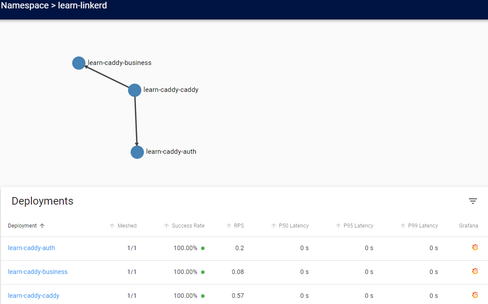
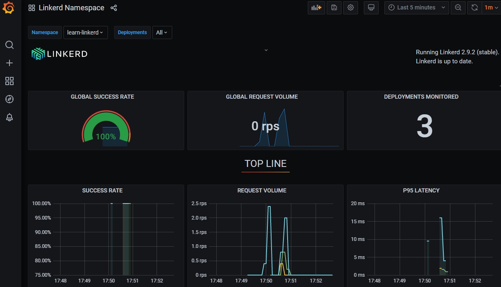

```yaml lw-blog-meta
title: 'linkerd 尝鲜日记'
date: "2021-02-07"
brev: "有k8s了当然就要玩一下 Service Mesh 了"
tags: ["DevOps","中间件"]
```

## 安装linkerd

参考： [官方教程](https://linkerd.io/2/getting-started/) 

首先检查 kubectl ，这个是废话。

然后安装CLI，执行：

```shell
curl -sL https://run.linkerd.io/install | sh
```

上面的脚本如果不放心的话，可以先下载下来看一眼（虽然大概率是看不懂或者懒得看的）。

接下来要做一个很蠢的事情，上面的脚本是将CLI安装在当前用户的HOME里面了，所以要手动export它的可执行文件……

```shell
export PATH=$PATH:$HOME/.linkerd2/bin
```

然后执行一下检查，这个也是废话，不过姑且做一下：

```shell
linkerd check --pre
```

然后就是重头戏了，向k8s集群中安装 linkerd 的服务。这里我建议不要完全照着教程做，我们先把yaml文件给弄出来，保存在一个文件里。弄出来的一个最笨的方法是：

```shell
linkerd install > linkerd-install.yaml 
```

这里面是几百行的yaml代码……然后apply：

```shell
kubectl apply -f linkerd-install.yaml 
```

这个过程大概需要一两分钟（取决于你的网速），稍作等待。可以用 `get pod -A` 等命令检查进度。

接下来暴露 DashBoard 和 Grafana 。由于我是从另一台电脑去访问这个页面，所以在暴露的时候要额外指定host：

```shell
linkerd dashboard --address 0.0.0.0
```

然后在控制台上会输出它开放的端口号，我这里是50750，所以我通过 10.0.6.239:50750 去访问，但是访问失败，因为它对host做了限制，很蠢啊。提示内容：

```text
It appears that you are trying to reach this service with a host of '10.0.6.239:8084'.
This does not match /^(localhost|127\.0\.0\.1|linkerd-web\.linkerd\.svc\.cluster\.local|linkerd-web\.linkerd\.svc|\[::1\])(:\d+)?$/ and has been denied for security reasons.
Please see https://linkerd.io/dns-rebinding for an explanation of what is happening and how to fix it.
```

解决方案，我这里直接用Chrome的 SwitchOmega 插件，将 `linkerd-web.linkerd.svc` 代理到 10.0.6.239:50750 上去，这样就可以访问了。它所谓的安全考虑，其实一点都不安全，只是给人添麻烦罢了。

顺便一提，代理之后，直接访问`linkerd-web.linkerd.svc`打开的是普通web页面，访问`/grafana`就是grafana的页面。

## 实践：给自己的服务mesh一下

这里借用昨天 [学习k8s](../2021/210206-learn-k8s.md) 时用到的一份caddy作为反向代理的 [代码](https://github.com/Saodd/learn-caddy) 继续改造一下。

由于我们今天要使用 linkerd 提供的 proxy 服务，因此我们要给3个服务分别建立 Service ，这里只贴前两个服务的配置：

```yaml
---
kind: Namespace
apiVersion: v1
metadata:
  name: learn-linkerd

# Caddy 服务
---
apiVersion: v1
kind: Service
metadata:
  name: learn-caddy-caddy
  namespace: learn-linkerd
spec:
  ports:
    - port: 80
      nodePort: 30080  # 暴露在宿主机的端口
      protocol: TCP
  selector:
    app: learn-caddy-caddy
  type: NodePort
---
apiVersion: apps/v1
kind: Deployment
metadata:
  name: learn-caddy-caddy
  namespace: learn-linkerd
spec:
  replicas: 1
  template:
    metadata:
      labels:
        app: learn-caddy-caddy
    spec:
      containers:
        - name: learn-caddy-caddy
          image: learn-caddy:caddy2
          ports:
            - containerPort: 80
  selector:
    matchLabels:
      app: learn-caddy-caddy

# 业务服务一：auth服务
---
apiVersion: v1
kind: Service
metadata:
  name: learn-caddy-auth
  namespace: learn-linkerd
spec:
  ports:
    - port: 30000
      targetPort: 30000  # 暴露在cluster内部的端口
      protocol: TCP
  selector:
    app: learn-caddy-auth
  type: ClusterIP
---
apiVersion: apps/v1
kind: Deployment
metadata:
  name: learn-caddy-auth
  namespace: learn-linkerd
spec:
  replicas: 1
  template:
    metadata:
      labels:
        app: learn-caddy-auth
    spec:
      containers:
        - name: learn-caddy-auth
          image: learn-caddy:auth
          ports:
            - containerPort: 30000
  selector:
    matchLabels:
      app: learn-caddy-auth
```

然后重新配置 caddyfile ，让它通过 Service 去访问另外两个服务：

```text
:80 {
    reverse_proxy /business* {
        to learn-caddy-business.learn-linkerd:30001
    }
    reverse_proxy /auth* {
        to learn-caddy-auth.learn-linkerd:30000
    }
}
```

这里补充讲解一下，上面的代理地址的格式是 {service}.{namespace}:{port} .

然后build，然后apply，此时我们有了如下的 svc ：

```shell
$ k get svc -n learn-linkerd
NAME                   TYPE        CLUSTER-IP       EXTERNAL-IP   PORT(S)           AGE
learn-caddy-auth       ClusterIP   10.107.118.180   <none>        30000/TCP         2m13s
learn-caddy-business   ClusterIP   10.111.64.166    <none>        30001/TCP         2m13s
learn-caddy-caddy      NodePort    10.98.123.169    <none>        80:30080/TCP   2m13s
```

此时我们可以通过 `:30080` 端口去访问到这个服务，看起来一切工作正常。

接下来我们将其接入 linkerd 。其实它的本质，就是用 CLI 去处理一下所有的 Deployment ，给所有的 Pod 里面加上 Sidecar 而已。感兴趣的同学可以想我一样先预览一下：

```shell
k get -n learn-linkerd deploy -o yaml | linkerd inject -

# 上面的输出可能会复杂一点，我们也可以用原始的yaml文件来让它注入
cat xxxx.yaml | linkerd inject -
```

稍作观察，其实它也就是给 Namespace 和 Deployment 注入了一个 `linkerd.io/inject: enabled` 的 annotations 罢了。如果需要的话我们也可以手动加上这个注解，可以达到一样的效果。

接下来apply一下！

```shell
cat xxxx.yaml | linkerd inject - | k apply -f -
```





这……这就搞定了吗？真的好简单……

## Trace

上面截图中所展现的，也就是当前默认配置下所能达到的功能，其实都是针对宏观层面的、 Service 或者 Pod 层面的表现情况。

但我们也需要针对每个请求来做追踪，以此来定位BUG和瓶颈点。

这时候我们需要的是 Trace 功能。

它的主要原理是，由一个 Ingress 接受外部请求时生成一个 TraceID ，然后在路径上的所有服务都要能够将这个ID传递下去。这个实现就要侵入代码了，并且还要引入Ingress，所以我这里暂时不深究了，详情请参考 [Distributed Tracing - 官方文档](https://linkerd.io/2/features/distributed-tracing/) 。

## 卸磨杀驴

```shell
linkerd uninstall | kubectl delete -f -
```

## 总结

我现在好像还没回过神来，这也太容易了吧，丝毫没有侵入服务内部，就把代理给注入进去了，并且自动化地生成了 Dashboard 和 Grafana 报告。

其实我这次本来对它没有抱太大希望的，我的主要目的是巩固一下k8s的用法，可它这也真的太好学了吧，笑哭。

真的就像它在 [首页](https://linkerd.io/) 所自称的那样，极度轻量、极度简单、极度强大……
