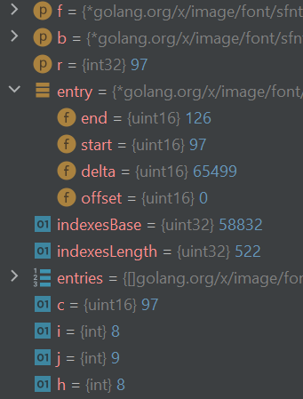
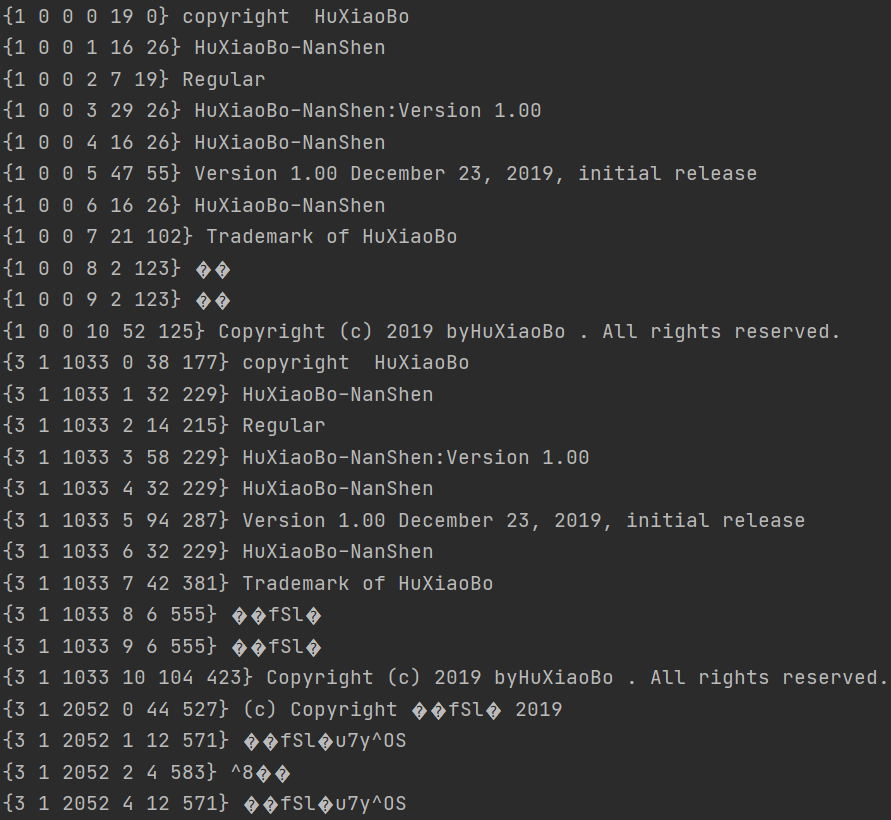

```yaml lw-blog-meta
title: "OpenType数据结构解读"
date: "2021-03-03"
brev: "既然要搞字体，那就好好搞一下。"
tags: ["DevOps"]
```

## 前言

做电商平台服务商，提供给商家们一个很重要的能力，就是文本图像编辑能力。

另一方面，我个人心里也算憋着一口气，因为之前有分享过 [Golang绘图:文字](../2020/201115-Golang绘图-文字.md) 那时就发现，在 Golang 的世界里，对于这种“小众需求”的支持还是远远不够完美的。当时就想，有空了我要自己弄清楚字体文件的格式，甚至去提PR或者自己来撸个库。

既然要搞，那就好好搞，从读规范开始。

## 总体介绍

先从不那么专业的文章开始： [OpenType Wikipedia](https://zh.wikipedia.org/wiki/OpenType) 

简而言之，OpenType 是当前流行的、且是加入了ISO标准的字体文件格式。主要参与制订的大公司是微软、苹果和Adobe 。它的前身是 TrueType 。

它的重要特征之一是，编码基于 `万国码 Unicode` 。

然后顺便提及一个小知识， [BIG5](https://zh.wikipedia.org/wiki/%E5%A4%A7%E4%BA%94%E7%A2%BC) 包含13060个汉字， [GB](https://zh.wikipedia.org/wiki/GB2312-80) 包含6763个汉字。

再然后，我们在Web端经常见到的 [WOFF](https://en.wikipedia.org/wiki/Web_Open_Font_Format) 则是基于对 OpenType 文件进行编码压缩之后的产物。

所以，OpenType是基本功，弄清楚了它，其他的都好说。

## 主要特性

[原文地址](https://docs.microsoft.com/en-us/typography/opentype/spec/ttochap1#opentype-layout-terminology)

OpenType 支持对同一个字符的不同字形。例如，在阿拉伯语中，同一个字符会因为它在一个单词中处于不同的位置而变成不同的字形。


OpenType 支持横排竖排。（其实也是同一个字符的不同字形）


OpenType 支持多个字符的组合和分解。例如，在英语、法语和一些语言中，`f`和`i`连续出现时会组合成一个新的形状：


OpenType 支持指定基线。（即可以想象为我们小时候英语作业本上那四条横线。）这样在多语言混排的时候，统一基线会让排版显得整齐：


## 一些术语

[原文地址](https://docs.microsoft.com/en-us/typography/opentype/spec/ttochap1#opentype-layout-terminology)

### Characters versus glyphs

用户看见或者打印出来的，并不是「字符`characters`」：用户只能看见「字形`glyphs`」。`character`是一个抽象的实体，它用数字来表达（即Unicode）；而`glyph`则是一个字符的视觉形象。

**客户端使用`cmap`表来查询字形。** 它保存着字符码到字形索引的关系。

`glyph`有时也会代表一组字符的组合形象，而`character`也可能会同时对应多个字形。即`glyph`和`character`并不是严格一一对应的。

### Scripts

一个脚本是由一组相关的字符组成的，这些字符可以被一种或多种语言使用。拉丁语、阿拉伯语和泰语分别是一种脚本。一种字体可以只包含一个脚本，也可以包含多个脚本。在OpenType中，脚本由唯一的4字节标记标识。[参考](https://docs.microsoft.com/en-us/typography/opentype/spec/name#platform-specific-encoding-and-language-ids-macintosh-platform-platform-id--1)

### Language systems

脚本又可以分为语言系统。例如，拉丁语脚本用于编写英语、法语或德语，但每种语言对文本处理都有自己的特殊要求。

## golang/x/image 包

接下来让我们随着官方的字体包的源码来看。这个在我之前的文章中介绍过了，我们使用的是：

```text
module xxx

go 1.15

require (
	golang.org/x/image v0.0.0-20200927104501-e162460cd6b5
)
```

但是实际上，仅仅看代码是不够的，因为这个库还不算完善，所以我需要下载源代码来进行调试：

```shell
git clone git@github.com:golang/image.git
```

入口函数是`Parse`:

```go
package main

import (
	"golang.org/x/image/font/sfnt"
	"io/ioutil"
)

func main() {
	fileContent, _ := ioutil.ReadFile("./your-font.otf")
	font, _ := sfnt.Parse(fileContent)
}
```

```go
// Parse parses an SFNT font, such as TTF or OTF data, from a []byte data
// source.
func Parse(src []byte) (*Font, error) {
	f := &Font{src: source{b: src}}
	if err := f.initialize(0, false); err != nil {
		return nil, err
	}
	return f, nil
}
```

这个入口函数，先把源文件二进制数据保存起来，然后进入初始化流程，最后返回一个结构体。我们看看`Font`这个结构体的样子：

```go
type Font struct {
	src source

	cmap table
	head table
	hhea table
	hmtx table
	maxp table
	name table
	os2  table
	post table
	glyf table
	loca table
	cff table
	cblc table
	gpos table
	kern table

	cached struct {
		// ...
	}
}
```

```go
type table struct {
	offset, length uint32
}
```

从上面可以看到，它的主体就是各种`table`，而每个table其实都只是这个二进制数据中的一段。然后解析后的一些数据是放在一个匿名字段`cached`中的。

那么这一堆二进制数据是如何索引的呢？查看 [Organization of an OpenType Font](https://docs.microsoft.com/en-us/typography/opentype/spec/otff#organization-of-an-opentype-font) 可知，文件最开始的12字节（即96bits）就是这个文件的「目录`directory`」

## Table Directory

顺着源码往下走，我们接下来看到这个函数，负责处理文件头部的12字节的目录：

```go
func (f *Font) initializeTables(offset int, isDfont bool) (buf1 []byte, isPostScript bool, err error) {
    // offset=0, 这里读取开头12字节，然后分析
    buf, err := f.src.view(nil, offset, 12)
    // ...
}
```

首先处理第一个Flag，前32bit的`sfntVersion`:

```go
func (f *Font) initializeTables(offset int, isDfont bool) (buf1 []byte, isPostScript bool, err error) {
    // ...
    switch u32(buf) {
	default:
		return nil, false, errInvalidFont
	case dfontResourceDataOffset:
		return nil, false, errInvalidSingleFont
	case 0x00010000:
		// No-op.
	case 0x4f54544f: // "OTTO".
		isPostScript = true
	case 0x74727565: // "true"
		// No-op.
	case 0x74746366: // "ttcf".
		return nil, false, errInvalidSingleFont
	}
	//...
}
```

从这里可以看到，这个库目前只能处理 `0x00010000`(OpenType), `0x74727565`(TrueType), `0x4f54544f`(PostScript) 三种格式的字体文件。至于还有一种常用的格式 `ttc` 则暂时不支持（它的格式稍有不同，我们另外找时间看看）。

> 0x4f54544f 如果化为4个ASCII字符的话，正好是 OTTO .

然后读出表的数量，然后根据表的数量，读出后面跟着的所有的表的索引，每个表16bytes:

```go
func (f *Font) initializeTables(offset int, isDfont bool) (buf1 []byte, isPostScript bool, err error) {
    // ...
	numTables := int(u16(buf[4:]))
    buf, err = f.src.view(buf, offset+12, 16*numTables)
    // ...
}
```

这16bytes分成4*4bytes 的字段，分别是 表类型、校验和、偏移起点、长度。接下来把这些表头信息全部遍历一遍：

```go
func (f *Font) initializeTables(offset int, isDfont bool) (buf1 []byte, isPostScript bool, err error) {
    // ...
	for b, first, prevTag := buf, true, uint32(0); len(b) > 0; b = b[16:] {
        tag := u32(b)
        // ...
		switch tag {
        case 0x43424c43:
            f.cblc = table{o, n}
        case 0x43464620:
            f.cff = table{o, n}
        case 0x4f532f32:
            f.os2 = table{o, n}
        case 0x636d6170:
            f.cmap = table{o, n}
        case 0x676c7966:
            f.glyf = table{o, n}
        case 0x47504f53:
            f.gpos = table{o, n}
        case 0x68656164:
            f.head = table{o, n}
        case 0x68686561:
            f.hhea = table{o, n}
        case 0x686d7478:
            f.hmtx = table{o, n}
        case 0x6b65726e:
            f.kern = table{o, n}
        case 0x6c6f6361:
            f.loca = table{o, n}
        case 0x6d617870:
            f.maxp = table{o, n}
        case 0x6e616d65:
            f.name = table{o, n}
        case 0x706f7374:
            f.post = table{o, n}
        }
	}
    // ...
}
```

遇到长度时要警醒，是否会越界？以`unit32`来表示长度，最多可以表达2GB的内容。但是在这里约束长度和偏移量最大是`1<<29`即536MB，正常情况绝对是够用的。

然后这里还有一个小规则，所有的table必须以名字升序排列。

## CMAP表

[CMAP表文档](https://docs.microsoft.com/en-us/typography/opentype/spec/cmap)

回到`initialize`函数，接下来是逐个对table进行解析。我们先直接来看最重要的表，`cmap`.

它负责记录 character -> glyph 的映射关系。它可能含有多个子表来支持多种编码模式。

没有 glyph 的 character 必须指向 glyph0, 这个东西用来表示确实的字符，通常我们称其为`.notdef`。

首先，`cmap`表也有个头部，其中包含 2*2bytes 的字段，以及子表索引列表。第一个字段没用，直接取出第二个`numTables`即子表的数量，用于接下来的循环：

```go
func (f *Font) parseCmap(buf []byte) (buf1 []byte, glyphIndex glyphIndexFunc, err error) {
	const headerSize, entrySize = 4, 8
	u, _ := f.src.u16(buf, f.cmap, 2)  // 跳过2bytes直接取第二个flag
	numSubtables := int(u)
    for i := 0; i < numSubtables; i++ {
    	// 每个subtable前面又是3个字段
        pid := u16(buf)
        psid := u16(buf[2:])
        offset := u32(buf[4:])
    }
}
}
```

## cmap是如何查找的

在`Font.Parse()`方法中，只是解析了字体文件的整体结构，但是并没有针对单个字符的处理。为了探究这个问题，我们还是回到之前的 [应用场景](../2020/201115-Golang绘图-文字.md) ，看一下一个典型的文字转换图像的场景是如何执行的：

```go
d := &font.Drawer{
    Dst:  background,
    Src:  image.White,
    Face: fontFace,
    Dot:  point,
}
d.DrawString("一些文字啊啊啊")
```

这里有几个数据结构层级，`font.Drawer`包裹着`Face`，`Face`包裹着`Font`。通过`DrawString`方法传入我们接下来要使用的所有字符，在它里面会逐个字符(`rune`)地进行处理：

```go
func (d *Drawer) DrawString(s string) {
	for _, c := range s {
		// ...
		dr, mask, maskp, advance, ok := d.Face.Glyph(d.Dot, c)
		// ...
	}
}
```

这里的`Face`是个interface，在上面的场景中我们使用的是`opentype.Face`，它的方法是：

> TIP: 在Goland编辑器中，在接口方法上按`alt+Enter`，选择`Go to Implementations`，会展示出所有实现了这个接口的结构体。

```go
func (f *Face) Glyph(dot fixed.Point26_6, r rune) (image.Rectangle, image.Image, image.Point, fixed.Int26_6, bool) {
	x, err := f.f.GlyphIndex(&f.buf, r)
	// ...
}
```

然后我们抵达了目的地，回到了刚才讨论的`sfnt.Font`结构体的范围：

```go
func (f *Font) GlyphIndex(b *Buffer, r rune) (GlyphIndex, error) {
	return f.cached.glyphIndex(f, b, r)
}
```

这里的`Font.cached.glyphIndex`是一个闭包函数，它是在前面`parseCmap`方法中执行的最后一步生成的：

```go
func (f *Font) parseCmap(buf []byte) (buf1 []byte, glyphIndex glyphIndexFunc, err error) {
    // ...
	return f.makeCachedGlyphIndex(buf, bestOffset, bestLength, bestFormat)
}
```

```go
func (f *Font) makeCachedGlyphIndex(buf []byte, offset, length uint32, format uint16) ([]byte, glyphIndexFunc, error) {
	switch format {
	case 0:
		return f.makeCachedGlyphIndexFormat0(buf, offset, length)
	case 4:
		return f.makeCachedGlyphIndexFormat4(buf, offset, length)
	case 6:
		return f.makeCachedGlyphIndexFormat6(buf, offset, length)
	case 12:
		return f.makeCachedGlyphIndexFormat12(buf, offset, length)
	}
	panic("unreachable")
}
```

上面这个`format`，指的是`cmap`的子表的HEAD中的第1个字段（定义 [在这里](https://docs.microsoft.com/en-us/typography/opentype/spec/cmap#use-of-the-language-field-in-cmap-subtables) ）。这里可以看到这个库只支持0,4,6,12这四种格式，不深究。

我这里随手打开一个字体文件`HuXiaoBoNanShenTi.otf`，它包含 format=4,6 的子表，所以我们这里以 4 为例子来仔细看一下。（从文档可知它也是标准的Unicode用表）

```go
func (f *Font) makeCachedGlyphIndexFormat4(buf []byte, offset, length uint32) ([]byte, glyphIndexFunc, error) {
	// 1. 根据文档，Format4的HEAD长度是14字节
	const headerSize = 14
	buf, err = f.src.view(buf, int(f.cmap.offset+offset), headerSize)

	// 2. 取出第四个字段，即 segCountX2，注意这个是seg的数量的两倍而不是character或者glyph的数量
	segCount := u16(buf[6:])
	segCount /= 2
	
	// 3. 扫描，建立索引
	entries := make([]cmapEntry16, segCount)
	for i := range entries {
		entries[i] = cmapEntry16{
			// ... end, start, delta, offset 四个数值
		}
	}

	// 4. 返回闭包函数
	return buf, func(f *Font, b *Buffer, r rune) (GlyphIndex, error) {
		// ... 这里是返回的闭包函数glyphIndexFunc
	}, nil
}
```

> Unicode标准版是有65536个编码的，而字体文件一般不会覆盖所有Unicode，因此在索引中必然存在大量的空洞。上述的 end, start, delta, offset 这些字段都是为了在去除空洞的同时尽可能优化查找速度。  
> 因此有了 seg 的概念。一个seg可能包含若干个Unicode, 在下面的例子中的seg就包含了97-126的。

`glyphIndexFunc`负责查询指定的`字符`对应的`glyph索引值`（然后待会就可以取glyph表里查到字形数据了）。它的本质是在刚才构建的`entries`列表里进行二分查找：

```go
func (f *Font) makeCachedGlyphIndexFormat4(buf []byte, offset, length uint32) ([]byte, glyphIndexFunc, error) {
	// ...
	return buf, func(f *Font, b *Buffer, r rune) (GlyphIndex, error) {
		// 最大只支持到 U+FFFF 即65536个Unicode
		if uint32(r) > 0xffff {
			return 0, nil
		}

		c := uint16(r)
		for i, j := 0, len(entries); i < j; {
			h := i + (j-i)/2
			entry := &entries[h]
			if c < entry.start {
				j = h
			} else if entry.end < c {
				i = h + 1
			} else if entry.offset == 0 {
				// 二分查找命中，返回索引
				return GlyphIndex(c + entry.delta), nil
			} else {
				// ...
			}		}
		return 0, nil
	}, nil
}
```

我举个例子，此时我要在这个字体文件中查找`a`这个字符对应的索引，我会得到如下内容：



最后得到`a`在这个字体文件中的`GlyphIndex`=`uint16(97+65499)`=`60`.

## glyf表

[规范文档](https://docs.microsoft.com/en-us/typography/opentype/spec/glyf)

这个表，以TrueType轮廓格式，保存着所有的字形数据。

它由很多 glyph数据块 组成，每个块提供1个glyph的信息，并且通过`glyph ID`来索引，这个索引是从0开始的顺序整数。

`glyf`表本身并没有额外的表头来记录 每个数据块的位置(offset)，这些位置信息记录在`loca`表中，`loca`表可以用`glyph ID`来查得数据块的位置。所以`glyf`必须和`loca`（以及`maxp`）一起使用。

### loca表

[规范文档](https://docs.microsoft.com/en-us/typography/opentype/spec/loca)

注意，`loca`仅仅记录了一个字段`offset`，因此要知道某个数据块的长度的话，必须要再查询下一个`glyph ID`的值来做减法。这个要求造成两个结果：第一，`loca`表的顺序必须按`glyph ID`的顺序来；第二，在最后一个数据块后面要再加一个特殊的记录，来处理最后一个数据块的位置。

它的字段有两种版本，一种是段的，每个`offset`用2bytes记录，另一种长的用4bytes。这个版本号记录在`head`表的`indexToLocFormat`字段里。

> 在 head表 里 indexToLocFormat 是个int16 ，但是在golang这个库的实现里是用的bool，这里埋下了一个也许永远都不会踩到的兼容性的坑呢。

```go
func parseLoca(src *source, loca table, glyfOffset uint32, indexToLocFormat bool, numGlyphs int32) (locations []uint32, err error) {
	// 1. 因为glyphID是从0开始的顺序整数，所以用一个数组来记录就可以了。
	locations = make([]uint32, numGlyphs+1)

	// 2. 逐个读取并记录offset数值。
	if indexToLocFormat {
		for i := range locations {
			locations[i] = 1*uint32(u32(buf[4*i:])) + glyfOffset
		}
	} else {
		for i := range locations {
			locations[i] = 2*uint32(u16(buf[2*i:])) + glyfOffset
		}
	}
	return locations, err
}
```

## Glyph是如何查找的

在前面的章节中，我们已经查得了，在我所用的某个字体文件中`a`这个字符对应的`glyphID=60`。接下来看看如何通过它找到对应的数据块。

先整理一下思路。在golang中使用字体绘图，入口是`font.Drawer.DrawString`，然后进入`opentype.Face.Glyph`，这个函数接受单个字符，查得字形数据后在绘图区域中画上去：

```go
func (f *Face) Glyph(dot fixed.Point26_6, r rune) (image.Rectangle, image.Image, image.Point, fixed.Int26_6, bool) {
	// 1. 查ID
	x, _ := f.f.GlyphIndex(&f.buf, r)
	// 2. 根据ID找出字形数据
	segments, _ := f.f.LoadGlyph(&f.buf, x, f.scale, nil)
    // ... 下面的代码拿着字形信息去转化为图像，略过
}
```

然后在`Font.LoadGlyph`方法中继续追踪，到了这里：

```go
func (f *Font) viewGlyphData(b *Buffer, x GlyphIndex) (buf []byte, offset, length uint32, err error) {
	xx := int(x)
	if f.NumGlyphs() <= xx {
		return nil, 0, 0, ErrNotFound
	}
	// 1. 取得ID对应的offset以及下一个offset
	i := f.cached.glyphData.locations[xx+0]
	j := f.cached.glyphData.locations[xx+1]
	// 2. 从glyf[i:j]取出数据块
	buf, err = b.view(&f.src, int(i), int(j-i))
	return buf, i, j - i, err
}
```

好了，到这里我们已经完成了从`character`到`glyph`的查询操作。（剩下的图像逻辑超纲了而且太复杂了这里不再深究。）

接下来布置一个作业，想象一下，如果我们需要从一个字体文件中切割出一个子集，我们应该怎么做？

思考一番：

- 我们所需的核心数据是`glyf`，但是它必须依赖`loca`和`maxp`。
- 然后loca又依赖`head`。
- 为了从字符查得ID，我们需要`cmap`。

主要能想到的表大概就是上面这些。（当然，这只是针对TrueType格式的处理，其他格式会则要求更多的表）

在切割时，我们首先需要知道一个所需的字符的数组，然后遍历这些字符，找出所需的数据；然后把所需的数据重新组成尺寸更小的表，再把这些表组装成符合OpenType格式的文件。

由于时间关系，我这里不去亲自实现了，这里直接使用一个Python库来做：`fonttools`

## 用fonttools来实现字体文件切割

```python
from fontTools import subset

options = subset.Options()
font = subset.load_font('需要切割的字体文件.ttf', options)
subsetter = subset.Subsetter(options)
subsetter.populate(text='Google')
subsetter.subset(font)
options.flavor = 'woff'  # 默认是woff2格式
subset.save_font(font, '切割后的子集.woff', options)
```

恕我才疏学浅，Python的源码真的做不到一眼就看懂，也没有时间慢慢琢磨，所以源码就不看了，能用就行.jpg

## name表

[规范文档](https://docs.microsoft.com/en-us/typography/opentype/spec/name)

这是一个跟我们日常使用比较相关的表。

这个表可以放置一些与字体相关的字符串，例如版权申明，字体名，家族名，样式名，等等。

为了让这个表的体积不要太膨胀，字体制作者 可以仅仅选用少数语言来准备这些信息（例如只提供英语版本的版权申明）。并且在随后需要的时候进行“本地化适配”，添加所需的某种语言的信息。需要使用时，通过一个 语言ID 来选择获取相应语言的这些信息。除了语言字段之外，还允许根据平台来筛选。最终筛选条件有 platform ID ,encoding ID language ID, name ID.

在`golang.org/x/image/`这个包里，并没有对`name`表做处理，仅仅只是标记了它的起止范围（即一个`table`结构体）。所以为了从一个字体文件的`name`表里取出数据，我直接修改它的源码，在`sfnt.go`文件中加入下面的代码：

```go
type NameRecord struct {
	platformID   uint16
	encodingID   uint16
	languageID   uint16
	nameID       uint16
	length       uint16
	stringOffset uint16
}

func (f *Font) ParseName(buf []byte) {
	// 1. name表表头
	version, _ := f.src.u16(buf, f.name, 0)
	recordCount, _ := f.src.u16(buf, f.name, 2)
	storageOffset, _ := f.src.u16(buf, f.name, 4)
	fmt.Println(version, recordCount, storageOffset)

	// 2. 表头后面跟着的是 NameRecord数组，再后面就是纯的 字符串数组
	records := make([]*NameRecord, recordCount)
	const headerSize, recordSize = 6, 12
	for i := 0; i < int(recordCount); i++ {
		buf, _ = f.src.view(buf, int(f.name.offset)+headerSize+recordSize*i, recordSize)
		var record = NameRecord {
			platformID:   u16(buf),
			encodingID:   u16(buf[2:]),
			languageID:   u16(buf[4:]),
			nameID:       u16(buf[6:]),
			length:       u16(buf[8:]),
			stringOffset: u16(buf[10:]),
		}
		records[i] = &record
	}
	// 3. 直接打印出来看
	for _, record := range records {
		buf, _ = f.src.view(buf, int(f.name.offset)+int(storageOffset)+int(record.stringOffset), int(record.length))
		fmt.Println(*record,string(buf))
	}
}
```

这样我得到了如下结果：



- 第一个字段是平台ID，`1`是苹果平台，`3`是windows。
- 第三个字段是语言ID，苹果的`0`是英语，windows的`1033`是英语(美国)。
- 第四个字段是 NameID，[查表](https://docs.microsoft.com/en-us/typography/opentype/spec/name#name-id-examples) 吧

咦，怎么有些内容是乱码，我们先直接把二进制数据以十六进制的形式打印出来：

```text
{3 1 2052 4 12 571}80 e1 66 53 6c e2 75 37 79 5e 4f 53
```

找个Unicode转换工具试一下，嗯，果然正确，上面的数据可以翻译为：`胡晓波男神体`。 所以处理方式就是将bytes内容两两组合成一个Unicode（Unicode范围是uint16即两个字节），然后转化为`rune`类型，这样Golang就能将其以utf8的形式输出了。把上面的代码最后一段打印的部分稍作修改即可：

```go
func (f *Font) ParseName(buf []byte) {
	// 3. 直接打印出来看
	for _, record := range records {
		if record.platformID == 3 && record.encodingID == 1 {
			buf, _ = f.src.view(buf, int(f.name.offset)+int(storageOffset)+int(record.stringOffset), int(record.length))
			values := make([]rune, len(buf)/2)
			for i := range values {
				values[i] = rune(u16(buf[2*i:]))
			}
			fmt.Println(*record, string(values))
		} else {
			buf, _ = f.src.view(buf, int(f.name.offset)+int(storageOffset)+int(record.stringOffset), int(record.length))
			fmt.Println(*record, string(buf))
		}
	}
}
```

所以上述将两个字节合在一起转化为一个字符的方法，有何理论依据？——有的，根据文档，当 PlatformID=3,encodingID=1 时，后面的字符串的编码格式应当是`UTF-16BE`。

但是对于苹果平台上的那两个乱码，就找不到理论依据了，就当作是作者制作字体文件的时候搞错了吧，不深究了。

如果把上述字体文件用Linux中的`fc-list`扫描一下，会得到它的`family`是 `HuXiaoBo-NanShen,胡晓波男神体`。看起来，猜测似乎用的是`NameID=1,4,16`这几个地方的名称。我们在前端页面或者文字编辑器中选择的字体名也就是由这几个地方定义的。可能还有一些具体的规则，精力有限不再深究了。

## 总结

简而言之，整个数据结构的组织原则就是 头部+内容，然后通过offset去定位具体的数据位置。OpenType文件的大致结构就是 头部+各个表的内容，各个表里面又是 头部+内容数组，表里的子表也是……

这种多级解耦的组织方式，虽然挺臃肿的，但是也保证了扩展性。

但是话说回来，拓展性好了，那写客户端、写库的人就脑袋疼了，难以顾及所有情况。比如上面我写了一个解析`name`表的函数，一开始以为很简单，但是运行之后才发现，原来就这一个表里都要考虑多平台、多语言、多编码格式的各种场景。本来还挺有自信想去提个PR的，立马就被输出的乱码 浇了一盆冷水。所以还是再埋头学一学吧~

此次最大的收获之一，也是预期目标，我了解了一下字体文件的内部结构。虽然可能不会立即对工作产生什么很大帮助，但是多了解一点、写代码的时候就会少踩一点坑，总归是好的。

然后收获之二，顺带了解了很多编码方面的知识。

收获之三，是进一步学习了Golang对二进制数据的处理方法。有一说一，在Golang里处理二进制还是很轻松的吧~

总体来说，学这个学得挺累的，而且也没有什么成就感，算是最近我啃过的最硬的一个骨头了吧。

下班。

## 附：参考文献

https://www.font.im/chinese 按字符切割的万恶之源

https://markoskon.com/creating-font-subsets/ 字体文件原理&Python库用法

https://my.oschina.net/colin86/blog/3015044 路人甲的Python库用法

https://tool.chinaz.com/tools/unicode.aspx 站长工具Unicode转换工具

https://home.unicode.org/ Unicode官方网址

https://www.ssec.wisc.edu/~tomw/java/unicode.html#x0000 Unicode分布

https://en.wikipedia.org/wiki/CJK_characters CJK定义

http://www.ruanyifeng.com/blog/2007/10/ascii_unicode_and_utf-8.html 阮一峰：字符编码问题

https://zh.wikipedia.org/wiki/OpenType WIKI - OpenType

https://www.jianshu.com/p/3fe21f3730b1 Linux中安装字体

https://stackoverflow.com/questions/16788330/how-do-i-get-the-font-name-from-an-otf-or-ttf-file 如何从字体文件中扫描出FamilyName
