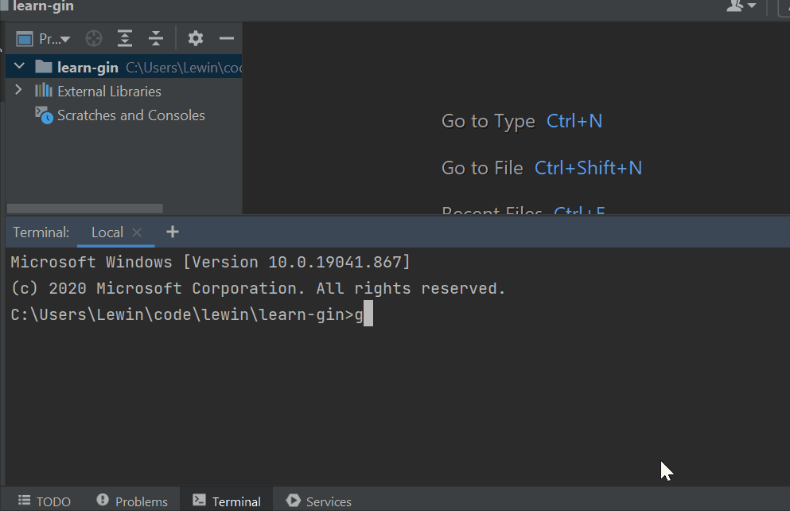
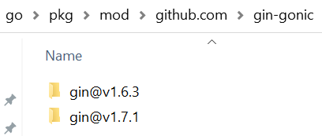
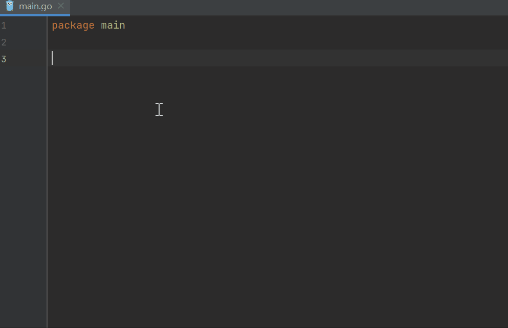
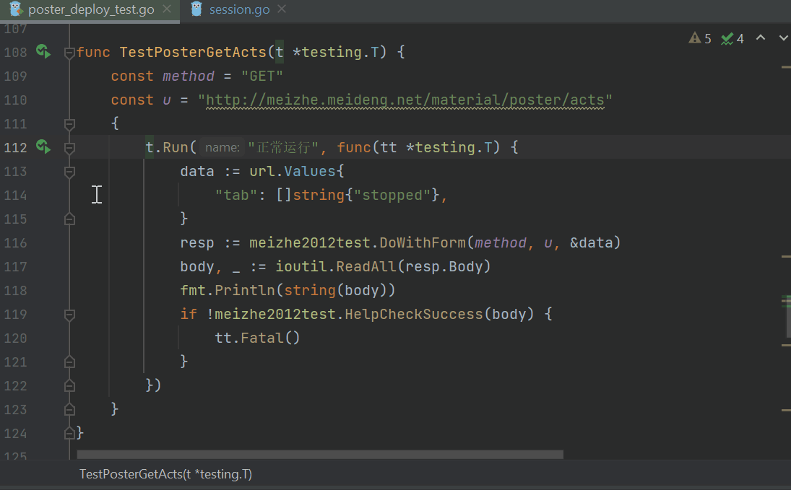

```yaml lw-blog-meta
title: "Golang入门 & 一万种Goroutine的泄漏姿势"
date: "2021-04-13"
brev: "谢邀，今天加班"
tags: ["Golang","技术分享会"]
```

## 写在前面

我记得那是一个细雨绵绵的日子。我正愉快地改着自己写的BUG，忽然收到 @胡少 的消息：“这周四开一期Go语言入门？”

说实话我内心是拒绝的。原因很简单，众所周知，美登没有Go浪。

更何况，「……和一万种Goroutine的泄漏姿势」这个副标题也太强人所难了。我已经变强了，现在的我已经不会泄漏Goroutine了，最多也就访问几个空指针而已。

但转念一想，上周我才嘲讽过 Deno 的包管理工具，这周要是不接这个题，好像有点不Go意思。

那我就献丑了。

## 目录

本次班车途径站点：

1. 10秒入门`Go Mod`
2. 3分钟速成语法
3. Web项目实战：WTFIO
4. 资源泄漏与诊断

## 事前准备

- 一个Golang运行时环境： [官网下载](https://golang.org/dl/)
- 一个IDE（特指`Goland`）

## 10秒入门 Go Mod

话不多说，开始计时吧。

假如我们在Github上看到一个Web框架 https://github.com/gin-gonic/gin 觉得不错，想要试试，我们只需要开一个文件夹，然后敲：

```shell
go mod init learn-gin  # 或者任意你喜欢的文件夹名字
go get github.com/gin-gonic/gin  # 你想要下载的库的url
```

然后新建一个`main.go`，敲：

```go
func main() {
    gin.New().Run()
}
```



计时结束。超过10秒了吗？~~超过就当我没说过~~

到此为止，我们就已经借助Go的包管理工具，下载了一个流行的Web框架，然后用它启动了一个服务，监听在本地的`:8080`。虽然此时还没有任何路由逻辑，所有请求都会404，但是框架是已经搭好了。

在IDE的帮助下，根本不需要写`import`，你只需要关注你所需的函数叫什么名字，然后一路 Tab Tab 按地去就行了。

### Go Mod 主要原理

在最初的一步，`go mod init` 的时候，创建了两个文件：

- `go.mod`: 记录本仓库依赖的包、依赖的依赖的包的**引用名称**和**版本号**。等同于Python的`Requirement.txt`或者Node的`package.json`。
- `go.sum`: 记录依赖包的Hash值，防止被篡改。相当于`package-lock.json`

### go.mod

Golang并没有提供一个中心化的包管理仓库，像`pip`或者`npm`那样的。

`Go Mod`底层依赖的是`Git`，因此，只要你的环境里的`Git`能够访问到的仓库（中的所有内容），都能被`Go Mod`访问并且加载到你的代码里。

并且，这使得“发布一个Go包”这件事变得极为简单，任何人在任何时间只要在一个公开的Git服务上上传他的代码，他这段代码就可以被别人引用。

这可能引发两个问题：一是依赖可靠性问题（别人突然把包删了或者闭源了怎么办？），二是下载代码时的安全问题（发布的包里有恶意代码怎么办？）。

问题一，是通过某种“公共CDN”来保护的。实质上，我们在墙内使用Golang，不可避免地要依赖某种代理，最常见的有 [goproxy.cn](https://goproxy.cn/) 。它的原理就是代理、并且缓存。如果代码的源头（例如github）突然篡改了，在代理这一层依然可以根据版本号提供原先缓存过的正确的代码。

值得一提的是， [goproxy](https://github.com/goproxy/goproxy) 是一个开源组件，任何组织和个人如果有需要，可以很轻松地搭建属于自己的代理。并且这个搭建过程我猜会比npm和pip更容易，因为它仅仅只做了代理这一件事情，私有库的鉴权是通过Git来实现的。

关于问题二，不在这里展开，最近有一篇官方博客讲了这个过程， [我翻译了](./210125-GoBlog-path-security.md) ，对安全有兴趣的同学可以了解一下。

### go.sum

但是，Golang提供了一个中心化的校验仓库： [sum.golang.org](https://sum.golang.org/) ，它会记录所有已知的仓库、已知版本的Hash值。

以Url的形式来提供灵活性，以Hash的形式来保障安全性，这种思路很值得我们学习。

> 参考阅读：[译：Module Mirror and Checksum Database Launched](../2019/190926-官方-模块镜像仓库和校验数据库.md)  
> 参考阅读：[官方：using-go-modules](https://blog.golang.org/using-go-modules)

### go.dev

在`sum.golang.org`的基础上，[pkg.go.dev](https://pkg.go.dev/) 为每个已知的仓库记录更详细的文档信息。

### 依赖下载存在哪里？

默认放在用户根目录的`~/go/pkg/mod`文件夹中，以上面的gin为例：



没错，以版本为单位，一个版本一个文件夹。

### 版本很重要

Google推行的版本规则： `大版本.小版本.修复版本`

- 同一个大版本中，后面的小版本必须兼容前面的小版本，不允许breaking changes
- 一般有新功能增加则使用小版本，只是修复则使用补丁版本。
- 如果要废弃或者修改小版本中的接口，则考虑先将原接口标记为deprecated，然后把修改后的接口用一个新命名。在下一个大版本中再移除旧的接口。
- 当然，上述只是原则，并没有硬性检查工具

参考我的译文： [Go Modules 快速入门](../2020/201115-GoModules教程.md) 其中讲解了带版本发布Go包的流程。

## 3分钟速成语法

我们目前主要技术栈是 Python 和 JS ，二者都是脚本语言，所以在学习 Golang 这种静态类型语言的时候一定记得纠正一些观念。

### 语法1：main

Python 和 JS 都是会将加载的代码的每一行都**执行一遍**的，但Golang只会从`main`开始执行，并且执行完`main`之后就会退出进程。

所以，如果要实现一个长时间运行的服务，要么写无限循环（如Web框架无限循环接受请求），要么主动阻塞住`main`：

```go
func main() {
    go SomeWork()  // 起了一个Go程去执行任务
    select {}  // 阻塞！
}
```

> TIPS: `select` 并不是 `switch`，它是 Golang 特有的、用于并发流程控制的关键字。

### 语法2：package

- Golang的代码文件组织，是以**文件夹为单位**的。
- 所有文件的第一行（非注释行）都必须声明它所属的`package`。
- `package`可以与文件夹不同名，但最好同名。并且一个文件夹内只能有一个`package`。
- `package`是**引用名**。

例如：

```go
// learn-gin/tools/tool.go
package t

func Do() {
    print("haha")
}
```

```go
// learn-gin/main.go
package main

import "learn-gin/tools"

func main() {
    t.Do()
}
```

### 语法3：声明变量

变量要先声明再使用！变量要先声明再使用！变量要先声明再使用！

可以声明在最外层（作用域是整个包），也可以声明在函数里（作用域是函数），也可以声明在任何一个大括号里（作用域就是这个大括号）。

一个语法糖是`:=`，可以代替`var`。

```go
package main

var Name = "Lewin-1"

func Homework1(Name string) {
    {
        Name := "Lewin-3"
        print(Name)  // 这里应该输出什么？
    }
    print(Name)  // 这里应该输出什么？
}
func main() {
    Homework1("Lewin-2")
}
```

此外，Golang **不允许存在未被使用的变量**，如果某个函数的返回值你不想用，则必须将其赋给 `_`，例如：

```go
func Demo() (int, int) {
    return 1,2
}
func main() {
    num1, _ := Demo()
    print(num1)
}
```

### 语法4：声明类型

所有变量、常量都必须有类型。虽然有些情况可以省略（编译器推导），有时也可以用`接口变量`和即将到来的`泛型`实现一定的灵活性，但是，所有变量都必须有类型，**不允许改变变量的类型**。

Golang也有一些（借助接口和反射实现的）“魔法方法”，一个典型应用，就是可以给一个类型同时声明`json`和`bson`的字段名（此处点名批评FastAPI）：

```go
type User struct {
    Id       primitive.ObjectID `json:"open_id" bson:"_id"`  // 转化 _id 很简单！
    SecureId string             `json:"-" bson:"secure_id"`  // 控制某个字段不传出去也很简单！
    Nick     string             `json:"nick" bson:"nick"`    // 数据库字段和json字段相同！
}
```

这里顺带一提，在`Goland 2021.1`版本中，推出了 **直接将json转化为struct声明** 的超神功能：



### 语法5：指针

这里先讲一下我们所熟悉（？）的语法。

在Python（和Node）中，`变量`都是引用，并不是它本身的值。例如，`a=1`这个语句，是将`a`指向了一个「值为`1`的`int`类型的对象」

然而，有些类型是「不可变类型」，修改它的 值 的时候，只是令变量指向了另一个对象；而有些类型是可变的，修改它的 值 的时候，修改的却是原对象。这很容易引发BUG。例如：

```python
def update_int(num: int):
    num = 100

a = 1
update_int(a)
print(a)  # 这里应该输出多少？
```

```python
def update_dict(d: dict):
    d["a"] = 100

a = {"a": 1}
update_dict(a)
print(a["a"])  # 这里应该输出多少？
```

> 如果在座的有搞不清楚这个特性的后端同学，今天下班后惩罚自己多吃两碗饭吧。

而在 Golang 中，你传递的到底是 「值」还是「引用」，通过指针表示地清清楚楚。看代码：

```go
func updateInt(num int)  {  // 传值，不改变原变量
    num = 100
}
func main() {
    a := 1
    updateInt(a)
    print(a)
}
```

```go
func updateInt(num *int)  {  // 传引用，会改变原变量
    *num = 100
}
func main() {
    a := 1
    updateInt(&a)  // 取址
    print(a)
}
```

### 语法5：Go程

众所周知，Golang的核心精神是「大道至简」。它通过`Goroutine`（及配套标准库）把「并发」这件事情做得匪夷所思的简单。

只需要一个关键字`go`，我们就可以启动一个轻量级的“并发执行单元”。轻量到什么地步？官方甚至鼓励你在一个进程内随便开**几百万个Go程**随便用。

不知道有没有后端同学像我一样被Python所**毒害**：学Python入行，我曾一度认为「一个进程只能跑在一个CPU上」，然而实际上这只是GIL的大坑罢了。

> 搞不清楚「进程、线程、协程」「并发、并行」「同步、异步、阻塞、非阻塞」，的同学，请自觉补习相关概念。

```go
func SomeHardWork(num *int) {
    for i := 0; i < 100000000000000000000000000000; i++ {
        *num += i
    }
    print(*num)
}
func main() {
    var a, b, c int
    go SomeHardWork(&a)
    go SomeHardWork(&b)
    go SomeHardWork(&c)  // 三个Go程并行执行
    select{}
}
```

### 语法6：Channel

如果仅仅只是Go程的话，也许你可以说它不过是多线程的语法糖而已。它真正的杀器其实是 `chan`。

它的实质是一个带锁的循环列表。在使用时，可以理解为它是一个进程内部的异步队列系统。

而且它的语法十分有趣，`chan <-` 表示入队，`<- chan` 表示出队，非常直白。

```go
var queue = make(chan int, 10) // 创建一个"队列"，其中最多储存10个任务

func produce(task int) {
    queue <- task // 发布任务
}
func consumer() {
    for {
        task := <-queue // 取出任务
        print(task)
        os.Exit(0)
    }
}
func main() {
    go consumer() // 在新的Go程上单独运行消费者
    produce(1)    // 执行发布任务
    select {}
}
```

### 语法7：Context

Goroutine 很强，强大到我们需要给它加上束缚。Context就是这么一个工具，可以将无数的 Go程 “串” 在一起，便于管理。

```go
func endlessLoop(ctx context.Context) {
    for {
        select {
        case <-ctx.Done():  // context通知要退出了
            return
        default:
            println("循环中")
            time.Sleep(time.Millisecond * 100)
        }
    }
}

func main() {
    // 创建一个最多3秒就超时的context
    ctx, cancel := context.WithTimeout(context.Background(), time.Second*3)
    defer cancel()

    endlessLoop(ctx)  // 无限循环直到timeout
    println("bye~")
}
```

`Context`是可以拥有子孙的，也就是说，只要通知父对象退出，那么它所有的后代都会被通知到。

`context`标准库源码阅读可以参考我的文章： [context标准库](../2019/191126-Go源码之context.md)

总之，我现在写一个函数，第一个参数不是`(ctx context.Context)`的话就总觉得心里不踏实……

### 语法8：错误处理

这可能是Golang争议最大的地方：它不支持`try catch`语法。

不过，有一说一，通过`panic`+`recover`，也可以写出与`try catch`相似的效果。但这并不是推荐用法。

Golang核心团队是拒绝`try catch`的，一个比较合理的解释（来自 [Reddit](https://www.reddit.com/r/golang/comments/j7c8ut/why_is_there_no_trycatch/) ）：

> Go wants you to handle errors where they occur. Also, it makes it clear which functions can produce errors.  
> Go希望你（显式地）处理错误。同时，这个机制让你可以很明确哪些函数会产生错误、哪些函数不会产生错误。

以及第三点，应该要认识到，「错误`error`」 和 「异常`exception`」 应该是不同的东西，应该有不同的处理方式。大部分业务逻辑情况都应该是error，只有真正的代码bug才能叫exception。

从我个人的理解，结合我个人的开发经验，我非常、非常认同这三个观点。

唯一可能有点不好的是，`if err!=nil`的代码的确有点多，虽然在IDE的帮助下写起来并不累，但是这还是在一定程度上让写出来的代码显得“啰嗦”，有时会“淹没”核心业务逻辑。

然后还有些缺陷的是，返回err，会丢失产生err的栈的上下文状况。关于这一点可以自己写一些代码去做，有一点点挑战，但是参考一下`sentry-go`的源码，其实也挺容易的，我自己就撸了一套，完全解决了这个问题。

在新的设计（Go2）中，主流提案是添加一些语法糖帮助减少错误处理逻辑的篇幅，但是依然会保持显式返回error这个特征。

参考关于Go的错误处理的设计提案： [Go2ErrorHandlingFeedback](https://github.com/golang/go/wiki/Go2ErrorHandlingFeedback)

### 语法N：更多……

Golang还有很多先进的设计。

例如它的「接口`interface`」就很先进。（并不是Typescript的interface）

例如它用「组合`combine`」去替代「继承`inherit`」就很先进。

例如……举不出来了。但难道有了这些还不够吗？

## 实战项目：WTFIO

http版本： [git.meideng.net/talks/wtfio](https://git.meideng.net/talks/wtfio/src/branch/master/solutions/lanlin/main.go)

tcp版本：[用go撸一个高并发http服务](../2020/201123-用go撸一个高并发http服务.md)

用成绩说话： [语雀](https://meideng.yuque.com/meideng/techshare/wtfio#Lwgd)

## 资源泄漏

其实讲Go程的泄漏问题，对于初学者来说稍微有点太深入了。而且并没有很大的意义，因为像Go这么好写的语言，只要按规矩来，能写出泄漏的代码还真不容易。

先讲讲什么叫做「泄漏」。

任何语言任何程序都会有泄漏问题，有GC也解决不了泄漏问题。参考阅读：

- [Python-GC垃圾回收机制](../2019/190719-Python-GC垃圾回收机制.md)
- [Go的垃圾回收](../2019/191120-官方-Go的垃圾回收.md)

要“刻意制造”一种泄漏场景，无非就是：先创建一个引用，然后保持住它不删掉，然后不断地给它添加子孙后代，让GC想删又不敢删，就达到“资源泄漏”的目的了。

先模拟一个「内存泄漏」的场景。声明一个简单而又体积庞大的链表节点类型，然后声明一个头节点，然后无限循环创造Next：

```go
type ListNode struct {
    Next *ListNode
    Data [1024*1024]byte
}

// 这段代码会让堆内存暴涨到4GB以上然后被kill，机器性能不足的同学请不要轻易运行
func main() {
    var head = &ListNode{}
    var next = head
    for i:=0; i<1000000000000; i++{
        next.Next = &ListNode{}
        next = next.Next
    }
    println(head)  // 一定要访问一次，否则会被编译器优化掉
}
```

相似地，要让Go程泄漏也很简单。首先要理解，Go程的引用是在runtime的某个地方的，所以只要它的函数没有运行结束返回，那这个Go程就一直没有结束，就一直不会被清理掉。

最常见的情况，要么就是一直从chan里收不到东西，要么就是一直推不进chan里，一直阻塞着Go程无法退出，就会造成泄漏。

我们沿用前面写的队列系统，启动无数个消费者，模拟泄漏的场景：

```go
var queue = make(chan int, 10) // 创建一个"队列"，其中最多储存10个任务

func produce(task int) {
    queue <- task // 发布任务
}
func consumer() {
    for {
        print(<-queue)// 取出任务
    }
}
// 这段代码可以在2秒内将进程内存暴涨到10GB以上，机器性能不足的同学请不要轻易运行
func main() {
    for i:=0; i<10000000000000; i++{
        go consumer()
    }
    produce(1)
}
```

解决的办法也很简单，听老人的话！所有阻塞等待的情况，都要使用`Context`，示例代码：

```go
// 改写上面容易造成泄漏的代码
func consumer(ctx context.Context) {
    for {
        select {
        case task := <-queue:
            println(task)
        case <-ctx.Done():
            return
        }
    }
}
```

还有一种比较特殊的情况，类似**死锁**，两个或者多个Go程之间互相卡住。来看一段好玩的代码：

```go
var queue1, queue2 = make(chan int), make(chan int)

func consumer1() {
    for{
        queue1 <- <-queue2
    }
}
func consumer2() {
    for{
        queue2 <- <-queue1
    }
}
func main() {
    go consumer1()
    go consumer2()
    queue1 <- 1
    select {}
}
```

上面的代码可以形成一个完美的无限循环。但是如果在循环中再增加一个值（如下面代码所示），那就会造成deadlock了。这个过程大家自己思考一下。

```go
func main() {
    go consumer1()
    go consumer2()
    queue1 <- 1
    queue1 <- 1  // 增加一个值，导致死锁！
    select {}
}
```

死锁现象一般比较容易在业务逻辑复杂的场景出现。应对方案也很简单：听老人的话！数据的流动原则上应该做成单向流动，不要循环依赖。

## 诊断工具

标准库中就有强大的诊断工具，示例用法：

```go
import _ "net/http/pprof"
```

上述写法会启动一个web服务，提供各项参数，包括cpu、堆栈、go程、线程等各项指标。可以采集（录制）一段时间的指标，然后通过一些官方工具，生成火焰图等更直观的表现形式。

诊断工具参考用法： [Go性能分析工具: pprof](../2019/191213-Go性能分析工具pprof.md)

## Go的骚操作：测试

你以为`go test`只能用作单元测试吗？不，我甚至拿他来做接口测试！Proxy, IP, Header, Cookie, status-code……全部都在我的掌控之下，我才不要学什么postman postwoman之类的半吊子。

借助IDE的快捷按钮，点哪个用例，就跑哪个用例，非常愉快。



另一个场景，要测试异步服务的时候，还必须要Golang这样的异步语言才好写，现成的测试框架是测不成的。

实际上，我平时就是拿Golang来当脚本语言写的。一点不比Python写得慢。

## 后记

写引用出处的时候才发现，不知不觉间，我已经写了这么多关于go的文章。颇有一番 丈母娘看女婿——越看越喜欢 的奇妙感觉。

话不多说，该下班了。
