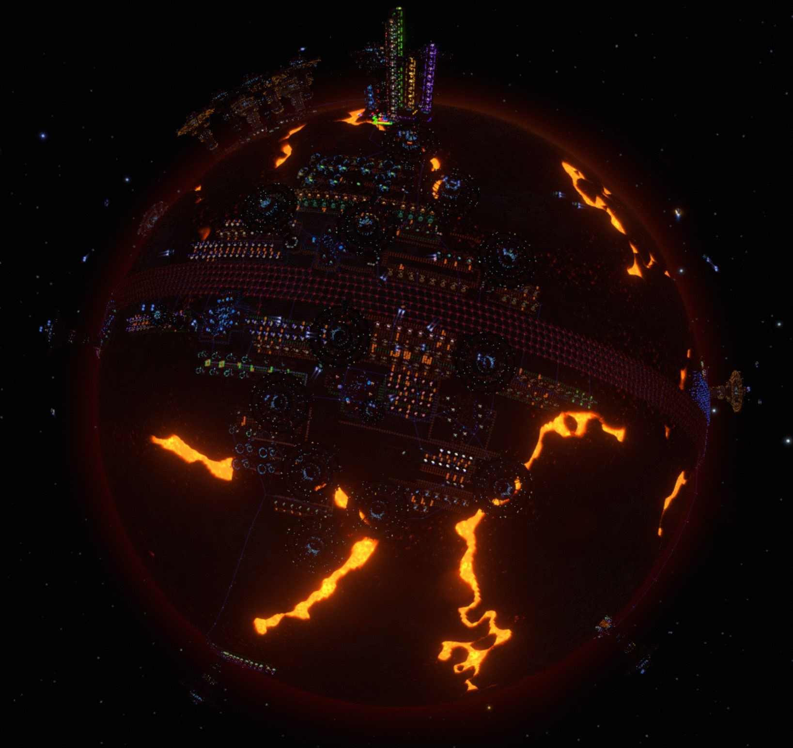
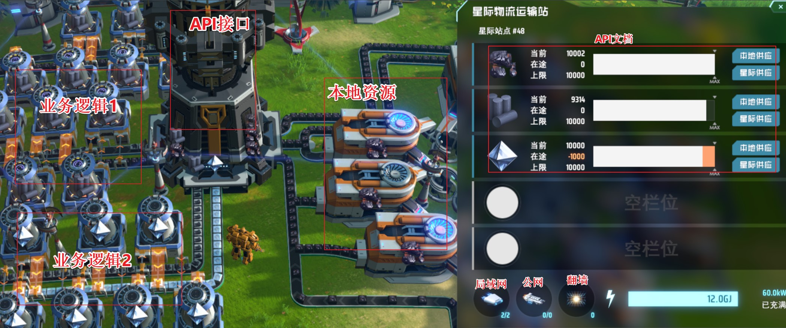
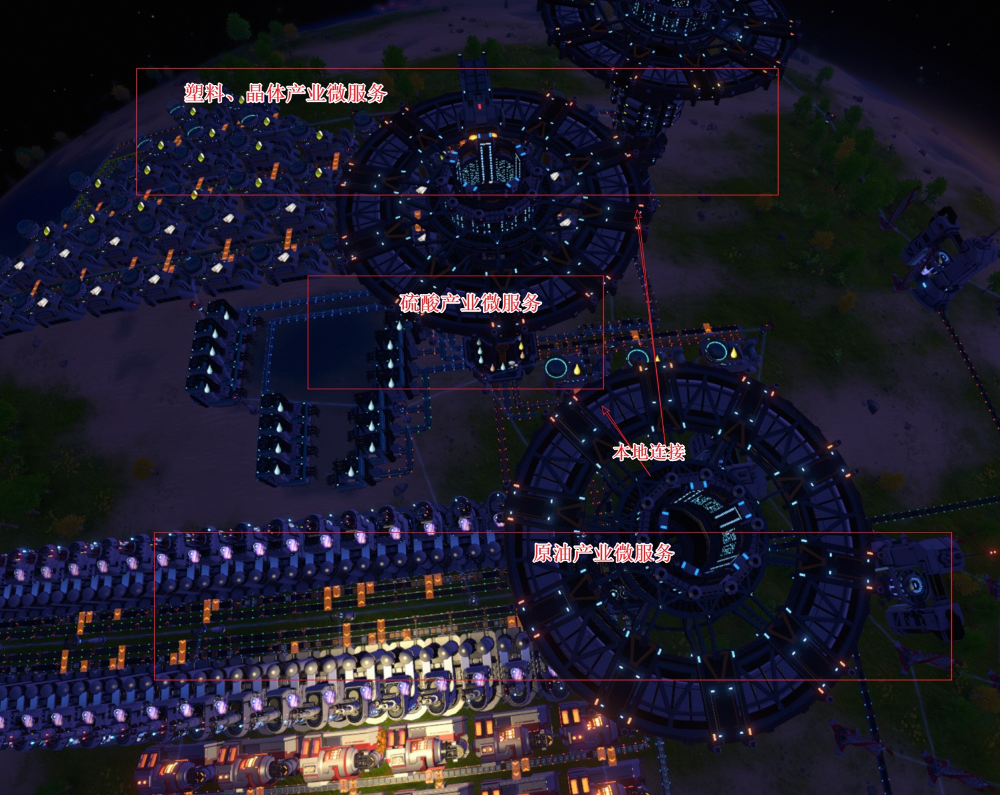
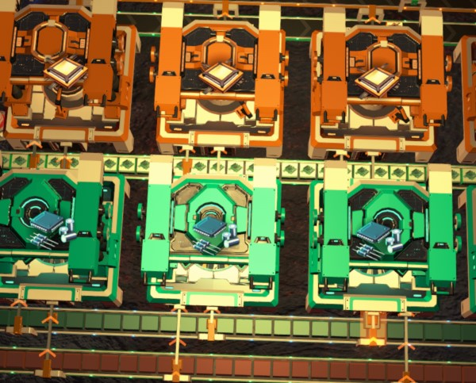
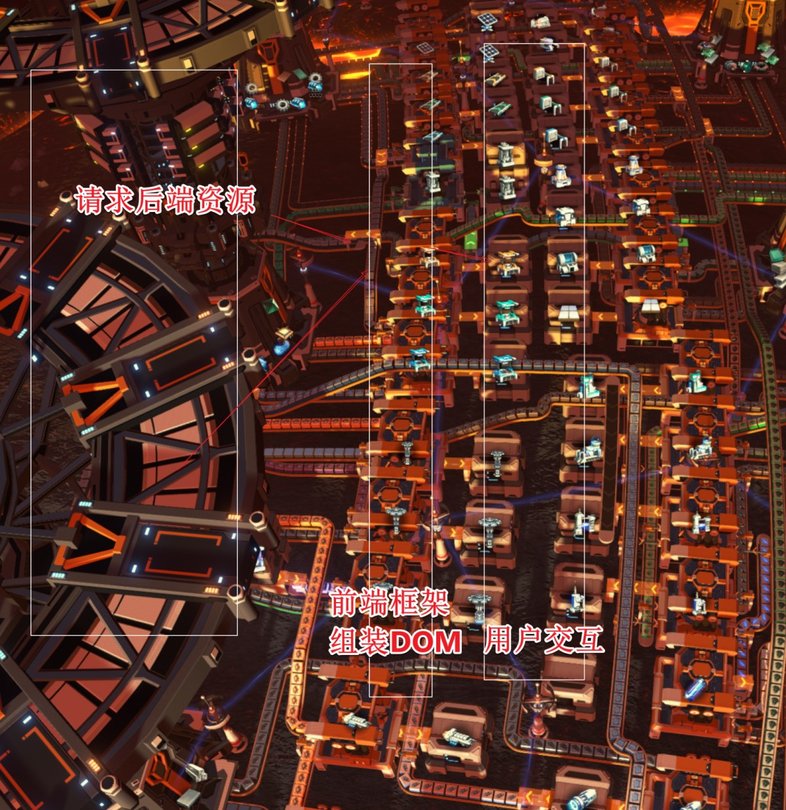
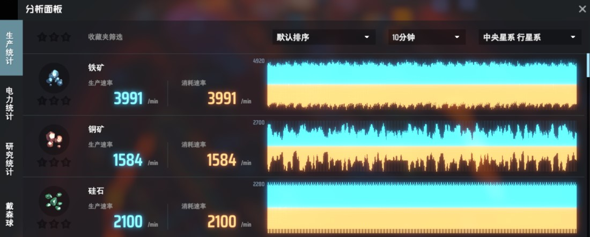

```yaml lw-blog-meta
title: "程序员眼中的戴森球"
date: "2021-04-18"
brev: "奥奥~~学以致用"
tags: ["杂谈"]
```

## 前言

就直接从“星际物流塔”之后的建造模式开始吧。前面的传送带模式虽然也有趣，但是并不是创新。

先上一张（暂时）弃坑前的建设总览图：



看到中间那条太阳能腰带没有？整整7个环哦？600MW绿色能源哦？要是在行星上铺满太阳能电池板我觉得也能有5GW以上的电量吧？~~还造什么球~~

总之，最后的游戏进度是量产绿糖，然后观察了整个宇宙，选好了潮汐锁定准备造球的星系、也选好了附近的资源星系。

弃坑的原因是太肝了，整整两周，业余时间没有学习一点代码，好慌好慌。并且心里总想着要为玩游戏 [写个功能](./210413-Golang-Start-and-Goroutine-Leak.md) 所以玩得也不痛快，干脆暂时不玩了。

## 微服务

首先最自然能够想到的当然就是微服务了吧！

以（星际）物流塔作为基础，在某个资源点（或者空地）上建立一个提供某些固定资源的独立生产单位。

直接上图，懂的自然懂：



## SideCar

SideCar应当是`k8s`造的一个概念？意思是对于一些紧密依赖的东西，可以直接把他们放在一起整合为一个单位来进行调度。

其实物流塔对于生产线来说就已经是SideCar了。

但这里我想说的是，以更高的单位来说，对于一些紧密关联的微服务，我们也可以接把他们放在一起，用传送带(localhost)替代小飞机(tcp)来减少性能开销。

例如最典型的石油工业，塑料、有机晶体都是重度依赖原油的，因此直接把他们放在一起：



然后还有另一个典型例子，在处理器产业链中，微晶元件这个东西只有一个用途就是用来造处理器，而且他们的生产速率比例刚好是3:4，因此我直接把他俩捆绑在一起：



## 用户界面

不管后端微服务做得再好，没有给用户交付实际可用的产品，这套系统就不算完善。那么戴森球的世界里有前端吗？当然有。

在这里，用户（玩家）最终需要的资源其实就是建筑。（太阳帆和节点都是自动化的，只有铺设建筑需要手动操作）。

因此我造了一个“建筑超市”，在这里，从后端各项服务中获取资源，组装成建筑，然后提供给用户任意挑选。用户不必关心代码是怎么写的，只要最后的产出他可以用就行了。



## 运维监控



当然，这个游戏在监控方面还是挺落后的，~~既没有Sentry也没有日志只有Grafana~~，往往出了BUG之后要沿着链路追踪很久才能找到原因……

另外从上图得到的另一个感触就是，理解了什么叫做「工业基础」。

以前经常在新闻中看到什么我国钢铁产业达到多少多少万吨之类的，但是一直没有实感，很疑惑为啥要统计这个？现在自己“经营一个工业帝国”，才算理解，只有这些基础工业打扎实了，才能支撑起那些高端产业啊。

## 小结

实际上这个游戏的主题思想依然是规划，但是如何规划地更好更高效，则需要大量的思考和尝试。

总体来说，是我玩过的最好的模拟经营类游戏了。特别是游戏程序本身真的太高效了。大写的服。
