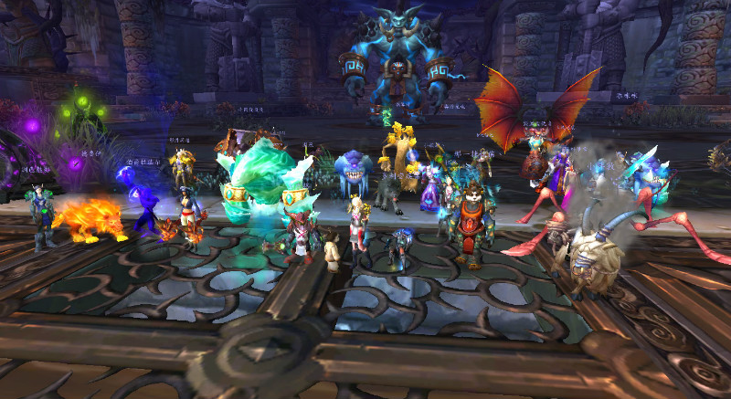

```yaml lw-blog-meta
title: "忆WOW有感"
date: "2021-05-30"
brev: "游戏人生"
tags: ["杂谈"]
```

## 背景

在上一篇博客中，我分享了最近玩EVE的经历和感受。

其实我没有说的是，在这个过程中，我分别在国服和世界服都创建了账号，并且都加入了公司（指游戏玩家公会），以一名小兵的身份，体验了加入一个高度模拟现代社会组织的游戏玩家团体是怎样的感受。

总体来说，这个感受并不算好。（这也是我很快就放弃这款游戏的原因之一）

但是，这两份体验，（以及最近几年的工作经历），却引发了我的深度思考——

我回想起了多年前的一段WOW游戏经历。

## WOW经历

作为上个时代风靡世界的最经典没有之一的网络游戏，《魔兽世界》引入中国我记得应该是在08年左右？我就记得那时候我玩游戏还得去黑网吧里玩，看着别人玩魔兽，卧槽这游戏好牛逼，手里的红警啊帝国时代啊劲舞团啊瞬间就不香了。但是想玩这游戏还不容易，因为要实名认证，要年满18岁才能玩。因此这游戏一直算是我的一个小梦想。

高考之后的暑假总得做点什么。因此我召集了几个志同道合的伙伴，正式进入了这个经典的世界。（虽然那时仍未年满十八，但总有办法的对吧）

那时候有个叫战友招募的东西，一起玩游戏有3倍经验加成，因此我们没有选择代练，而是几个人相约一起上线做任务升级，进度也还算快。

满级之后，就要面临团队副本的问题了。是加个公会，还是找野团？

当时也没有想太多，只觉得，我们兄弟姐妹几个人，就想自己玩玩，没想玩多牛逼。而我这人呢，又喜欢折腾、喜欢操心，于是我就直接创建了一个公会。那名字我至今记忆犹新——她是我的骄傲之一。她就是在那一两年名扬整个第十大区提瑞斯法服务器的「魔舞」公会。

可以算是白手起家。开局只有兄弟姐妹几个人，但是经过几个月的发展，「魔舞」变成了拥有超过1000个角色、同时在线超过100人、每周可以打3个团队副本的一流公会。



但后来，由于我个人学业原因，无法继续投入，因此将她交给了一个资深成员代管。这个决定也成为了我二十多年人生中最遗憾的事情之一。

有话，就讲出来，哪怕是以博客的形式没人看，也会觉得舒服很多。因此，我在这里将我不成熟的感想分享给大家：

## 草创阶段

无论是经营一个游戏公会也好，还是推广到——经营一家店铺、一家公司也好，我觉得一个很重要的理念叫做：「**守**」

是的，店铺要有人守着、公司也要有人，而游戏公会，更是需要这种坚持和奉献的精神。

一开始我们要钱没钱，要人没人，要技术也没技术，为什么别人愿意加入我们？

把玩家当作用户来看，这实际上就是一个实现初期用户增长的过程。总结起来就两个词，用营运同学的专业术语表达叫做：**入池**、**转化**。

首先，要投入人力成本（我自己），长期坚持公屏打广告、地推等行为，积累新用户。

这一步很简单，任何一个公会都做的到。

第二，也是更重要的一点，继续投入人力成本（我自己）和一定的资金成本（我自己），主动去帮助公会成员。

这个步骤，可能很多公会能做到表面的程度。但是我的理解是，这个步骤的关键在于「**主动**」。

为啥要主动？这其实就是一个很简单的换位思考：玩家到底需要什么？我们为什么来玩（这款）游戏？

概括一下，我认为无非就是「**我能玩**」+「**我想玩**」。

前者，就是（很多公会都可以做到的）新手教学、新手礼包、群聊问答等内容，无论对方是新玩家还是老油条，只要愿意帮，一定有能互相学习和提升的地方。而后者，则是更高层级的“被需要”的安全感和归属感，恕我直言，其实就是要给人安排事情去做。

当然不是每个玩家都会接受你的好意，白眼狼多的是，因此这个过程会遇到很多的挫折，因此创始人的心理素质不能太低，这点小坑还是要乐观积极地扛过去。

做到这些，就有了最重要的：人员的的原始积累。

## 成长阶段

当团队规模膨胀以后，事必躬亲的思路就行不通了。

这时候需要做两件事情：**制订规则**、**分散权力（和义务）**。要把**人治**转化为**法制**，或者，容我使用一个不太恰当的比喻，应该至少是君主立宪模式——团长的人格魅力和少量的私人权力可以保留，但是平时做事还得按规章制度来。

这时候我做了大量的文档和管理工作。例如：

- 公会内部成员划分了等级，明确了等级的要求和福利（硬性）。
- 整理了一些文档内容，提升每个等级的荣誉感（软性）
- 制订了团队活动利益分配规则（DKP规则）
- 整理了各种交流渠道，QQ群，YY频道，甚至一个简单公会网页+文档。（归属感）
- 将一些管理工作交给信任的成员去做。（提高管理效率）

等很多事情。这样归纳起来，感觉好像我是个邪恶的资本家在控制别人哈哈哈，但其实，在做的时候我并没有考虑那么深，我只是凭着自己的直觉在走，我觉得这样做对大家都有好处，我就这样做了，仅此而已。

而所幸的是，我的天赋大概是点对了，这些举措的效果相当不错。

## 成熟阶段

当团队一切走入正轨的时候，作为公会会长，我需要做的事情就与之前完全不同了。

到这个阶段的团队，我觉得最核心的是一个「精神领袖」，而不是具体执行管理操作的人。

自比于乔布斯是过于狂妄了，但是我依然想说，苹果的成功与乔布斯的个人魅力是绝对分不开的，而魔舞的成功也是有我个人魅力的因素在的。

「精神」这个东西，可能我们平时总是嗤之以鼻，但实际上它可能比我们想象中要重要的多得多。

举个例子，在这个阶段发生了这么事情：有个老成员（为什么这个时候我想用老员工来称呼他哈哈哈我有毒）与外人发生了一些经济纠纷，一开始在游戏里世界频道吵，然后我看到了，很自然地介入了，于是客客气气地请对方来YY频道，了解了事情的原委，让双方协调了解决方案，然后赔礼道歉送人走。

其实看起来也就一个很普通的事情。但接下来就玄幻了：事后立即有一个高玩团队（十几号人）直接联系我，说要整个团保留建制加入我们。

我问为什么？对方说：就凭我今天这为人处事。

原来，YY频道是有公开区域的，刚才处理纠纷的时候，有不少路人玩家也进来看热闹来了，所以就才有了这么一出……

说实话，其实我自己是觉得我没做什么的，而且，现在再联想到不久之后我不负责任的AFK，我甚至觉得很愧疚，很对不起他们对我的信任。如果上天再给我一次机会，面对这样一群重情意的人，我必须要以加倍的情义回报之。

所以，这个故事就是发生在我身上的、关于「影响力」的最好的例子。

## 领袖的能力

实话实说，我在WOW的操作水平只能算中等，好听点算中等偏上吧。

我很羡慕有些玩家，大概是脑子结构不一样导致对游戏理解不一样？也没见他们比我多投入，但是他们在游戏操作的表现就是比我厉害。（在现实中，其实我的算法能力大概也就中等水平，也同样羡慕那些对算法很敏感的人）

在WOW团队副本中，一个理想的团队组织结构，应该包含1~2个团长副团长（主要负责人员、分配、补给等杂务），1~2个指挥官（研究战术其实需要很多精力），以及多个MT（坦克其实也能认为是副指挥），甚至再狠一点，每个战术小队都可以安排组长来负责协调和训练。

但我并没有做到理想的情况。

不是我不想，而是，这种管理、指挥一类的工作，其实也和那些技术性的工作一样是需要一定天赋的，这样的人才只能说可遇不可求（至少在游戏的环境中）。

所以我一个人兼顾了太多事情，导致在每件事情上都没有达到我想象中我应该做到的完美程度。

那么，领袖是这种半吊子的水平，究竟行不行？

我的观点是：不是不行，但是如果可能的话，还是要有个杀手锏比较好。要么在广度上秒杀所有人，要么在某个深度上有一定的权威，总要有点拿的出手的东西，才能让更多的人心服口服。

好吧，毕竟我算是个完美主义者，这样看下来，我心目中对领袖的要求可能太高了吧哈哈哈。

## 接班人的选择

如果说那个整团加入我们的事件是我WOW生涯的高光时刻，那么，我在接班人的选择这件事情上，则是我WOW生涯最失败的事情没有之一。

虽然那位兄弟估计一辈子也不会看见这篇文章，但是我仍然要强调一下，每个人有每个人不同的情况，也许他也有他的难言之隐，我这里对事不对人。我不怪他，我只怪我自己，真的。

我觉得这段经历对我的教训就是：

- 有**领袖能力**的人是很少的
- 有**管理能力**的人，未必会有**领袖潜力**
- 心态有时候可能比能力更重要
- 人心并不是表面上就能看得出来的，特别是在游戏这种都见不到真人的环境中。

容我再次狂妄地对比一下苹果。我并不是个果粉，在我看来，在乔布斯走后，库克的风格是有很大不同的，当时我一度认为苹果要走下坡路了。但结果看来，库克做的很好，至少远远比当初唱衰他的那些人所预料的要好的多。库克很强，乔布斯眼光也足够好。

到底什么样的人可以是个好的接班人？这个我还没有答案。

如果以我自身为参考，很抱歉，我还真没见过有跟我的三观和做事风格都接近的人，说白了，我觉得我是个奇葩，甚至我觉得我这样懒散而又不负责任的人，其实才不应该担任领袖。魔舞的成功经历，有一些必然的部分（我自信的部分），但更多的我觉得还是意外的（大概只是当时没人比我做的更好吧）。

## 总结

最近我感觉自己有点哲学气质了哈，到摸棱两可的时候，就想说一句：现实中没有绝对的对错，人都会犯错，吸取教训就好了。

所以，到底怎样当一个成功的领袖？还是大家自行思考吧，本文仅供娱乐，请勿当真。

话说回来，用游戏的经历来思考对现实的感悟，这个事情大概有点不太靠谱吧哈哈哈。
