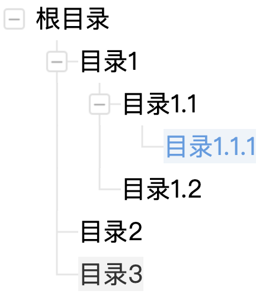

```yaml lw-blog-meta
title: "React写一个可展开的多级列表"
date: "2021-08-07"
brev: "算是前端组件里比较复杂的一个吧"
tags: ["前端"]
```

## 背景

继续以一个专业前端的能力来要求自己。

前阵子在工作中做了一个多级列表。本以为这东西还挺常见的，而且之前在 [antd中也使用过](https://ng.ant.design/components/tree-view/en) ，所以我们项目的前端组件库应该会有吧。可是等我动手的时候，好家伙，还真没有，所以就自己手撸了一个。

这篇文章不直接抄代码，我重新、从零开始写一个通用的多级列表。

## 需求

1. 可以展开、收起。
2. 多级之间有递增缩进，前面有 + - 按钮以及相应的连接线。
3. 选中、hover等基本样式。
4. 最好具备泛型，支持灵活的数据格式。
5. 最好支持自定义组件。


作为展示，我开了一个全新的 [Github项目](https://github.com/Saodd/learn-react-expandable-list) ，特别一提，这里的代码框架是用的我自己配置的 [一套前端项目模板](https://github.com/Saodd/Project-Template-React) .

## Step1: 后端接口

以数据为核心，我们先模拟一个后端接口，这个接口会以列表的形式返回一个树形结构，这里我们就定义一个最简单的样子：

```typescript
export interface SomeCategory {
  id: string,
  parentId: string,
  title: string,
}
```

然后做一个简单的Mock：

```typescript
function getSomeCategory(): GetSomeCategoryResponse {
  return {
    data: {
      cats: [
        { id: '0', parentId: '', title: '根目录' },
        { id: '1', parentId: '0', title: '目录1' },
        { id: '2', parentId: '0', title: '目录2' },
        { id: '3', parentId: '0', title: '目录3' },
        { id: '4', parentId: '1', title: '目录1.1' },
        { id: '5', parentId: '1', title: '目录1.2' },
        { id: '6', parentId: '4', title: '目录1.1.1' },
      ],
    },
  };
}
```

然后就可以把重点放回到UI上了。我们在顶层容器上用Hooks来获取这个接口的数据：

```tsx
function MyList() {
  const [cats, setCats] = React.useState<SomeCategory[]>([]);
  React.useEffect(() => {
    getSomeCategory({}).then(body => setCats(body.data.cats));
  }, []);

  return <div>
    {cats.map(cat => <p>{cat.title}</p>)}
  </div>;
}
```

验证可用，进入下一步。

## Step2: 组件的基础逻辑部分

> 在说我的方案之前，先说一下antd 。现在(2021-08-07)看 ng-zorro 的组件文档，是有很多种树形组件的，大概看上去是满足各种需求的。但是 2021-04-21 那时候应该还是没有这些组件的，看代码记录，那时候我是用`nz-table`以列表的形态实现的。

要做的组件，先不管css样式，我们先让数据能够正确流入，然后展开、收起的动作能正确执行。

首先处理数据，将平铺的列表转化为树形结构。为了体现通用性，这里我们的树形结构特地做成与上面接口返回的不同的类型：

```typescript
export type ExpandableListNode<T> = {
  children: ExpandableListNode<T>[]
  data: T,
  defaultExpand?: boolean,
}
```

其实对于这个树来说，最核心的就是`children`字段，它负责将各个节点关联起来，形成树状结构。然后我们用泛型`data:T`来储存我们的业务数据类型。

接下来我们将业务的对象列表转化为对象树（其实这个逻辑可以放入通用组件中而不是在业务组件中）：

```typescript
  const root = React.useMemo<ExpandableListNode<SomeCategory>>(() => {
    // 1. 先把列表转化为Map，把所有元素注册进去
    const map = new Map<string, ExpandableListNode<SomeCategory>>();
    cats.forEach(cat => map.set(cat.id, { children: [], data: cat }));
    // 2. 兜底处理一下根节点，应对列表为空的情况
    map.set('0', map.get('0') || { children: [], data: { id: '0', parentId: '', title: '根目录' } });
    // 3. 逐个添加到父节点的children中去
    cats.forEach(cat => map.get(cat.parentId)?.children.push(map.get(cat.id)));
    // 4. 根节点默认展开
    map.get('0').defaultExpand = true;
    return map.get('0');
  }, [cats]);
```

然后以上面的节点结构为基准，写一个泛型组件：

```tsx
interface ExpandableListProps<T> {
  root: ExpandableListNode<T>;
  render?: (root: ExpandableListNode<T>) => ReactNode;
}

export function ExpandableList<T>(props: ExpandableListProps<T>) {
  const { root, render } = props;
  const [expand, setExpand] = React.useState<boolean>(!!root.defaultExpand);
  const handleClick = React.useCallback(() => {
    setExpand(!expand);
  }, [expand]);

  return <div>
    <div onClick={handleClick}>
      {render ? render(root) : <p>{root.data}</p>}
    </div>
    {expand && <div>
      {root.children.map(node => <ExpandableList root={node} render={render} />)}
    </div>
    }
  </div>;
}
```

这里，我没有把各级节点的`expand`状态储存在数据对象中，而是储存在组件的State中。然后通过`render`属性来支持自定义节点所要展示的组件。

还有，这里仅仅实现了最基本的树的特性，其实可能还需要更多其他属性来实现更复杂的树的功能。

## Step3: 子节点的连接线

然后完善一些样式。

依然先说解决方案。在现在的 `ng-zorro` 组件库中，连接线是借助`::before`和`::after`来插入带`border`的伪元素来实现，然后 `+` `-` 符号则是svg符号来实现。

我这里的方案，是抄的淘宝某个业务的线上方案，主要思路是给一个包含各种情形的切图，然后用大小和位置来切出需要展示的内容。


上面的图片就是淘宝所使用的切图，颜色很淡，看不清的话请右键新标签页打开。

样式主要分成3个部分：

- 一个是各级节点本身所要展示的内容。在本例中就是一个title，但是要注意hover和selected等样式。
- 一个是children前面的缩进。
- 最后的重点是各级children前面的 横竖连接线 和 +-按钮。

第一个并不难，但是要注意文字的对齐，简单点用`line-height`来对齐。这里由于淘宝的切图资源是按24px来设计的，所以我们也按这个高度来做。

第二个，缩进最好由父元素来控制，子元素不需要感知。

```css
.root {
  padding-left: 24px;
}

.parent {
  height: 24px;
  font-size: 12px;
  line-height: 24px;
  span{
    cursor: pointer;
  }

  &.selected {
    span {
      background-color: #EBF1F9;
      color: #3089DC;
      opacity: 0.8;
    }
  }

  &:hover {
    span {
      background-color: #F0F0F0;
      opacity: 0.8;
    }
  }
}
```

第三个，只能由子元素自己判断前面的树枝样式。因为父元素只能感知到自己的子元素的情况，而不能感知到子元素的子元素的子元素……的情况。所以，由所有的子元素自己控制自己的样式，然后以某种规则刚好拼接在一起，看起来像是整体就好了。

最后一个复杂的点在于，连接线的判断情况看起来有很多。但实际上，只要分成 横竖连接线 和 +-按钮 两个部分，分成两个判断，让后者叠加在前者上面自然形成组合，这样我们的逻辑判断就能变得非常简单了。

```css
.prefix {
  position: absolute;
  background-image: url("https://img.alicdn.com/tfs/TB1wZpDnBTH8KJjy0FiXXcRsXXa-296-296.png");
  background-size: 148px 148px;
  width: 24px;
  height: 24px;
  left: 0;

  &.branch {
    z-index: 5;
  }

  &.branch0 {
    display: none;
  }

  &.branch1 { // 三叉
    background-position: -8px -35px;
  }
 // ...
}
```

除了样式之外的控制逻辑，都是基本操作了，不再赘述。

最后放上 [预览地址](https://saodd.github.io/learn-react-expandable-list/)


