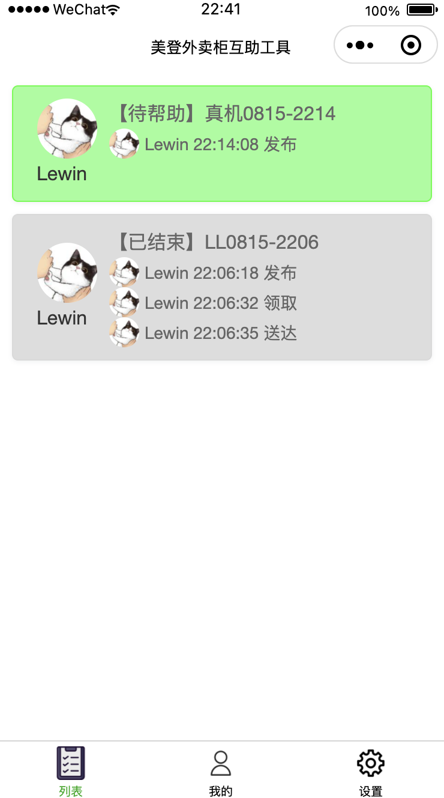

```yaml lw-blog-meta
title: "微信小程序全栈开发笔记"
date: "2021-08-14"
brev: "一个人的七夕，就用两天时间写个小程序玩一下吧~"
tags: ["前端"]
```

## 背景

Web端已经玩得差不多了，除了动画这块还未深入研究之外，其他的需求已经完全没有难度了，产品经理要啥我就能写啥。

看到同事在写小程序，自己心里也痒痒。既然组里没有（微信）小程序的需求，那没办法，自己创造需求吧。得从产出需求开始完成全链路闭环，那才叫全干工程师嘛（不是）。

最近刚好有个现实问题，可能会是一个需求：现在的外卖都是放在楼下的外卖柜里，但是坐电梯很不方便，因此我打算做一个外卖助手，让同事们能方便地代取外卖，节省大家的时间。

用Web写当然很容易，不过毕竟对于用户来说还是略有不方便。这种天天要用的小工具，能做在小程序里当然是最好的。

## Step1：了解小程序

不得不说，微信的相关 [文档](https://developers.weixin.qq.com/miniprogram/dev/framework/quickstart/getstart.html) 做得还是很不错的。

创建小程序账号（准确的说是微信公众平台账号），需要一个邮箱，由于每个邮箱只能注册一个小程序，建议专门注册一个，专门用于这个小程序的管理。

下载 微信开发者工具（IDE），选择上述小程序账号，创建一个新项目。

在Demo项目中，已经展示了 `wx.login` `wx.getStorageSync`等重要功能。

至于网络请求方法`wx.request`，就得自己去看看文档了，不过用法上基本与常规js网络库相近，可以自己控制header，可以获取完整的response对象。

作为入门，可以参考一下阮一峰的教程，不过他的文章已经比较过时了，有个大概的印象即可，不必深究。

## Step2：后端开发

### Step2.1：调通接口

这里先要了解一个背景知识，微信小程序对于网络请求是有域名白名单限制的，并且只支持https。所以为了在本地调试，一种方法是在本地劫持自己的域名代理到本地服务上，另一种简单的方法是在开发工具里给项目设置不检查域名（仅在开发模式下有效）。

先随手封装一个接口请求函数试一下连通性：

```typescript
export async function testApi(): Promise<{ msg: string }> {
    return new Promise((resolve, reject) => {
        wx.request<{ msg: string }>({
            url: "http://localhost:7777/miniapp/test",
            success: (resp => resolve(resp.data)),
            fail: reject,
        })
    })
}
```

```go
// 后端是go-gin
g.GET("/test", func(c *gin.Context) {
    log.Println(c.Request.Header)
    c.JSON(200, gin.H{
        "msg": "Hello, lewin!",
    })
})
```

### Step2.2：用户认证

然后考虑用户身份系统。

此前，我的个人博客网站已经实现了 Google OAuth2.0 已经把所有的框架都搭好了。特别值得一提，值得表扬自己的是，我已经做成了独立的账号体制，也就是说，我的用户是一个表，谷歌关联账号是另一个表，我的用户系统并没有绑死在Google上，因此这次接入微信登录只需要在用户表里加一个字段、再新开一个微信账号表就可以了，一切都非常地简单自然。

稍微有点区别的是，微信的请求似乎不支持（也不建议用？）Cookie，所以原来针对Web的那一套机制会稍微有点别扭。不过也不需要改造，只要在小程序这边手动模拟一下Cookie的使用就行了。

小程序的 [登录流程](https://developers.weixin.qq.com/miniprogram/dev/framework/open-ability/login.html) 是个很标准的OAuth，不过稍有区别的是，可以省略了跳转微信登录页以及认证后跳转回到自己的页面的操作，直接可以获取微信的code。

根据标准，有了用户的code，接下来我们还需要自己的 AppID 和 AppSecret 用来去微信获取用户数据。这个去 小程序后台 设置一下，就能获取。

这里有不少区别。Google的认证接口是POST方法，把参数以JSON的形式放在Body里，而微信是GET方法，把参数放在url里。显然Google的方案胜出，一方面Body中的数据更安全一点点，另一方面这个认证操作应当是非幂等的，用GET方法不太合适。

第二，Google在认证时，可以直接指定你所需要用户授权的范围，认证通过之后会直接将授权范围内的数据发给你。但微信不是，这个登录接口仅仅只是登录而已，只会给回你一个 `openid` 和一个 `session_key` 。也就是说，认证通过之后，服务端仅仅知道这个人是谁，而没有任何其他的信息。

如果需要补充一些基本信息，首先是昵称和头像，可以通过在小程序中调用`wx.getUserProfile`来获取。不过这个又很恶心，要求必须通过button来触发，不能直接弹窗，这样在设计小程序页面的时候就不得不做一个登陆页了。

> 这里吐槽一下，这个api说是在密文中有一些东西，然鹅，等我费劲地解密之后，发现里面的东西跟外面明文的东西根本就没区别……所以根本不用去解密这个玩意。解密算法实现参考: [文章](https://studygolang.com/articles/26798)

然后，一个很常见的需求是获取手机号，然鹅，腾讯说，[只有非个人用户才能使用这个接口](https://developers.weixin.qq.com/miniprogram/dev/framework/open-ability/getPhoneNumber.html) ……

罢了，这个功能就曲线救国，用其他方法来鉴别一下用户的真实身份吧（鉴别是否是自己的同事）。

到此为止，虽然没有用户数据，不过服务端至少可以认证用户身份，所以至少我们自定义登录态是可以实现了。进入下一步。

### Step2.3：自定义登录态

之前我的Web实现，是在认证登录之后，设置一个Cookie。

在微信小程序中不能直接使用Cookie，所以我需要拦截`wx.request`，添加自己的`Cookie`，然后读取服务器返回的`Set-Cookie`保存到 Storage 中去。

正好，`wx.request`方法是传统的回调式调用，我也正需要将它包装为 Promise 风格的实现以便于后面使用。

（代码略）

### Step3：首屏拦截-用户注册

如果仅仅是认证接口，那我连用户的昵称和头像都没有，这在后续的使用中会造成极大的麻烦。

而且考虑到，补充用户信息 这个事情，对于用户来说仅仅需要点一下授权按钮即可，而且每个用户只需要补充一次，数据将会在服务端永久保存。所以我完全可以将这个步骤拦截在首页之前，强迫用户必须授权。

所以我需要在首页加载时，读取一下我自己的用户信息接口，如果用户的信息充足，那么进入应用；如果不足，就显示授权按钮。

不过，小程序并不能很方便地去操作页面元素，因此我选用了一个比较笨的办法，在需要权限的页面上的`onShow`回调上进行权限检查，如果不通过则跳转到登录页。

或者准确的说，跳转到登录Tab。微信小程序内置的TabBar还算是比较方便。

然后在登录页有个按钮，用户点击授权。授权之后，前端（小程序）会获得wx返回的用户信息，我将其推回服务端，成功后，再跳转回到首页。

（代码略）

### Step4：任务列表页

这次的需求，可以理解为是一种多人协作点餐系统，或者更本质一点，可以理解为是一种实时多人聊天室。

任务列表页，其实就相当于是聊天室的公共频道。

为了保证实时性，我们需要一种服务器推送到客户端的手段。首先第一个想法是Websocket，但是毕竟我也做过，也知道这里面涉及到要注意的东西还是挺多的，逻辑会变复杂。于是我选择一种更简单更粗糙的实现——长连接。

为了提高并发性能，我设计两层存储结构——数据库+缓存。不过有些特殊的是，我的上层缓存直接在Web服务内（因为我只有一个Web容器），连Redis都不需要。

实现思路与传统缓存架构一致，不过由于缓存层的写入是一定成功的，所以异常处理模型可以简化很多。

即，先写入数据库，可以同步知道结果，写入成功后再更新本地缓存，（然后响应所有的长连接）。

### Step4.1: 纯缓存版本

由于长连接这块还是需要一定的并发实现能力，所以先把它给实现了。

首先准备两个路由，一个查询列表，一个创建：

```go
g.GET("/list", views.BlockGetList)
g.POST("/create", views.CreateTask)
```

最最重要的是，本地缓存的数据结构设计：

```go
var (
	lock          = sync.Mutex{}
	tasks         []*Task         // 本地缓存
	currentCtx    context.Context // 长连接都挂在这里，便于一次性通知所有连接进行响应
	currentCancel context.CancelFunc
)
```

```go
func initCurrent() {
	// todo: 从数据库中恢复数据

	lock.Lock()
	defer lock.Unlock()

	// 将现有数据转为JSON并计算HASH
	data, _ := json.Marshal(tasks)
    mc := md5.New()
    mc.Write(data)
    hash := base64.RawURLEncoding.EncodeToString(mc.Sum(nil))
    ctx1, newCancel := context.WithCancel(gCtx)
	ctx2 := context.WithValue(ctx1, "data", string(data))
	newCtx := context.WithValue(ctx2, "hash", hash)

	// 在锁的保护下替换当前的context，并取消旧的
	oldCancel := currentCancel
	currentCtx, currentCancel = newCtx, newCancel
	if oldCancel != nil {
		oldCancel()
	}
}
func init() {
	initCurrent()
}
```

这样，一个全局的context就能自己维护自己了，所有进来的查询请求，获取当前context，检查hash，如果一致则表示没有新数据则阻塞等待（长连接），如果不一致则表示有新数据即可立即返回。

> 注意，这里在单机缓存的情况下，可以只检查hash，因为web容器中的缓存一直是最新的。但是如果在分布式环境下，那么就要再加一个时间戳，避免客户端从某些未及时更新缓存的容器中拿到旧的数据。

> 再提一个细节，`context.WithValue`这个方法中的key，最好不要提供string，因为不同的库之间可能会产生冲突（碰巧用到同一个名字）。最安全的办法是用指针，例如`new(int)`。再扯远一点，gin框架中的Keys却是限定了string类型。只能说，用string更方便，但是用指针更严谨。

```go
func BlockGetListJson(c context.Context, hash string) (_json string, _hash string) {
	ctx := currentCtx
	currentHash := ctx.Value("hash").(string)
	if hash == currentHash { // 没有新数据
		select {
		case <-c.Done():
			return "", hash
		case <-ctx.Done():
			newCtx := currentCtx
			return newCtx.Value("data").(string), newCtx.Value("hash").(string)
		}
	} else { // 有新数据
		return ctx.Value("data").(string), currentHash
	}
}
```

```go
func BlockGetList(c *gin.Context) {
	hash := c.Query("hash")
	ctx, cancel := context.WithTimeout(c, time.Second*10)
	defer cancel()
	data, hash := takeaway.BlockGetListJson(ctx, hash)
	c.JSON(http.StatusOK, gin.H{"data": data, "hash": hash})
}
```

加一个路由，调一下上面的接口。预期结果应当是，如果不传或者任意传一个hash参数，那么会立即返回数据和当前的hash值；如果用这个当前的hash值去请求，那么应当会阻塞到超时，然后返回空数据。

然后我们完善一下create的逻辑，先有一个数据模型，便于理解：

```go
type Task struct {
	CreateTime int64 `json:"create_time"`
}
```

然后我们把之前 "带锁更新context" 的逻辑抽取出来，做成一个独立的函数，叫它`updateContext`，代码省略。

```go
func CreateTask(c context.Context) error {
	task := Task{CreateTime: time.Now().Unix()}
	lock.Lock()
	defer lock.Unlock()
	tasks = append(tasks, &task)
	updateContext()
	return nil
}
```

把这个函数也加入路由中，进行测试。预期结果是，在查询接口阻塞时，如果立即创建，那么查询接口也会立即响应。

这就达成了我们的长连接设计目标。

### Step4.2: 落地数据库

主要注意这几点：

1. 写入操作时，先写入数据库，再更新本地缓存。
2. web容器启动时的初始化，要将数据库中的内容全部读取出来。
3. 可以考虑做个定时任务，定时读取数据库覆盖本地缓存，提高一致性。
4. （如果要强一致，则每次更新都从数据库全量读取，不过这样的性能代价很大）

## Step5：任务创建页

创建页就是使用一个form组件，很简单。

## Step6：任务列表页的各种操作

一个比较理想的状态是，列表中的所有任务，都能共享一个弹窗之类的东西，每次点击一个任务，弹窗中的数据会绑定对应的任务，然后上面有一些按钮可以进行操作。

然鹅，小程序的组件中，并不支持自定义`children`元素，只能写最简单的一些button，不能加一个`input`组件进去，导致很蛋疼。

最后我的方案是，给每个任务组件分别安排按钮。平时是收起的，当用户点击某个任务之后，这个任务的下面会展现出一排按钮以及input。

## Step7：发布

经过本地调试之后，就可以进入上线流程了。

首先，由于小程序上线要审核，而（我自己的）后端上线可以随心所欲，所以先上后端。老规矩，docker build, docker push, docker pull, k8s rollout ... 一气呵成，轻松无痛。

在本地开启域名检测，直连我线上后端。然后开启真机调试，用自己的手机扫码登录之后就可以进行体验了。简单自测一下，与模拟调试的体验一致，没有bug。

那就可以开始发布小程序的版本了。

首先在IDE中点击上传版本（构建后上传），上传时要指定版本号和备注。

然后进入小程序后台管理页面，选择刚才上传的版本，点审核。

接下来就等吧。

说不定审核不通过也不是不可能，如果真是那样，那我就再花一天时间重写一个Web版本的吧~

先截个图纪念一下~



## 小结

总体来说，小程序基本上是Vue的语法，然后（关于Vue我有点记不清了）又觉得这种html/js/css文件分离的方式又很像Angular，不过显然比Angular弱了N个档次。 在灵活性上，更是远远不能跟React相比。

总之，从技术上来看，小程序这个东西，就是写一写简单的基本的需求还行，要更复杂的交互还是只能选择Web 。

虽然 免费托管+对接微信 这个还比较香，但是审核机制的存在，又大大地增加了阻碍。

不过毕竟用户在微信，也是很无奈。这次先简单地点到为止吧。

## 后记

微信的审核速度令人震惊……我在周日晚上11点提交审核，11点半就提示我审核通过，也是牛逼。然后直接登录小程序后台，发布版本！

然后我切换小号登录看了下，咦，果然有bug（

不过只是我的账号系统的一些小问题，后端立即修复上线。

值得一提的是，在这个过程中，Sentry起到了很大的帮助作用，直接可以定位到出错的具体代码行数。所以在这里我也顺便安利一下我封装的Golang环境下的Sentry库： [Saodd/alog](https://github.com/Saodd/alog) .
