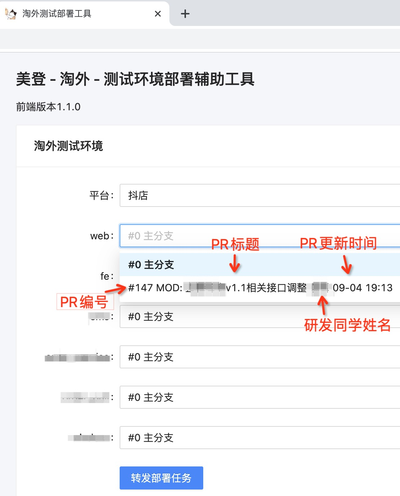

```yaml lw-blog-meta
title: "搭建一个自动部署(CD)系统"
date: "2021-09-05"
brev: "关键词：Gitea Golang React shell docker k8s. 从前端写到后端写到运维，害，怎么就没有一个环节能难住我呢？？"
tags: ["DevOps"]
```

哎呀，这个副标题太招人嫌了，忘记加狗头了！ :)

## 背景

我们内部有一个测试环境发布平台，原本是一个很简单的页面，因为不是我管所以能用就行。

可是最近在做抖店直播的需求，然后发现1个测试环境不够用了，于是我在我自己的开发机上启动了一套环境。既然这样，就顺手做一套发布系统吧，我可不想每次都自己去服务器上操作；同时也顺便造福一下原本的发布逻辑。

这套东西，简单说，先要有个前端选择部署的代码分支，然后提交到后端某个构建部署机器上去执行。

在基本功能的基础上可以做一些优化，例如查看日志，例如并发控制，~~甚至队列系统~~。

先上图：



> 随着我个人境界的提高，现在我已经懒得讲代码细节了，主要讲讲思路。

## Step1: 接入Gitea

准确地说是接入`Git`，具体地说，因为公司这些代码托管用的是`Gitea`，所以就针对它对接一下。

主要目的是，查询某个仓库的PR列表，或者再准确一点，状态为`Open`的PR列表。

因为Gitea肯定有用户身份认证，Token肯定不能放在前端，（同时跨域估计也是不支持的，）所以这部分只能放在后端来实现。认证的Token可以去Gitea的前端，在用户设置页面中，生成一个专用Token就好。

然后去查看 [Gitea的接口文档](https://try.gitea.io/api/swagger) ，是个标准的`swagger`，还挺友好的。接口是`/repos/{owner}/{repo}/pulls`，有2个path参数和n个query参数。

然后可以开始写代码了，先搭一套`gin`的框架，然后想办法调通这个接口，然后封装好，对外暴露，阶段完成。

## Step2: 拉代码&构建&部署

其实这个东西已经是一个简化版的`Jenkins`了，（或者另一套解决方案是用`Gitlab`，）不过我不想折腾那么重的东西，我造个小轮子实现自己的需求也就是两个小时的事情。

首先想象一下这个服务的运行环境。它最重要的依赖是`git`, `docker`, `kubectl` 。

其实涉及到`git`的操作，我理想中是希望把它放在docker中运行的；至于`docker`，可以用`docker in docker`来解决；不过最后还要访问`k8s`，理论上我可以直接访问它的grpc接口，照着protobuf来写肯定能写，但是也太费事了吧，还要考虑配置和秘钥的传递问题，脑壳疼，搜索了一下也没看到有现成的解决方案。

还是作罢，直接在宿主机上运行吧，虽然写`shell`脚本以及这种老派运维相关的坑也有点头疼，不过总比去折腾 k8s in docker 这种看起来就难受的东西要好一点。

### Step2.1: 在Golang中启动子进程

`cmd.Exec()`，然后把stdout和stderr接到一个文件上去。

可以考虑做个`context.WithTimeout()`，超时就杀掉。我这里偷懒没做。

可选优化1，全局限制并发数量1个，用`chan`来解决。

可选优化2，自动清理日志文件，用`go`一个`Ticker`来解决。

### Step2.2: 拉取代码

在启动子进程的时候，通过环境变量来传入需要拉取的仓库名和分支名。（这里**小心脚本注入**，在web层要做好参数处理）

核心命令是`git fetch`，然后`git checkout FETCH_HEAD`，相关优化自己处理。

### Step2.3: 构建镜像

核心命令`docker build`。

其实我理想中成熟的CD系统，应该不包含构建。构建应该是在前置的CI来完成，CD仅仅负责部署。

然后这里，由于我们的项目代码结构也还不够「云」，所以我还需要补充一些Dockerfile和一些配置，这个不属于本次话题内容，而且也是基本操作，不展开讲。

构建之后，如果是单机环境，那就放在本地就好了；如果是集群环境，那还要推送到镜像仓库中去。

### Step2.4: 重启资源

核心命令：`k8s rollout restart`。

依然，k8s资源的`yaml`文件，还是要我自己写。不过因为是测试环境，规模也不大，写起来挺快的，复制修改一下就完事。

## Step3：前端界面

先导入一套前端项目框架（或者脚手架生成，反正我是用自己写的）。

UI组件用`antd`，然后因为需要表单所以要`mobx`及相关，然后一些零碎项目`dayjs` `axios`。

`webpack`相关优化是前端基本操作，几个注意点：

- lib全部使用CDN。
- 根目录不能是`/`，因为我不打算多域名反向代理，所以为了跟`/api`区分开，要在webpack中设置一个根目录。
- 自己少量的代码，因为没用nginx也懒得在gin里配缓存头，既然不缓存，那生成的文件名就不要带hash值。

页面上，做一个居中定宽的根元素，加一个背景色，然后放两个`<Card>`上去承载内容，`<Form>`来展现选项，样式稍微调一下顺眼就行，一个页面下来也超不过小半天。

## Step4: 运维脚本

好了，功能都实现了，继续把运维工作自动化一下。

总体来说，这个服务，是一个直接运行在宿主机上的web服务。程序本身是一个Golang二进制文件，然后依赖一个前端构建产物目录`dist`，和一个CD流程脚本。

运行要用`nohup`，输出重定向到日志文件中去。可以保存一下pid（，或者不保存每次ps+grep处理）。

> 正常来说，Golang的程序应当是极度健壮的，可以认为它不会死，就算某些偶然不可抗力导致的死亡，那我可以手动处理一下，所以不需要更高端的服务管理工具。
> 程序内的业务异常是上报到Sentry。

每次需要重启服务的时候，先本地构建，然后上传文件，然后杀掉旧的，启动新的。

一套逻辑写进一个`.sh`脚本里。

完成。

## 小结

看，就这么几段话就讲完了，是不是很简单？我做这一套也就1天时间罢辽。

所以还在等什么，赶紧回去自己做一个，升级一下公司的运维水平吧~
