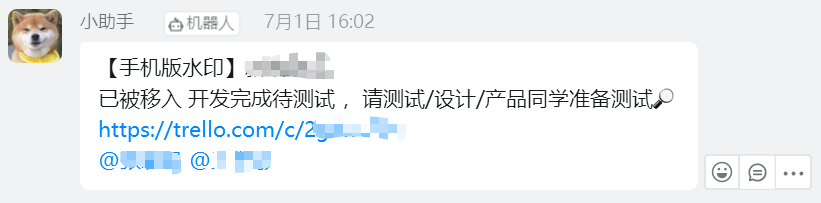

```yaml lw-blog-meta
title: "Trello API 应用实战"
date: "2021-12-12"
brev: "打通项目工具，提升管理效率"
tags: ["架构"]
```

## 背景

其实最近一段时间我还挺咸鱼的，懒洋洋的，业余时间基本都没写代码了。一个很重要的原因是感觉自己又达到一个瓶颈期，至少目前在web前端和后端领域我感觉已经全部精通了，没什么大的东西值得去学了，剩下只能结合实际应用去攒经验、抠细节。

公司这边呢，其实项目管理上一直都很随性，然后测试的人力资源一直不够用，于是就在管理上采取了一些措施，于是导致结果之一就是对项目文档的要求更高了。而雪上加霜的是，由于一些线上事故，我们项目组内部也加强了对需求卡格式的要求。我们是用trello来管理项目需求的，现在已经麻烦得产品经理自己都觉得吃不消了。（哭笑不得）

位卑言轻的我也不好说啥啦，只能一时兴起，顺着现在的方式，写点代码帮助减少一些重复机械劳动吧。

## 思路

首先必须表扬trello，他们的接口做得相当的规范，基本上严格按照REST风格设计，并且有很多小窍门帮助开发期间的调试，非常人性化，是我接触过的平台中开发体验最好的一家。

首先所有的操作都会产生事件（他们叫`Action`），可以自己订阅事件，通过Webhook的形式通知回来进行相应的处理。这就是核心了。

所以这次解决三个小问题：

1. 开发卡在不同开发阶段（提测、通过、上线等）会被加入不同的列，需要通知相应的同学去处理（接入钉钉机器人通知）
2. 创建开发卡的时候，如果需要提测，希望自动创建一张关联的测试卡。
3. 测试卡中有测试同学加入的时候，也同步加入到开发卡中。

## 准备工作

先找到他们的 [接口文档](https://developer.atlassian.com/cloud/trello/rest/api-group-actions/) 

然后既然是Webhook回调，那么我们需要一个有效的（并且带https的）公网域名，以及一台后端服务器。这里我直接用我博客网站现有的资源来处理。

是纯后端的工作，Golang语言实现，数据库Mongo。

## API鉴权

既然要调接口，先了解一下trello的 [鉴权策略](https://developer.atlassian.com/cloud/trello/guides/rest-api/authorization/) 

关键是两点，一个`API key`是可以公开的，表明一个**应用**的身份；一个`API token`，是必须保密的，表明一个**用户**授权给这个应用的身份。

如果只是开发一个简单的应用自己使用，不需要让其他用户再次授权，直接通过他官方的`Server Token`这个应用创建一个token，拿着它就可以直接开始用了，都不需要注册应用。（页面中有一个链接，点过去就可以很方便地为当前登录账号查看key和token）

## Webhook

Webhook通俗理解就是一种事件监听器，当某些事件触发的时候，就会将相关的数据推送到指定的地址上。 [官方文档](https://developer.atlassian.com/cloud/trello/guides/rest-api/webhooks/#webhooks-and-admins)

我们先要上线callback接口，一开始可以直接把body内容打印到日志上，便于调试。

接口必须同时支持`HEAD`和`POST`方法。因为在创建Webhook的时候，trello那边会先调用一次`HEAD`方法来确认接口有效。后续实际通知则是通过`POST`。如果没什么特殊需求的话，给他们都返回简单的200就行了。这里注意，如果返回400 500响应，trello那边会认为调用失败，它有一套重试策略。所以如果是业务内的异常，建议直接捕获，不要反应在http响应中，否则小心重试给你重试崩了：）

webhook请求是携带签名的，签名值放在请求头的`X-Trello-Webhook`这个字段里，验算签名可以验证这个请求是否是从trello那边发来的还是攻击者伪造的（毕竟我们的callback接口肯定是公开的对吧）。除了验算签名之外，trello还明确了请求发起的服务器IP地址，有需要的话也可以借助它来做一些保护。

创建webhook的接口是`POST /1/webhooks/`，参数中要指定`idModel`就是需要监听的东西（板块、列表、卡、用户等任意模型），以及一个`callbackURL`。

创建之后，用`PUT`方法可以修改。还有`GET` `DELETE` 非常直观。

查询当前账号下所有webhook的接口有些特别，`GET /1/token/%s/webhooks/?key=%s`，似乎只支持query传入参数，自己小心处理一下吧。 [参考](https://community.atlassian.com/t5/Trello-questions/How-to-get-delete-webhook-without-id/qaq-p/651450)

创建webhook之后它就开始运行了，当我们做一些操作，例如在板块上创建一张卡片，就会有数据发过来。一开始的开发调试阶段，建议把整个请求Body打印出来或者保存到数据库里。

## REST调用

请求时必须同时携带key和token，携带的方式有几种，可以放在 url path/query 里，也可以放在header里。

请求参数，有些path参数必须放在path里，其他query参数可以用JSON放在BODY里，但是必须明确`Content-Type`头。

一个小技巧，在trello网页上打开一张卡，然后把url拷贝出来，在最后面加上`.json`这五个字符，就会以json的形式显示这个卡的相关数据，很便于开发调试。 [参考](https://docs.datadoghq.com/integrations/faq/how-to-make-trello-card-using-webhooks/)

## 需求1：卡片移入特定列时

`Body.Action.Type`这个字段表明这个事件的类型，对于「移动卡片到某列」会触发`updateCard`这个事件类型，我们做一些简单的判断过滤，然后进入处理环节。

`Body.Action.Data.ListAfter.Name`这个字段说明了移入的那个列的名字，（当然你也可以选择用id来判断），根据它来判断我们接下来需要通知什么内容。

接下来要知道我们需要在钉钉群中@谁？就需要调用接口`GET /1/cards/%s/members`来了解这张卡上都挂着哪些同学的名字。

然后经过一些匹配，得到他们在钉钉中的账号信息。

于是我们现在有了通知内容+艾特列表，拿去调用钉钉机器人的接口，需求完成。



## 需求2：为需求卡创建一张关联的测试卡

并不是所有的需求都会提到测试同学那里去测试，所以需要一种特定的触发方法。

我这里选择的是——评论。类似Github机器人那样，在某张卡片下面评论："@小助手" ，就会有一个神秘"小助手"去创建测试卡。

所以我们需要的事件类型是`commentCard`。

创建卡片用`POST /1/cards`接口。

创建完毕之后再回到原先被艾特那张卡上回复一句创建完毕，用`POST /1/cards/%s/actions/comments`

这里可能需要一些数据库操作，以及排除重复，加锁限制并发等细节，略过不讲。


## 需求3：同步添加成员

事件是`addMemberToCard`。

场景是测试同学在测试卡上挂上了自己，那么如何反向找到对应的开发卡呢？方案一是用数据库中保存的数据，（局限是只对通过这种方式创建过的卡才有效），方案二是直接从卡片内容中搜索对应的开发卡的链接。

获取卡片详情的接口是`GET /1/cards/%s`，可以指定`fields`字段来提升运行效率，这里我需要的是`desc`即卡片中的描述文本内容。获取到之后用正则表达式去找出链接（以及链接中附带的短ID）。（这里再提一个小窍门，短链接中的短ID，是可以替代24位的长ID去调接口的。）

找到对应的需求卡之后，用`POST /1/cards/%s/idMembers`接口给它添加一个成员。注意这个接口在添加已经存在的成员的时候会响应400，自己处理一下哦。

## 小结

这一遍流程走下来，相信你已经对trello的玩法有了一个比较清晰的认识了，后面再要做啥应该都是体力劳动了。

做这个东西，除了提升一些日常工作的效率之外，还会有一种很酷的感觉——因为所有的规则和文案都可以自己定义，可以尽情发挥灵感，挖掘各种玩法。

技术方面也能稍微开拓一些思路，稍微，嗯，稍微。

困了，去嗦个粉然后回家躺平了~
