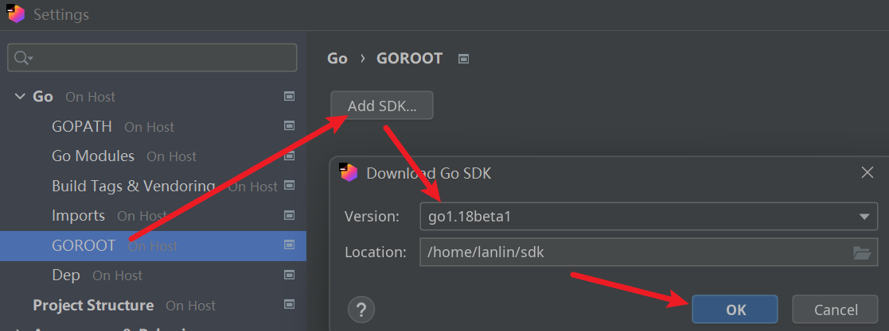

```yaml lw-blog-meta
title: "用 Jetbrains Gateway 体验嵌入式开发"
date: "2022-01-02"
brev: "远程开发是近期热门啊，JB相比VSCode是落后的，看看最近推出的Gateway好用。以ESP32开发板为例"
tags: ["运维"]
```

## Jetbrains Gateway

### Gateway简介

它的主要原理，是在客户端（即我们双手控制的电脑上）启动一个轻量级的IDE，这个IDE叫`Gateway`，它通过ssh等方式连接到服务器（也就是开发机）上，在服务器上安装一个服务端版本的IDE（Goland/Pycharm/Webstorm等）来保存代码，使用服务器的原生Linux环境来运行代码和开发工具链。

- 场景1：使用的是一台性能强大的win台式机，我们在win系统上启动Gateway，远程到wsl2上进行开发；
- 场景2：有多台电脑，选择其中一台相对固定的机器（台式机/刀片机）作为开发机，用另一台相对灵活的机器（笔记本/mbp）远程过去开发

这套东西在VSCode上应该玩得更早更成熟了（虽然我没用过），很高兴Jetbrains的动作还算快，推出的`Gateway`今天就来试试。

### 准备服务器环境(Ubuntu)

> 吐血，我都准备编译了，才发现 [wsl2不支持usb设备](https://github.com/microsoft/WSL/issues/4322) …… 所以又重新在一台原生Linux开发机上配置了一套环境……

一般来说Linux服务器都默认配置好了ssh，只要加入公钥就行了（这个一般也早就做好了对吧），所以不需要做什么事情。

### 准备服务器环境(WSL2)

[Jetbrains Gateway + WSL2](https://vodkat.dev/jetbrains-gateway-wsl2/)

如果之前没有开启过wsl2的ssh-server的话，此时需要现场配置一下：

1.先要生成一个 Host Key ，这个跟我们平时登录时用的公钥-私钥对是不同的，它仅为ssh-server使用

```shell
$ sudo ssh-keygen -A
```

2.然后简单配置一下sshd的配置：

```shell
$ sudo vim /etc/ssh/sshd_config
```

主要把这两行前面的注释取消掉，让他们生效：

```text
Port 2222
ListenAddress 0.0.0.0
```

3.重启ssh-server:

```shell
$ sudo service ssh restart
```

4.（给当前用户）装上公钥，将公钥写入：

```shell
$ vim ~/.ssh/authorized_keys
```

> 虽然不能在WSL2做iot开发，但是普通web开发应该还是没问题的，所以这一套配置并不算浪费。

### 客户机操作

[A Deep Dive Into JetBrains Gateway](https://blog.jetbrains.com/blog/2021/12/03/dive-into-jetbrains-gateway/)

首先在客户机上安装Gateway，这里我直接使用 Jetbrains toolbox 安装，非常省心。

启动之后，选择ssh连接，进入配置界面要填服务器的ssh配置。（这里要想办法获取wsl2服务器的地址，可以用`ip address`命令来获取。）

然后选择一个服务器上的代码工程目录（如果没有的话可以开启一个ssh终端创建或者克隆一个），然后选择要使用的IDE（例如Goland），点击确定。

此时客户端会控制服务器安装 『服务器版本的Goland』，安装完毕后就进入IDE界面，简单看一下，界面基本与原生Goland是一致的。

如果是首次开发，此时服务器上可能连go都没有安装，此时我们可以继续偷懒，让Goland帮我们安装：



> TIPS：作为一个合格的程序员，必须是要懂如何在Linux环境中手动安装自己所需的开发环境的。不过我觉得仅限于知道就行了，实际日常开发中依赖IDE我觉得没什么毛病，特别是在多版本兼容的场景下，依靠IDE会非常非常省心。

稍等片刻，安装完毕后IDE会弹出提示。在IDE中打开一个终端，`go version`确认安装（以及环境变量配置）成功。

然后就可以进入开发了。

> TIPS: 启动一个Goland大概占用1GB的内存，然后代码索引的话看情况，加载了TinyGo之后暴涨了2GB。（一共使用3GB内存）

### 使用体验

Jetbrains Gateway 的体验总体来说一般般吧，毕竟它现在还是被标记为Beta的状态。

它存在一些问题：

1. 某些场景下文件更新不及时，典型场景是git操作之后，git状态错乱；（靠重启恢复）
2. 同一个目录只能由一种IDE打开，这个对于前后端不分离的项目来说很致命，我正常的使用习惯是写后端开Pycharm写前端开Webstorm，不同的IDE的功能还是有细微差别的、并不是靠插件能完全弥补的。

## 准备编译环境

### 安装TinyGo

TinyGo 是 Golang 专门用于嵌入式开发的编译器+工具链。

[Quick Install](https://tinygo.org/getting-started/install/linux/)

```shell
wget https://github.com/tinygo-org/tinygo/releases/download/v0.21.0/tinygo_0.21.0_amd64.deb
sudo dpkg -i tinygo_0.21.0_amd64.deb
```

通过`dpkg`安装之后，`tinygo`应该可以直接调用了，如果不行的话自己配置一下PATH。

### 安装ESP32 Toolchain

[参考](https://docs.espressif.com/projects/esp-idf/en/release-v3.0/get-started/linux-setup.html#standard-setup-of-toolchain-for-linux) ：

```shell
mkdir -p ~/sdk/esp  # 或者找一个你喜欢的目录
cd ~/sdk/esp
wget https://dl.espressif.com/dl/xtensa-esp32-elf-linux64-1.22.0-80-g6c4433a-5.2.0.tar.gz
tar -xzf ./xtensa-esp32-elf-linux64-1.22.0-80-g6c4433a-5.2.0.tar.gz
```

然后还要装一个叫做`esptool.py`的东西，这个需要机器上有python环境。（吐槽一下，虽然我天天写Python，可我依然被Python环境问题搞得头大，真的无Fa可说……）

首先确保你有pip（有python不一定有pip），没有的话需要apt

```shell
sudo apt-get update
sudo apt-get install python3-pip
```

然后安装这个库，[参考](https://docs.espressif.com/projects/esptool/en/latest/esp32/) ：

```shell
pip install esptool
```

安装完成之后，可以先用这个工具测试一下是否正常连接上了我们接入的开发板。

```shell
python3 -m esptool -p /dev/ttyUSB0 flash_id
```

补充：关于怎么找到USB设备我也不是很确定，不过最简单的办法，整个电脑上只连一个USB设备，那这个设备肯定就是那一个了对吧：）

```shell
ls /dev |grep USB
```

## 开发代码

[参考](https://medium.com/vacatronics/lets-go-embedded-with-esp32-cb6bb3043bd0)

### 准备IDE支持

由于 TinyGo 是一个特殊版本的Go，他们所携带的标准库是不一样的，因此在开发时也需要专门配置才能获得完整的IDE支持。

参考：[IDE Integration](https://tinygo.org/docs/guides/ide-integration/)

最重要的是要在IDE里配置好GOROOT。

### 代码：点亮LED

就像我们学习编程语言时的 "Hello, world!" ，在嵌入式开发时，我们会以 "点亮开发板上的LED灯" 作为第一个程序。

```go
import (
	"machine"
	"time"
)

func main() {
	led := machine.Pin(2)
	led.Configure(machine.PinConfig{Mode: machine.PinOutput})

	for {
		led.Low()
		time.Sleep(time.Millisecond * 1000)
		led.High()
		time.Sleep(time.Millisecond * 1000)
	}
}
```

代码很简单，会写Golang的人应该一看就明白。其中`machine.Pin(2)`是指向2号针脚（`GPIO2`），在开发板上它与一个LED灯相连，只要给`GPIO2`设置高电平就能点亮这个LED灯。

然后我们准备一个`.sh`文件，主要是为了给编译过程添加一些环境变量，以便于这些工具能够有效地互相调用：

```shell
set -x
# 第一个路径是esptool.py 第二个路径是toolchain
export PATH="`python3 -m site --user-base`/bin:$PATH:$HOME/sdk/esp/xtensa-esp32-elf/bin"
# 编译并写入
tinygo flash -target=esp32 -port=/dev/ttyUSB0 main.go
```

如果第一次运行，可能会遇到USB设备权限的问题，解决方案 [参考](https://github.com/cashoefman/TinyGo-On-ESP32) :

```shell
sudo usermod -a -G dialout $USER
sudo chmod a+rw /dev/ttyUSB0
```

OK~ 到这里应该终于成功将代码写入了，可以看到开发板上的LED灯一闪一闪的，挺有成就感的。

### 如果要联网……

[文档](https://tinygo.org/docs/reference/microcontrollers/esp32-coreboard-v2/) 说，目前TinyGo还不支持esp32的Wifi功能……

如果需要最原生的支持，还是得看C版本的，[esp-idf官网](https://docs.espressif.com/projects/esp-idf/zh_CN/latest/esp32/get-started/index.html#get-started-get-prerequisites) 

如果想快速地让这块开发板联网的话，应该只能转战Python了，看看 [microPython](https://docs.micropython.org/en/latest/esp32/tutorial/intro.html)

我不是很想写Python，所以这次嵌入式开发体验课就先到此为止了吧。

## 总结

可能只能说嵌入式依然算是一个小众领域吧，我感觉文档都很混乱，没有一些比较权威统一而且又好用的东西拿得出来。

姑且今天先入个门，以后有其他需求的时候再深入研究吧。以及，可能要考虑安排补习C语言知识了。
