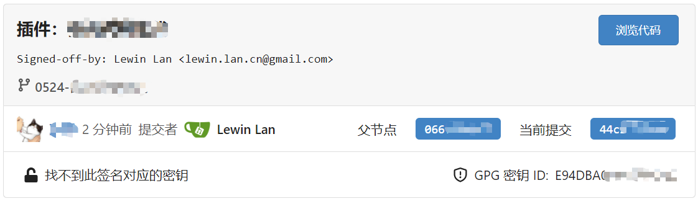

```yaml lw-blog-meta
title: "Git GPG sign 用法"
date: "2022-05-26"
brev: "点亮你的绿色标志"
tags: ["安全"]
```

## 配置过程

- [Github docs](https://docs.github.com/cn/authentication/managing-commit-signature-verification/checking-for-existing-gpg-keys)
- [Jetbrains](https://www.jetbrains.com/help/webstorm/2022.1/set-up-GPG-commit-signing.html#set-up-gpg-keys)

主要流程：

1. 安装GPG（Linux发行版可能自带了）
2. 生成/导入密钥
3. 把私钥配置给Git
4. 把公钥配置给Github等托管平台

密钥配置完毕后，后续所有的commit都会自动签名(`signature`)。不过在Jetbrains里还需要额外配置一下，它不会直接用git的配置。

如果再在Jetbrains的Git界面中开启`sign-off commit`，这样commit就会自动带上 `Sign-off`（实际上就是commit message里多一行内容）。

配置过程有个坑，在 GitBash 环境中的`gpg`与在 Powershell 环境中的`gpg`的数据是不共用的。为了在Jetbrains产品中使用，需要在 GitBash 环境中配置密钥。

> 其实ssh证书也是这样，在不同的命令行工具里配置都不同，不知道我哪里配置错了。这次的gpg证书，在 Powershell/GUI, GitBash, WSL 三个环境里分别是三套数据，因此我需要将一个证书导入导出才能在多个环境中复用。

> gpg客户端有个GUI界面，叫做`Kleopatra`，它的数据环境是与Powershell一致的，可以稍微简化一些操作。也许正是因为带了一个GUI，所以安装包体积才会达到20+MB，因此建议考虑安装那个4MB简化版本。

## gpg常用命令

```shell
gpg --list-secret-keys --keyid-format=long

gpg --full-generate-key

gpg --delete-secret-keys xxxx
gpg --delete-key xxxx

gpg --output private.pgp --export-secret-keys xxxx
gpg --armor --output public.pgp --export xxxx
```

## Signature与Sign-off

参考[这篇](https://segmentfault.com/q/1010000004044749) 讲得蛮好的，意思是：

- GPG签名是为了不被篡改，用作身份认证
- 而 Sign-off 只是在当年没有 Pull Request 这个东西的环境下，用于人工追踪变更记录用的。在现代的年代，不用也行。

## 实际效果

首先要提一句，git每个commit可以有两个身份出现，一个是`author`，一个是`committer`。二者的区别[参考](https://stackoverflow.com/questions/18750808/difference-between-author-and-committer-in-git)

一个很典型但是却被我们视而不见的例子：如果我们在github的web端提交代码（例如init或者licence提交），那么`author`会是我们的github默认用户名+邮箱，而`committer`则是`Github <noreply@github.com>`。

我个人理解，author是实际编写代码的人、拥有代码相关权力；而committer只是帮忙操作了一下。

我先在个人github项目上实践了一下，成功点亮绿色`Verified`标志，舒服了。

然后我在公司项目代码中实践了一下，author被我显式地指定为公司邮箱，而committer使用默认配置的个人邮箱，在Gitea上显示如下：



- 公司邮箱：因为在Gitea上配置过，因此能够被识别，能够显示昵称和头像
- 个人邮箱：因为没有配置，因此显示为原始信息：`Lewin Lan ...`，而且后面的GPG签名，由于我没有在Gitea上配置公钥，因此也被显示为"找不到此签名对应的密钥"。

## 签名的效力

我们知道HTTPS的证书是通过根证书一级一级认证下来的。

而在这里我们使用的GPG证书是没有任何权威根证书参与的。因此我的理解，它只用于：

- 个人识别"这个提交到底是不是我提交的"
- 配合平台认证（用户上传公钥），以平台的名义证明签名的有效性。

## 密钥管理实践

如果要按最严谨的安全级别，那就得参考HTTPS的体系，我们每个人都需要准备一个根证书，以根证书为基础签发出日常使用的证书，每个证书还要配备撤销证书。

想来想去，我个人还是不需要这么高的安全级别吧，先简单点。目前我个人的思路是，直接使用一级证书，设定一个有效期，每两年换一次。

私钥管理方案：

- 通过 对称加密算法+人肉记忆密码+传后即删 的思路来拷贝。（简单可行）
- ssh，不过在现实中会有网络连通性问题。（现实中有网络连通性问题）
- 不拷贝，每个机器使用独立的密钥。（那么密钥数量会翻几倍）
