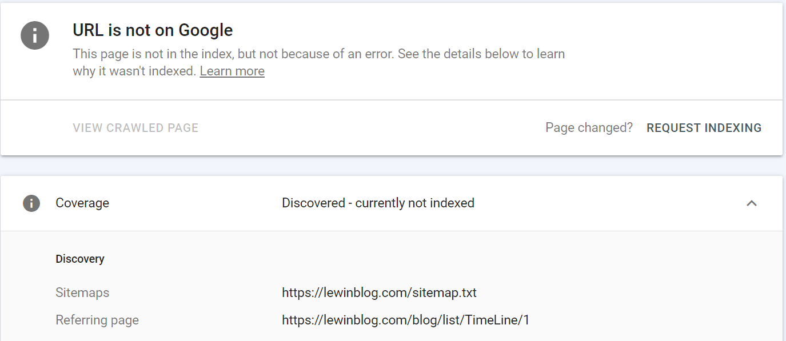

```yaml lw-blog-meta
title: "SEO技术方案"
date: "2022-05-27"
brev: "尝试给SPA应用简单地做做SEO"
tags: ["前端"]
```

## 背景

我这个个人网站，其实一直都没有做SEO （Search Engine Optimization）

原因呢，一方面最大的原因是懒，另一方面也是有些自私地想：我写的东西基本上都是干货，能不能看见全看缘分，难道还要我求着你们来看吗？

其实吧，最早我的项目用Django，以及后来用GithubPages的时候，都是自带一定SEO效果的，无需考虑。可是自从切换到纯SPA架构之后，搜索引擎的收录就渐渐地失效了。

直到最近，自己带的项目需要搞运营，那么作为用户增长的一个努力方向，SEO自然变得不可忽视了。

## SEO核心思路

据我目前所知：

- 技术架构优化（针对爬虫）
- 内容优化（关键词、转化率等）
- 商业手段（竞价排名、投放引流等）

可以参考google的 [SEO Starter Guide](https://developers.google.com/search/docs/beginner/seo-starter-guide) ，毕竟在这个领域没人比google更专业了是吧。

接下来我结合我个人网站SEO改造的过程，主要从**技术角度**来讲讲我的理解：

## 爬虫的原理

我自己是很早就了解过相关的知识的。可是跟其他不同背景的同学交流过之后，才意识到，相对于web技术来说，爬虫真的算是一个比较小众的领域。

我的背景其实也不算特别，只不过是"学Python入门"这个特点而已，而Python除了做AI、数据处理之外，第三个就业方向基本上就是爬虫了。所以认真搞过Python的人应该多多少少都了解爬虫才对。

搜索引擎会有一批机器运行着特定的程序，这些程序不断地访问互联网上的所有网页（所有他们觉得值得爬取的网页）。这种程序俗称"爬虫"。

爬虫的"访问"其实就是简单的GET请求罢了，会得到网页的HTML；然后爬虫程序对HTML进行分析（正则匹配等方式），从复杂的HTML标签中提取出关键内容，例如标题、摘要、文章内容、图片地址等信息；最后把这些关键内容保存在搜索引擎的数据库中，这样人们就可以通过搜索引擎搜到网页中的内容了。

爬虫程序在分析HTML的时候，不仅会得到文本内容，也会从`<a href='...'>`这类标签中获得其他页面的地址。所以一个有效的爬虫应该有一个队列系统，一开始操作人员只需要输入一个"种子url"，剩下的url都应该由爬虫程序自己寻找。

> 这也正是为什么爬虫叫做爬虫，因为它会自己在互联网上爬动！从一个url爬到另一个url！

注意，让爬虫能够爬取到你的网页内容，是SEO的必要条件，也是主要优化方向。

## SSR有必要吗？

答案：可以不需要。

现代的SPA架构对爬虫来说算是一个巨大的挑战，因为SPA的HTML页面中只有简单的script等标签，真正的页面内容需要js执行后（再加上后端提供的数据源）才能渲染出来。

解决方案呢，说难是难，说简单也简单：只要爬虫程序模拟浏览器的行为，也执行js，就能获取到SPA中的内容了。根据我最近的人肉观察来看，google、百度都是会对SPA做处理的，能够爬取到正确的内容。

> 不过这里要吐槽一下了，google还是牛逼啊，爬取的准确性和频率都明显比百度强多了。

SSR一般用于其他方面的优化考虑，例如首屏加载速度。

## ARIA有用吗？

答案：[没用](https://webmasters.stackexchange.com/questions/137304/does-aria-help-seo-have-you-experienced-any-benefits-for-organic-search)

关于ARIA的用法可以参考这篇：[知乎](https://zhuanlan.zhihu.com/p/349622979)

我们只需要知道，aria一般是给盲人之类的特殊人群使用的，aria属性并不会改变DOM本身的行为，我们也不应该期待搜索引擎爬虫去解析aria属性。

## 1. 各个页面要有效地互相链接

特别是在用React框架的时候，前端路由如果选择了`react-router-dom`这种纯js解决方案的话，那么你的代码应该像是这样：

```tsx
const Article: FC = observer(() => {
  const history = useHistory();
  return (
    <div onClick={() => history.push(`/article/xxx`)}>
      <span>xxx</span>
    </div>
  );
});
```

这种方案的问题在于，你所有的链接跳转都是隐含在js事件监听器里的，爬虫在分析HTML的时候不可能去解析这个div底层的js解析器里到底写了什么链接，在爬虫的眼里：你这个页面没有任何超链接，因此爬虫不会继续爬取你网站上的其他页面。

所以你必须通过某种方式在HTML中表达出链接来。例如，你可以写一个`<a>`标签，它可以是`display: hidden;`，它也可以以某种方式盖在div上，或者以某种方式与div产生联系，但一定要在HTML上体现出来。

或者，`<Link>`组件也可以代劳：

```tsx
const Article: FC = observer(() => {
  return (
    <Link to={`/article/xxx`}>
      <div>
        <span>xxx</span>
      </div>
    </Link>
  );
});
```

在这种方式下，div标签会被包进一个a标签里，a标签会准确地显示出目标链接。但也正因为是a标签，它的默认样式略有不同，为了实现与div一样的效果，你可能需要：

```css
.parent > a {
  display: block;
}
```

嗯，上面说的普通的div标签还好办一点，接下来，对于某些组件库提供的现成组件，就稍微有一点点麻烦了。典型的例子是antd提供的[Pagination组件](https://ant.design/components/pagination-cn/#API) 。不过幸运的是，文档中已经提供了`itemRender`方法，还特地说明了"可用于优化SEO"，这就非常容易改造了。

```tsx
<Pagination
  itemRender={(page, type, originalElement) => <Link to={`../${currentTag}/${page}`}>{originalElement}</Link>}
/>;
```

样式方面，由于`Pagination`原生元素就是a标签，它已经处理好了a标签的样式，不需要我们再操心。

## 2. 主动提供sitemap

上面说的正常方式，是从主页开始，有效地将你的所有页面串联起来，让爬虫可以自由爬动。

那么也自然存在另一种方式：你主动告诉爬虫哪些页面需要被收录。

它就是`sitemap`。

这里先提一个观点，我们的SPA页面大概可以用`页面 = 模板 + 数据`这个公式来概括，模板是jsx，数据则是后端API 。其实理论上来说，sitemap应当同时由前端和后端决定，前端掌握的是路由规则，而后端掌握着具体的内容。所以对于前后端分离的项目来说，制作sitemap其实是提升了系统的耦合度，提高了维护成本。

> 上述公式是我从一篇知乎文章上看到的，暂时找不到原始出处了。

虽然sitemap有缺点，但依然不妨碍它成为一项有效的辅助工具。正如其名，`sitemap`——站点地图，地图可以帮助爬虫移动，但是在地图标注不准确的情况下，爬虫一般也能够自己找到自己的路。

关于 [如何构建sitemap](https://developers.google.com/search/docs/advanced/sitemaps/build-sitemap) ，最简单的格式就是提供一个文本接口，每行写一个URL；

得到sitemap文件（或者接口）之后，将其配置到搜索引擎开发者控制台中去，例如[google的](https://search.google.com/search-console/sitemaps) ；

配置完毕之后，google会立即拉取sitemap进行分析。我这次被解析到了263个URL，此时再去搜索URL可以发现它已经与sitemap关联起来了。接下来就等爬虫去爬了（文档说可能要一两天或者一两周，慢慢等吧）。



## 3. 使用title和meta

在HTML格式中，在 [head部分](https://developer.mozilla.org/en-US/docs/Learn/HTML/Introduction_to_HTML/The_head_metadata_in_HTML) 有两类特殊的标签需要注意：

- `<title>`表明了页面的标题，它会显示在浏览器的tab上、书签栏等各种地方
- `<meta>`其中的`description`和`keywords`会被搜索引擎收录。（其他取值[参考](https://developer.mozilla.org/en-US/docs/Web/HTML/Element/meta/name) ）

我个人觉得，摘要和关键字这个见仁见智吧，但是至少标题是一定要有的。

例如，对于一个SPA博客网站来说，在进入博客内容页面的时候，我需要将title设置为博客文章标题，在切换到其他页面的时候恢复到原始默认标题。

具体到实现上可以借助`useEffect`：

```tsx
export function useDocumentTitle(title: string): void {
  useEffect(() => {
    document.title = title;
    return () => document.title = 'default title';
  }, []);
}
```

## 4. 注意HTML语义

既然爬虫是对HTML进行解析，那么HTML结构当然也会影响爬虫的解析结果了。比如同样都是标题，你用`<p>`或用`<h1>`它们的语义差别是巨大的。

简单列举一些：

- 爬虫会重点关注各级`h`标签
- `div`标签是没有任何语义的，试着用 header, main, footer, aside 等标签，[参考](https://www.pluralsight.com/guides/semantic-html)
- 层级的并列关系也很重要
- 图片元素的`alt`属性是有意义的！

## 5. robots.txt

其实我感觉这个应该是个老生常谈的东西了，但就我日常观察来看，会配置这个东西的团队其实并不多。

你可以通过它来告诉爬虫一些规则，类似sitemap，不过robots.txt一般是写禁止访问的内容。

这个东西确实可以认为是个"君子协定"，但是从最近的新闻来看它也是具有司法效力的。不要太小看它哦。

## 6. 用户体验

用户体验中有一部分是属于技术的，例如：

- 页面加载速度
- 移动端支持 / ARIA支持
- 异常状态处理

也有一部分是非技术的，例如内容质量，看起来是个很虚的东西，但实际上也是可以通过用户行为（点击率、转化率、时长、留存等指标）来数值化评估的。

换位思考，搜索引擎肯定也希望用户搜到的内容都是优质的对吧？而且这个事情也确实有利于行业整体水平提升，是好事。

## 7. 接入 analytics

大名鼎鼎的 Google Analytics ，在国内也有对标产品：百度统计。

之前我两个同时用过，后来还是觉得对于我这个小站来说略显多余，加之我不太信任国内企业的用户隐私保护策略，因此我放弃了百度，只用Google 。

然后我发现，大概也是从我放弃百度统计开始，百度也放弃更新我的站点内容了。

其实这个对于搜索引擎来说也是合理的。毕竟搜索引擎如何判断你的网站是否是"热门"网站呢？一类指标是搜索结果的点击量等相关数据，但是不是所有的产品都主要以搜索引擎作为入口呀，因此我认为这些统计工具也是它们判断权重的指标之一。

## 最后：检查工具

google为开发者提供了一项[工具](https://support.google.com/webmasters/answer/9012289) ，它可以评估你网站页面在爬虫眼中是什么样子。你可以根据评估结果，针对性地去改进你的站点。

- 在这个工具的控制台上方，输入你网站的某个URL，google会告诉你这个url当前的收录状态。
- 如果还未被收录，可以点击右上方的"LIVE TEST"按钮，爬虫会立即执行一次爬取动作并做出分析。
- 如果分析结果符合要求，你可以点击"Request Index"按钮，点击后你的URL会被加入爬虫的优先队列中。
