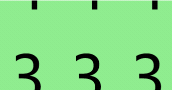
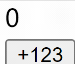

```yaml lw-blog-meta
title: "CSS: 从轮播图到老虎机"
date: "2022-05-30"
brev: "动画也还挺好玩的"
tags: ["前端"]
```

## 预览

代码效果参见 [展示页面](https://lewinblog.com/labs/220530-css-gallery)

## 轮播图

众所周知：『一个合格的前端至少也要能够达到会写轮播图的水平吧！』

同时它也是前端应用中非常常见的展示组件。在ant中这个组件的名字叫做[走马灯(carousel)](https://ant.design/components/carousel-cn/) ，虽然听着有点毛骨悚然，不过还是很形象的。

接下来，从简单的架构开始，逐步优化一个轮播图组件吧：

### 1. 轮播图的基本结构

首先，这个组件应当接受一个数组结构的数据，代表着需要轮播展示的内容。比较理想的实现应该是一组相似的组件，以`children`参数的形式传入；我们先简化一下，接受一个包含url的`string[]`结构。

其次，既然要"轮"而且还要能控制、切换，那就需要一个状态量来记录当前展示到哪个元素了。

```tsx
const Gallery: FC<{ urls: string[] }> = ({ urls }) => {
  const [current, setCurrent] = useState(0);

  return (
    <div className={styles.Gallery}>
      <div>
          {/* ... */}
      </div>
      <button onClick={() => setCurrent(current - 1)}>左</button>
      <button onClick={() => setCurrent(current + 1)}>右</button>
    </div>
  );
};
```

### 2. 图片的移动

要让多个图片左右切换，很容易能够想到，我们需要`transform`属性来控制图片的相对位置，然后用`overflow: hidden`来隐藏那些不需要的图片。如果再加上一些`transition`属性的话，滑动就可以变得更加丝滑。

```tsx
<div className={styles.GalleryWrapper}>
  <div
    className={styles.GalleryImages}
    style={{ transform: `translate3d(${-current * 90}px, 0, 0)`, width: `${urls.length * 90}px` }}
  >
    {urls.map((url) => (
      
    ))}
  </div>
</div>;
```

```scss
.GalleryWrapper {
  width: 90px;
  height: 120px;
  position: relative;
  overflow: hidden;

  .GalleryImages {
    height: 120px;
    transition: transform 0.5s;
    position: absolute;

    & > img {
      display: inline-block;
      width: 90px;
      height: 120px;
    }
  }
}
```

### 3. 首尾相连

先是索引本身的计算，相对简单，减到负数的时候就切回尾部，加过头了就切回头部。

然后是一个比较麻烦的：DOM元素的动画要如何过渡？——具体来说，我们希望最后一个元素继续向右的时候，第0个元素能够正确地从右方滑动入场，而不是整个列表快速倒退回去。

为此我们可以在最后一个元素后面，再加一个第0元素。即 `[0,1,2,3]` 渲染成 `[0,1,2,3,0]` 。

当越界的时候，等动画播放完毕后，暂时关闭`transition`然后再立即调整`transform`，这样就能在用户没有感知的情况下完成一轮循环。

```typescript
const moveRight = useCallback(() => {
  setCurrent(current + 1); // 正常右移

  if (current === urls.length - 1) {
    // 如果移到了尾部
    setTimeout(() => {
      setTransition('none'); // 关闭动画，然后闪回头部
      setCurrent(0);
      setTimeout(() => {
        setTransition('transform 0.5s'); // 重新开启动画
      }, 200);
    }, 500);
  }
}, [current]);
```

上面的实现其实并不完美，因为我拍脑袋定了一个`200ms`的调整间隔，这个间隔在真实的用户场景下可能是不准确的，也许会发生预想不到的结果（不过这个结果也就仅仅是动画上的，只影响视觉体验，并不影响用户功能）。

对这个间隔的问题就很不好优化了，作为参考，我看了下ant的组件实现得也并不完美。其根本原因在于，我们js里面很难确定css的实际执行状态，因此总是不可避免地要做一些强行设定，导致在某些极端场景下的动画还是不够完美。

如果一定要优化的话，我认为终极解决方案应该是：**由js来控制动画关键帧**！这样我们才能清楚地知道当前动画执行到哪一帧，才能做出最完美的优化。具体实现可以选择`GASP.js`这个框架，顺带一提，B站前端大量使用了这个库。

### 4. 懒加载

如果希望提升加载速度，懒加载可能是一个很常见的选择。即，只加载当前可见的元素和它前后两个元素（为了动画效果），其他元素不加载。

```tsx
const Gallery: FC<{ urls: string[] }> = ({ urls }) => {
  const [current, setCurrent] = useState(urls.length - 1);

  const moveLeft = () => {
    setCurrent(current === 0 ? urls.length - 1 : current - 1);
  };
  const moveRight = () => {
    setCurrent((current + 1) % urls.length);
  };

  const u1 = urls[current];
  const u2 = urls[(current + 1) % urls.length];
  const u3 = urls[(current + 2) % urls.length];

  return (
    <div className={styles.Gallery}>
      <div className={styles.GalleryImages}>
        
        
        
      </div>
      <button onClick={moveLeft}>左</button>
      <button onClick={moveRight}>右</button>
    </div>
  );
};
```

上面的代码里，要特别注意img标签的`key`属性，必须要有它，React才会帮我们复用同一个DOM、在同一个src上替换它的class以形成动画效果。如果不写的话，那就是只改src而不改class，这将毫无意义。

```scss
.GalleryImages {
  width: 90px;
  height: 120px;
  position: relative;
  overflow: hidden;

  & > img {
    width: 90px;
    height: 120px;
    transition: transform 0.5s;
    position: absolute;

    &.left {
      transform: translate3d(-90px, 0, 0);
    }
    &.mid {
      transform: translate3d(0, 0, 0);
    }
    &.right {
      transform: translate3d(90px, 0, 0);
    }
  }
}
```


这个方案也有缺点：只渲染3个DOM，会导致不能快速跳转（例如用户想从第1个跳到第4个）。如果要解决这个问题，可以考虑多渲染几个节点，然后做个自动连续点击的功能来模拟跳转。

### 5. 索引小圆点

上面的实现中，我只简单写了 左、右 两个按钮。在实际中我们可能会需要在下方显示多个圆点来代表图片索引。

这个只是一个简单的固定位置的组件，结合上面已经维护好的`current`状态，很好写，我就不展开讲了。

### 6. 拖拽

其实在前端领域，拖拽是一个很大的话题。这里先简单记录一下轮播图的拖拽实现。直接上代码吧：

```tsx
const Gallery: FC<{ urls: string[] }> = ({ urls }) => {
  // ...之前的代码省略

  // 鼠标起点X坐标 和 鼠标当前位置X坐标 ，用于计算当前拖拽的位置
  const [startX, setStartX] = useState<number>(0);
  const [currentX, setCurrentX] = useState<number>(0);
  
  // 开始拖拽，同时设置两个坐标值
  const handleDown = useCallback((e: MouseEvent) => {
    setStartX(e.clientX);
    setCurrentX(e.clientX);
  }, []);
  
  // 拖拽中移动，只设置一个值
  const handleMove = (e: MouseEvent) => {
    if (startX) setCurrentX(e.clientX);
  };
  
  // 取消拖拽（放下），此时计算拖拽的偏移量，超过偏移量则翻页
  const handleUp = (e: MouseEvent) => {
    setStartX(0);
    const dis = startX === 0 ? 0 : e.clientX - startX;
    if (dis > 45) moveLeft();  // 向左翻
    if (dis < -45) moveRight();  // 向右翻
  };
  
  // 计算偏移量，限制最大位移（即最多拖动一页，90px）
  const disX = startX === 0 ? 0 : currentX - startX;
  const transX = disX > 0 ? Math.min(disX, 90) : Math.max(disX, -90);

  return (
    <div>
      {/* 注意，四个事件里有三个是监听在外层，以获得更大的鼠标响应范围 */}
      <div className={styles.Gallery} onMouseLeave={handleUp} onMouseMove={handleMove} onMouseUp={handleUp}>
        <div className={styles.GalleryImages} onMouseDown={handleDown}>
          {/* 图片的位移量，由 当前页数 和 当前鼠标拖拽位置 共同计算决定，以实现无缝动画衔接 */}
          
          
          
        </div>
      </div>
    </div>
  );
};

```

```scss
.Gallery {
  padding: 20px 50px;
  width: 90px;
  background-color: lightgreen;

  .GalleryImages {
    width: 90px;
    height: 120px;
    position: relative;
    overflow: hidden;
    cursor: grabbing;

    & > img {
      width: 90px;
      height: 120px;
      transition: transform 0.5s;
      position: absolute;
    }
  }
}
```

这个拖拽翻页方案可以与按键翻页、定时翻页共存，只要共同操作一个`current`状态变量即可。在动画过程中可能会有一些互相干扰，有优化空间，但是实际体验上来说应该是符合日常习惯的。

### 7， 移动端拖拽

移动端拖拽的事件与鼠标略有不同。重点在于，手指在屏幕上的位置是不连续的，而鼠标是连续的，所以它们的处理方式也自然有不同。手指对应的是`Touch`动作。

- 起始事件是`onTouchStart`，坐标值取`e.touches[0].pageX`
  + 对应鼠标的`onMouseDown`。
- 移动事件是`onTouchMove`，坐标值取`e.touches[0].pageX`
  + 对应鼠标的`onMouseMove`，
- 终止事件是`onTouchEnd`，此时没有“抬起位置的坐标”这个东西，因此我们只能根据最后一次Move事件的值来进行判断。
  + 对应鼠标的`onMouseUp`，不需要关注`onMouseLeave`，因为就算手指移到了DOM外面再抬起，DOM也会收到抬起事件。

## 老虎机

本章内容参考了这篇文章：[产品经理：能不能让这串数字滚动起来？](https://juejin.cn/post/6986453616517185567)

老虎机可以看成是一种特殊类型的轮播图，但是又有一些根本上的区别——它的中间状态不需要交互。因此老虎机可以直接简化成两段动画：一段通用的刷屏动画 + 最后定格数字的动画。

### 1. 刷屏数字的基本结构

基本结构与轮播图是类似的：父元素充当遮罩层的作用，关键属性是`overflow: hidden`；子元素是一个纵向的数字列表，从0~9最后再加一个0，一共11个数字，刚好10层偏移高度。

因此一个最基本的框架如下：

```tsx
const Tiger: FC = () => {
  return (
    <div className={styles.Tiger}>
      <div className={styles.TigerNumbers}>
        <div>0</div>
        <div>9</div>
        <div>8</div>
        <div>7</div>
        <div>6</div>
        <div>5</div>
        <div>4</div>
        <div>3</div>
        <div>2</div>
        <div>1</div>
        <div>0</div>
      </div>
    </div>
  );
};
```

```scss
.Tiger {
  width: 1em;
  height: 1.5em;
  position: relative;
  overflow: hidden;

  .TigerNumbers {
    position: absolute;
    animation: NumberRoll 3s infinite linear;

    & > * {
      line-height: 1.5em;
      height: 1.rem;
    }
  }
}

@keyframes NumberRoll {
  0% {
    transform: translate3d(0, -15em, 0);
  }
  100% {
    transform: translate3d(0, 0, 0);
  }
}
```

这样我们就得到了一个无限循环滚动的数字。

### 2. 最后定格数字

很简单来一个回弹动作：

```scss
@keyframes NumberStop {
  0% {
    transform: translate3d(0, -1.5em, 0);
  }
  50% {
    transform: translate3d(0, 0.2em, 0);
  }
  75% {
    transform: translate3d(0, -0.3em, 0);
  }
  100% {
    transform: translate3d(0, 0, 0);
  }
}
```

上面的写法是针对单独一个数字的情况。在本例中，我们要对整个数字列表施加样式，因此在y轴上还要增加一个偏移量。

### 3. css变量

由于接下来的主要内容都是写在`@keyframes`里的，这里的东西用JSX来表达不太现实，因此我们需要引入一个新的工具：[CSS变量](https://developer.mozilla.org/en-US/docs/Web/CSS/Using_CSS_custom_properties)

简而言之，它的用法就是先定义，名称必须以两个减号开头，例如`--num: 9px`，定义之后再取出来使用`var(--num)`，相当于是字符串替换，可以参与`calc`运算。

我们借助css变量来实现前一小节提到的"偏移量"的概念。我将其命名为`--num`，它的计算方式很简单：当我们最后需要停在数字`n`，我们就从底部向上偏移`n`个行高即可。

```tsx
<div style={{ '--num': `${((num || 10) - 10) * 1.5}em` }} />
```

与前面的`NumberStop`动画结合，最后我们得到它的终极样式：

```scss
@keyframes NumberStop {
  0% {
    transform: translate3d(0, calc(var(--num) - 1.5em), 0);
  }
  50% {
    transform: translate3d(0, calc(var(--num) + 0.2em), 0);
  }
  75% {
    transform: translate3d(0, calc(var(--num) - 0.2em), 0);
  }
  100% {
    transform: translate3d(0, var(--num), 0);
  }
}
```

### 4. 结合两种状态

我们用一个状态量来表示当前是正在播放"刷屏动画1"还是"定格动画2"，这个状态量通过`setTimeout`来简单地更新。终极代码：

```tsx
const Tiger: FC<{ num: number; delaySec: number }> = ({ num, delaySec }) => {
  const [rolling, setRolling] = useState(true);
  useEffect(() => {
    setTimeout(() => setRolling(false), delaySec * 1000);
  }, []);

  return (
    <div className={styles.Tiger}>
      <div
        className={`${styles.TigerNumbers} ${rolling ? styles.rolling : styles.stop}`}
        style={{ '--num': `${((num || 10) - 10) * 1.5}em` }}
      >
        <div>0</div>
        <div>9</div>
        <div>8</div>
        <div>7</div>
        <div>6</div>
        <div>5</div>
        <div>4</div>
        <div>3</div>
        <div>2</div>
        <div>1</div>
        <div>0</div>
      </div>
    </div>
  );
};
```

```scss
.Tiger {
  width: 1em;
  height: 1.5em;
  position: relative;
  overflow: hidden;
  background-color: lightgreen;

  .TigerNumbers {
    position: absolute;
    width: 100%;
    text-align: center;

    & > * {
      line-height: 1.5em;
      height: 1.5em;
    }

    &.rolling {
      animation: NumberRoll 0.3s infinite linear;
    }

    &.stop {
      animation: NumberStop 0.6s forwards;
    }
  }
}
```

最后得到的效果：



其实这种方式实现的动画并不算完美，因为当我们切换`rolling`状态的时候，y轴偏移量是有一个突变的，只不过这里动画速度太快，人的肉眼看不出来罢了。

如果要做完美的话，可能需要考虑从终结状态来推导初始状态；但这样可能也会有时间误差，如果要最精确的动画，终究还是需要js控制关键帧。

### 5. 精确数字滚动

需求场景是需要展示商品的实时销量，实时销量这个东西在短时间内是单调递增的，因此我想到，可以做一个动画，让数字向上滚动。

重点在于，这次要实现精确滚动，即如果从5变为3的话，需要从3滚到0然后再滚到5 .

大致总结一下思路：

第一，需要清理掉前面的动画，这样才能实现"重新触发"的功能。因此需要`style.animation = 'none'`这种动作。但是这样做的话会造成一个突变，例如原来是3的、突然设为none那就会闪现为0了。所以我用一个阶段0的动画而不是none，这个`阶段0`的目标就是保持当前的位置：

```scss
@keyframes A0 {
  0%,
  100% {
    transform: translate3d(0, var(--y), 0);
  }
}
```

接下来进入滚动的动画。

第二，一种情况是，像 3->5 这种单调递增的过程，这种情况不需要 3->0->5 这样绕一圈，而是直接 345 就可以了。借助两个css变量，分别表示前后两个阶段的偏移量：

```scss
@keyframes A3 {
  0% {
    transform: translate3d(0, var(--x), 0);
  }
  100% {
    transform: translate3d(0, var(--y), 0);
  }
}
```

第三，另一种情况是，像 5->3 这种进位的情况，视觉效果上需要体现为 5->0->3 ，因此动画也分成两段来写：

```scss
@keyframes A1 {
  0% {
    transform: translate3d(0, var(--x), 0);
  }
  100% {
    transform: translate3d(0, 0, 0);
  }
}

@keyframes A2 {
  0% {
    transform: translate3d(0, -15em, 0);
  }
  100% {
    transform: translate3d(0, var(--y), 0);
  }
}
```

两段动画可以写在一起，借助 animation-delay 属性来实现连续播放，写出来大概像这样：

```scss
.TigerNumbers {
  animation: 
    A1 1s 0s forwards ease-in,
    A2 1s 1s forwards ease-out;
}
```

然后借助一些js的能力来控制，包括`useEffect` `setTimeout` `useRef`等，最终效果：



仔细看可以发现，如果是数字快速连续变化的时候，上面的实现没有办法让数字一直顺滑滚动。还有改进空间。

### 6. 多个数字并列的问题

前面的实现，都是用一个`overflow: hidden`的区域来截取列表的一部分，比喻的话就是老虎机的每个数字的玻璃框。

当需要并列显示多位数字的时候，正常的想法是将其按十进制划分为一个个单个的数字，然后对每个数字分别使用前面封装的组件来展现。

这里要关注两个问题。

首先是VDOM的`key`属性的问题。要给每个位数分配确定的key的值，这样数字的滚动才会自然平滑。例如：对 789 这个数字，三个数字的key分别是 2 1 0 ，这样当其进位变成 6789 的时候，key分别是 3 2 1 0 ，后面三位不会有突变。

其次是每个数字的宽度问题。对于高度来说其实都很简单，因为我们平时的字体尺寸都是按高度来计算的，这个组件只需要使用相对尺寸单位，例如`em`，即可较好地适应。但是宽度就很难说了，因为每个字符的宽度是不相等的；即使在阿拉伯数字中，例如`1`和`0`的宽度就可能有细微的差别。我的解决方案是：不管它们的细微差别，增加一个透明的`0`字符来撑开容器宽度。
