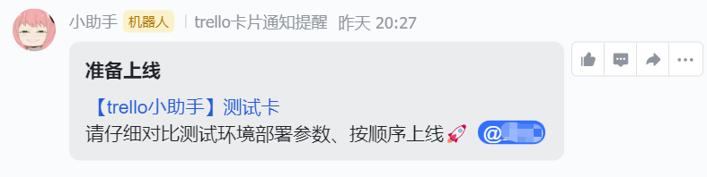

```yaml lw-blog-meta
title: "飞书机器人应用开发体验"
date: "2022-07-03"
brev: "有好有坏"
tags: ["Golang"]
```

## 背景

公司大概从几个月前，开始正式体验飞书作为协同工具。一开始仅限于IM（代替钉钉），后来拓展到飞书文档（代替语雀）、多维表格（代替trello）；最后推广到全公司全部迁移到飞书。

顺便吐槽一下，在使用体验方面，飞书这几个套件总体来说还是比我们之前那一套东西要先进一些的，但是也并不完美，也存在着一些别扭的地方。其中最别扭的是“多维表格代替trello”这件事，其实“多维表格”的思路是对的（也与我想象中差不多），但是具体的产品实现做得并不好，使用体验比trello还是差远了，所以我们依然有团队坚持使用trello没有迁移。

去年我做了个小工具（[Trello API 应用实战](../2021/211212-trello-api.md)），其中有用到钉钉机器人的能力。因此随着这次IM的迁移，我也被请求把钉钉机器人换成飞书机器人。因此有了这次飞书开放平台的开发体验。

## 飞书机器人

在飞书聊天群里，可以添加机器人。其产品形态与钉钉机器人完全一致：提供一个webhook，往接口发的内容会发送到聊天群里，鉴权方面也完全一致，我这里依然选择验签方式。

这里出现了第一个优点：飞书机器人的文档里，直接把验签算法的golang代码贴出来了，直接拷贝就能用，非常省心。而钉钉机器人呢，只提供了Java和Python版本的，想要golang的只能自己摸索着造个轮子。

同时也遇到了大坑：

首先，如果想要发送富文本格式的消息，那么这个数据结构非常的复杂；而类型系统又恰好是golang的弱点，因此我为了发这个富文本消息，定义了5级struct才勉强能够把它的结构表达清楚。

其次，它的响应体结构，在成功和失败两种情况下是不同的，像这样：

```json
// 成功的响应
{"StatusCode":0,"StatusMessage":"success"}
// 失败的响应
{"code":10002,"data":{},"msg":"text is nil"}
```

这个东西直接把我看得头皮发麻。总之呢，虽然踩了坑，但现在我的水平摆在这儿，我能心平气和地兼容他们，至少目前看来运行起来是没问题的，就好。

第三个大坑，出现在“艾特人”这个需求上。在钉钉机器人中，只需要直接提供对方的手机号码，消息发出去之后会储存原始的手机号码，然后在聊天群里自动匹配对应的人名。可飞书机器人不一样，它宣称要保护用户的隐私，只能用`open_id`来实现艾特人的能力。

仔细一看，这个`open_id`也是一个大坑。首先我们要知道，飞书一个账号下面是可以有多个子账号，即在每个组织中都是一个单独的子账号（身份）。在此基础上，`open_id`对应的是一个子账号在一个具体的应用中的身份。因此，仅仅有一个“机器人”是不能实现艾特人的能力的，要进一步，做一个“应用”，才能以应用身份去查询用户的`open_id`。

也有另一个方法（听说的，我没有验证过）：可以用`user_id`来代替`open_id`。这个`user_id`是用户子账号的id，在整个组织中唯一，但是它也被认为是一种“隐私”，（至少相对于在应用之间都隔离了的`open_id`来说确实是相对隐私一些的），因此需要组织管理员的权限才能查询`user_id`。

那么，既然反正都要麻烦管理员了，那我干脆就搞个应用吧，顺便还可以探究更多玩法。

## 飞书应用

强调一下，『飞书机器人』与『飞书机器人应用』是两个不同的东西。前者仅仅只是一个webhook，而后者是享有开放平台接口能力的应用身份。

从“飞书开放平台”进入“开发者后台”，创建一个『企业自建应用』，然后就可以开始开发了。

首先进入”权限管理“页签，找到你所需要的能力，然后开通对应的权限；有些权限需要管理员审批，因此也可以考虑创建一个“测试企业”，在测试企业里你就是上帝，可以为所欲为。

> 这里建议，“权限”这种东西呢，用多少就申请多少，不要多余，能用readonly的就一定不要申请写权限，这不仅仅是保护公司财产，同时也更是保护自己。

> 如果你创建了一个测试企业，那么考虑使用另一个浏览器（firefox/edge/隐私模式）以测试企业账号身份登录飞书开发者后台，再继续后面的步骤。

我们从自己的应用调用飞书开放平台接口，需要实现一套认证机制。飞书的认证机制类似微信，调接口的时候使用的是一个2小时有效期的`access_token`，这个token需要靠`app_key`来定时刷新，然后这个key又是与企业组织绑定的（毕竟是自建应用），即，你的现实公司组织与你创建的测试企业他们的key是不同的，注意区分。

有了`access_token`之后就可以调用任意接口（这个应用被开通过权限的接口）了。

接口文档质量不错，比淘宝、抖音的文档质量都高；特别是有些常见问题，例如“如何获取open_id”、“如何获取access_token”之类的，都以Q&A的形式列在相关文档后方，非常省心。

开发过程中有几个槽点吐槽一下：

1. 有些参数写在`path`里，有些参数写在`query`里，有些参数写在`body`里，这让我代码封装很难做啊……
2. 有部分接口的响应编码不是`utf-8`，（这让我想起了淘宝开放平台），因此可能需要手动解码。
3. 以“应用”身份发送聊天消息，其`content`字段是一个`string`；而以“机器人”身份发送聊天消息，其`content`字段则是一个对象（JSON对象），又增加了一点小小的麻烦。
4. 异常情况下的提示信息很不清晰，经常只有很笼统的“参数错误”的提示，因此调试过程只能靠猜。

……

ok，当应用开发完毕后，可以“上线版本”了。对于一个只有后端服务的应用来说，本来只需要更新自己的后端就行了，但是在飞书应用里，你对应用的权限、范围、事件、甚至名称头像等等信息经过修改之后，都要执行一次“发布版本”才能正式生效。也就是这个发布需要管理员进行审核。我是周六下午开发的，我们公司管理员看到了立即帮我点了一下，还设置了“后续免审”，因此我的开发过程还是挺顺利的。



最后说说『事件订阅』功能。

飞书机器人，或者准确说是“飞书机器人应用”，与钉钉机器人最大的不同是，它可以接收用户的聊天消息并且进行对应的处理。一个典型的场景是，用户可以在群聊中“艾特”机器人，然后机器人可以根据消息内容做出回复，只要你想，完全可以做一个AI聊天机器人。

在『事件订阅』页签中，首先配置`Encrypt Key`，配置之后回调内容都会以`aes-sha256`算法加密，减少了数据泄露的可能。值得表扬的是，在文档中又贴出了对应的解密算法代码，复制过来就能用，很省心。

然后要配置请求URL，配置之后会立即请求一次这个接口并要求做出回复，因此我们要先上线这个后端接口，再在这里配置URL地址。

URL配置之后，就可以选择需要订阅的事件了。我这里选择了“接收消息”事件，由于我已经开通过“接收群聊中@机器人消息”的接口权限，因此这个每当机器人被艾特的时候都会通知到这个接口上去。

事件消息格式算是很规范了，有一个固定的`schema`和`header`字段，可以用来判断事件类型。在我的golang代码实现里，我会根据`Header.EventType`的值来决定将`event`字段反序列化到哪个struct上去，体验还不错。

