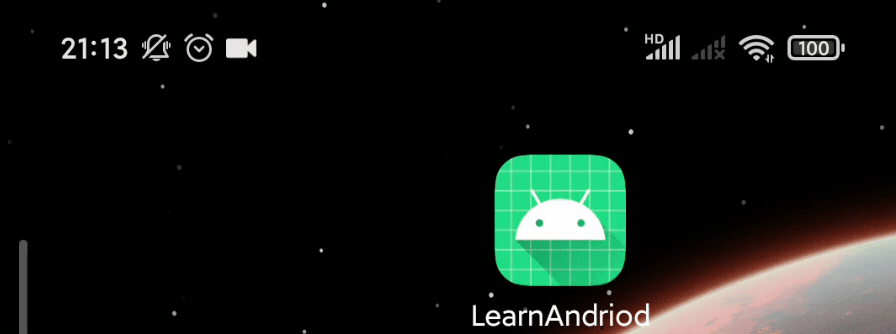

```yaml lw-blog-meta
title: "Android入门：把一个静态网站搬进手机app里"
date: "2022-09-23"
brev: "我连续好几个月没有生气的记录终于在今天打破了"
tags: ["安卓"]
description: "本文描述了作者开发一个原生安卓应用来展示静态网站的过程"
keywords: "安卓,Android,静态网站,Kotlin,NanoHttpd"
```

## 背景

之前我在[《Electron的一种用途》](../2022/220918-Electron-crawler.md)文章中介绍了，我用Electron爬取了整个网站的内容，得到了一个包含整个网站静态资源的文件夹。

ok，现在内容有了，要怎么方便自己阅读呢？

毕竟这个东西是违法所得，自己昧着良心鉴赏一下也就算了，万万是不能公布到互联网上的。

不能放在互联网上，那么如何满足自己随时随地阅读的需求呢？——某天我突然有了灵感：既然我都会写桌面客户端了，再写个安卓客户端专门用来展示，理论上肯定是可行的。

所以今天就来尝试一下安卓开发。

（其实一开始还尝试了 React-Native ，但因为我暂时没跑通，才来写原生安卓的。留个坑以后填。）

## HelloWorld应用

毕竟我是一个从后端干到前端的正经全栈工程师，让我做客户端的话，我第一直觉肯定是套壳浏览器，那么一个选择就是`WebView`了。

参考：[用安卓 WebView 做一个“套壳”应用](https://cloud.tencent.com/developer/article/1674348)

创建项目的时候，要注意选择『Empty Activity（空白活动）』，而不是『No Activity』，后者是完全空白的，对初学者来说没法按照教程走下去。

项目初始化之后，建议git提交一下，方便后续随意折腾。

此时可以直接在模拟器中预览app，此时已经会简单地显示出"Hello, World!"字样。

然后跟随上述文章的步骤，把文本替换成一个`WebView`，打开任意页面，这样我们的app的基本框架就算是了解了。

## 初识Kotlin

> 注：本节内容是一个初学者的随意吐槽，不是严谨的学术讨论，仅供娱乐。

在上面的步骤中，需要写少量的`Kotlin`代码，（因为教程里提供的是`Java`代码），因此我也是第一次体验了一下Kotlin，让我感觉比较奇怪的点有这些：

- 屏蔽lint的方法，居然是用装饰函数（在Java的世界里应该叫“注解”？），而不是在代码注释中写
- Java里用了大量的`getXXX()`, `setXXX()`，在Kotlin里不建议使用，建议直接操作：`obj.a.b = true`
- 创建对象居然不用`new A()`了，而是直接`A()`，这个我感觉会很危险啊……
- 对类型的校验非常严格，带`?`的类型必须要判断非空才能用，否则编译都不通过。

事件函数、匿名函数、创建对象，各种语法都特别诡异，例如我展示一段劫持app返回动作的代码：

```java
// java版本
webView.setOnKeyListener(new View.OnKeyListener() {
    @Override
    public boolean onKey(View v, int keyCode, KeyEvent event) {
        if (keyCode == KeyEvent.KEYCODE_BACK && webView.canGoBack()) {
            webView.goBack();
            return true;
        }
        return false;
    }
});
```

上面Java的代码，我这个从未写过Java的人（有JS、Python、Go、C#、C++等经验）来看，虽然感觉略显罗嗦、有一些魔法，但至少我一眼还是能够看出大概什么意思的，它还是很符合面向对象式的思想以及一般语法的。

```kotlin
// kotlin版本
webView.setOnKeyListener(View.OnKeyListener { v, keyCode, event ->
    if (keyCode == KeyEvent.KEYCODE_BACK && webView.canGoBack()) {
        webView.goBack();
        return@OnKeyListener true
    }
    false
})
```

可是下面这段[Kotlin代码](https://stackoverflow.com/questions/47298935/handling-enter-key-on-edittext-kotlin-android)是个什么鬼啊，正常人能看懂吗？？对象实例化不用`new`也就算了，连括号也省了？后面再跟一个大括号又是什么语法糖？？匿名函数参数列表不打个括号吗？？还有在`return`后面跟一个`@xxx`又是怎样的脑洞？？

我麻了。

还好IDEA稍微能够提供一些帮助，拷贝进`Java`代码过来，它可以帮忙转化为`Kotlin`，让我的痛苦减轻了一些。

## 在安卓手机上进行调试

Android Studio 提供的安卓模拟器，性能很差，很卡，（我不确定是否是我系统设置的问题还是少装了什么开发工具包），另外也是为了确保在我自己的手机上可用，因此我必须要进行真机调试。

参考阅读：[在硬件设备上运行应用](https://developer.android.com/studio/run/device?hl=zh-cn)

首先要在手机上设置开启“开发者模式”、“USB调试”、“USB安装”三项，小米手机[MIUI12参考](https://jingyan.baidu.com/article/1e5468f9c27830094961b7d9.html)

然后把手机插上电脑，首先弹出确认电脑的指纹，然后在电脑上选小米手机运行应用，手机中弹出确认安装应用的对话框，确认后，应用就装在手机上了并且自动打开运行了。

过程很顺利。

## 加载本地资源文件

例如，需要加载一个本地的HTML文件。

参考 [这个回答](https://stackoverflow.com/a/37545661/12159549)，意思就是静态资源文件要放在`app/src/main/assets`这个目录下，然后在应用中使用时，在webview中通过`file:///android_asset/...`这个相对路径去访问，在app（的`Activity`）中则以`assets`这个对象（[`AssetsManager`对象](https://www.google.com/url?sa=t&rct=j&q=&esrc=s&source=web&cd=&cad=rja&uact=8&ved=2ahUKEwjeiPy7gbr6AhUUBJQKHYW_CdcQFnoECAsQAQ&url=https%3A%2F%2Fdeveloper.android.com%2Freference%2Fandroid%2Fcontent%2Fres%2FAssetManager&usg=AOvVaw0Xr3wXHo3zgzsTTG8TKz4W)）去访问。

以我webpack的经验来参考，这个目录必然是在某个地方进行过配置的，在Kotlin的世界，构建工具是`Gradle`，必然有某个地方配置了这个路径映射才对吧，可是我没有搜索到项目中有相关的配置。

然后呢，当我茫然地尝试手动创建这个目录的时候，我发现在创建目录的对话框里，提示了`Gradle Source Sets`提供的许多选项。好吧，虽然我没找到这个配置写在哪里，但它应当是确实地生效了。

但是，这个`assets`有巨大的问题：

- 在webview中是可以直接`loadUrl("file:///...")`，但是加载了html资源之后，其他资源不能通过相对路径再次加载。
  + 如果一定有这个需求的话，则要考虑将所有逻辑都打包进一个html文件中，或者通过其他的方式在`Activity`中读取出内容来再塞进webview中去。
- 在`Activity`中访问，其实这个assets中的文件都是存在于apk安装包中的，并不是真正意义上的在运行时的目录中，所以会受到种种限制。
  + 例如死活就是读不出它的绝对路径，也就不能创建`File`对象给其他业务使用了。

## 自由地读写本地文件

因此我换了一个思路，既然`assets`这么难用，那我就不用了，我手动把资源文件拷贝到手机中的某个绝对路径下，例如`Download`目录。

参考：[how to access downloads folder in android?](https://stackoverflow.com/questions/7908193/how-to-access-downloads-folder-in-android)

其中提到了如何访问系统公共的那个`Download`目录：

```kotlin
val download: File? = Environment.getExternalStoragePublicDirectory(Environment.DIRECTORY_DOWNLOADS)
```

上面这种方式，得到的`File`对象是只有`execute`权限，没有读写权限的，这个问题也很大。

因此我再次降级，用下面的方式，取到了当前app专属的目录下的Download目录：

```kotlin
val download: File? = getExternalFilesDir(Environment.DIRECTORY_DOWNLOADS)
```

终于，app对这个目录拥有全部权限。我把整个静态网站，包含`index.html`、若干其他html、若干图片，整个目录拷贝到这个路径下，app终于可以访问了。

## 在安卓app上启动一个HttpServer

由于`WebView`不支持我直接用相对路径读取本地文件资源，因此我必须考虑一个很蠢的办法：在安卓app中启动一个后端服务，监听`localhost`，让WebView去访问这个`http://localhost`上的资源（而不是`file:///`）。

经过一番简单的搜索，我找到了[NanoHttpd Webserver](https://mvnrepository.com/artifact/org.nanohttpd/nanohttpd-webserver)这个库。

安卓的项目使用`Gradle`来做包管理工具，因此我又折腾了好一番，才把这个依赖库下载好。

下载了之后我发现我居然不知道怎么用！这个项目根本没有一个靠谱的文档！因此我又折腾了一番，终于在它项目源码的[测试文件](https://github.com/NanoHttpd/nanohttpd/blob/master/webserver/src/test/java/org/nanohttpd/junit/webserver/TestHttpServer.java)中找到了我所需要的类：`SimpleWebServer`

代码简化如下：

```kotlin
import fi.iki.elonen.SimpleWebServer

class MainActivity : AppCompatActivity() {
    override fun onCreate(savedInstanceState: Bundle?) {
        super.onCreate(savedInstanceState)

        val download = getExternalFilesDir(Environment.DIRECTORY_DOWNLOADS) as File

        val server = SimpleWebServer("127.0.0.1", 8080, download, true)
        server.start()

        // ...
    }
}
```

## 小结

最后，我这个套壳静态网站app运行效果还是不错的。



但是，总得来说，这次的开发体验依然很差，让我暴躁得摔鼠标了，我已经很久没有这样暴躁过了，感觉上一次暴躁还是在研究`etcd`、`k8s`的时候。（咦？怎么都是谷歌的东西？？）

至少，Java、安卓这个生态，跟前端的生态比起来真的是没有一丝一毫的可比性。唉，写个代码真难。
